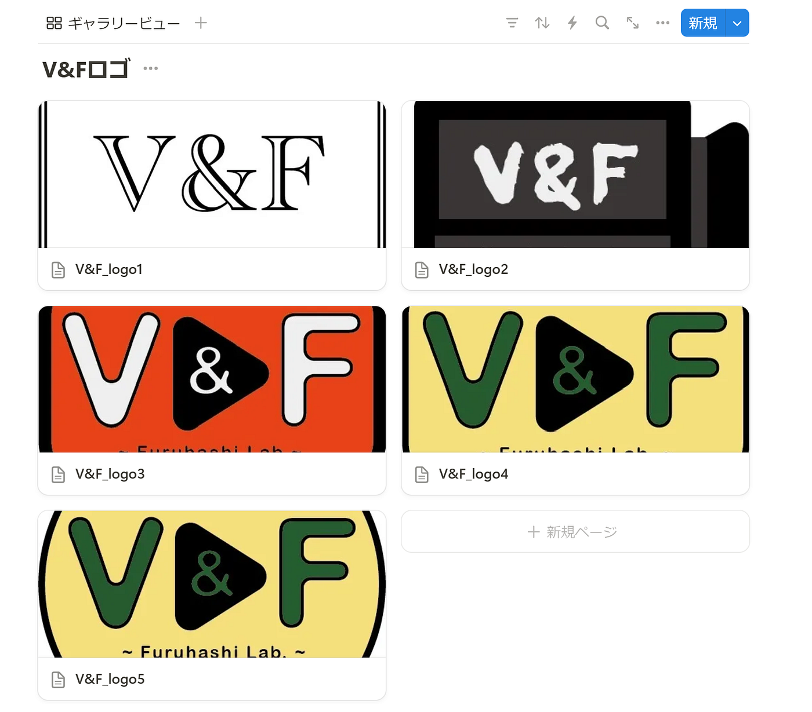
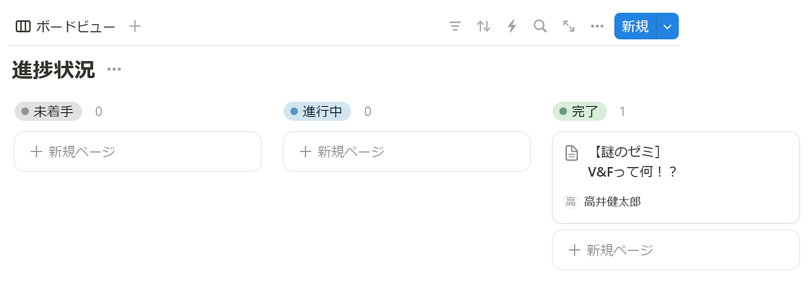
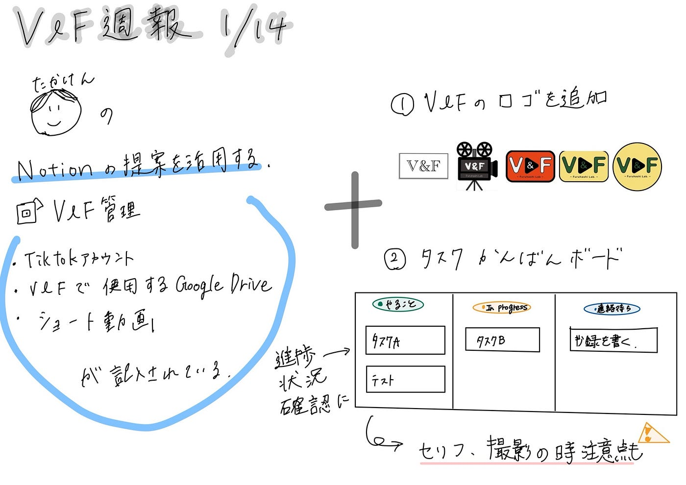

### V&F動画管理ツールをブラッシュアップしてみた

お疲れ様です！
3年の高井です。
今週のV＆Fでは、私が[Notion](https://www.notion.com/ja)ハッカソンの時に作成した「[V＆F 動画管理ツール](https://www.notion.so/V-F-1823791036c680c2a9c2e39ab1ad5ac7?pvs=4)」にさらに機能を追加して、より動画情報を網羅できるようなツールに仕上げてみました。

> 追加した機能

#### ・V&Fロゴ

ロゴを追加することで、動画を編集する際に毎回ロゴを送り合う手間を省く工夫をしました。

#### ・進捗状況ボードビュー

新たにボードビューでタスク一覧とその進捗状況を一目でわかるようにしました。また、セリフやそのシーンのイメージなどの詳細情報も記入できるようにしました。

> その他の改善点

編集権限問題→無料アカウントでワークスペースを作成してしまうと、他のユーザーに編集権限をあげられませんでした。

なので、GSCのメールアドレスで学割プランとしてアカウントを作成し、そのアカウントでワークスペースをもう一度作成することでメンバー全員に編集権限を与えられるようにしました。

> まとめ

今回の活動で、「[V＆F 動画管理ツール](https://www.notion.so/V-F-1823791036c680c2a9c2e39ab1ad5ac7?pvs=4)」がより使いやすく改善できたと思うので、来年度以降のV＆Fの活動で使用していきたいと思います。

> グラレコ

