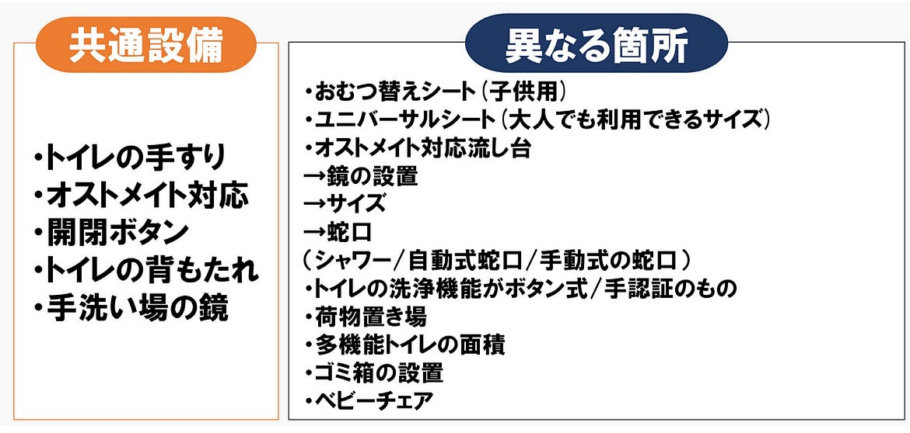
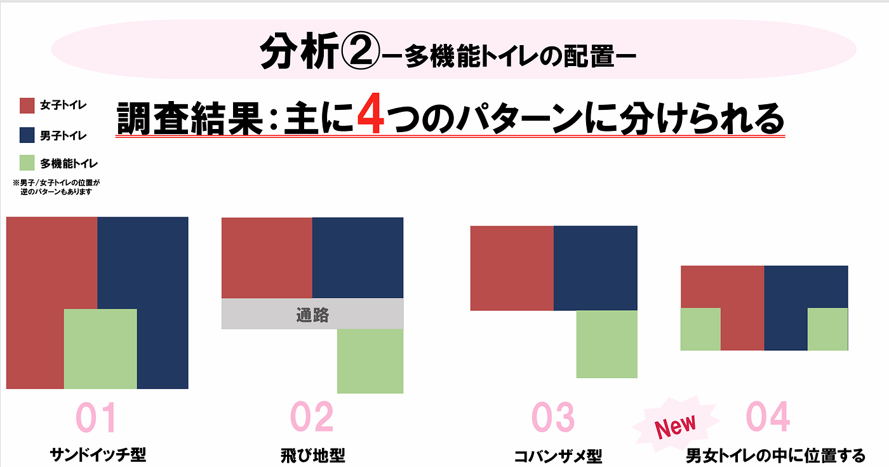
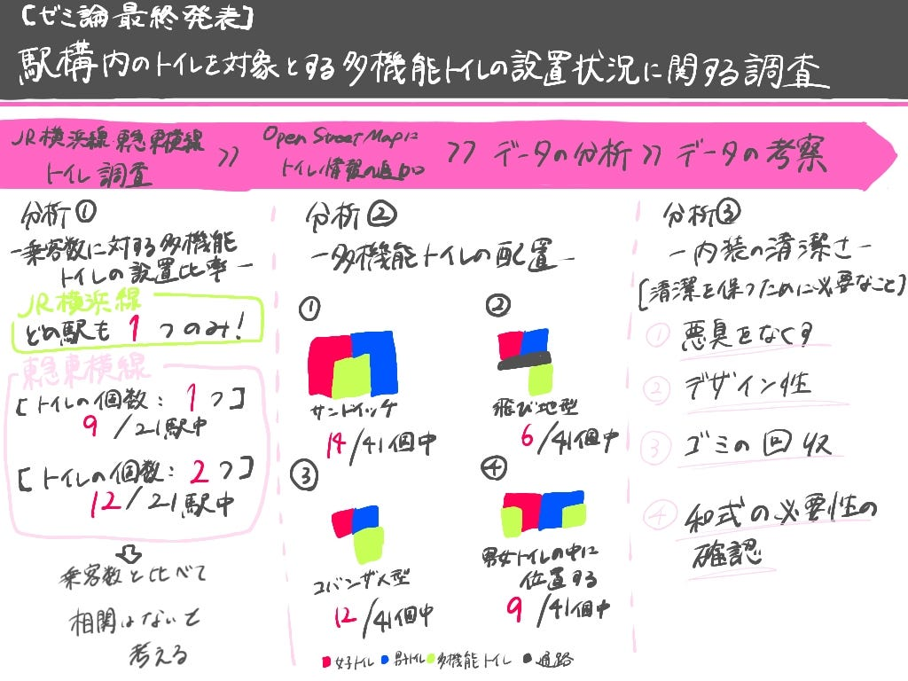

## 【ゼミ論最終発表】多機能トイレが充実している路線は！？

こんにちは。3年の林優香里です。今回は、3年から調査してきたゼミ論の成果を発表します。

> _GitHub：[furuhashilab/2024gsc_YukariHayashi_](https://github.com/furuhashilab/2024gsc_YukariHayashi)

> _パワーポイント：_[駅構内のトイレを対象とした１.pdf](https://github.com/user-attachments/files/18548997/default.pdf)

### Abstract

駅は多くの乗客が日常的に利用する公共の場であり、これに伴い、駅構内の設備の充実が重要な課題となっている。特に、トイレの数とその品質は、乗客の快適さや利用意欲に直結する重要な要素である。本論文では、駅構内の乗客数とトイレの設置状況に焦点を引き、特に多機能トイレの設置比率について分析する。多機能トイレは、障害者、高齢者、子供連れの親、性的マイノリティ者など、さまざまな利用者のニーズに応えるための重要な設備である。これらの要素を考慮し、OpenStreetMapに駅内のトイレの位置情報を反映させ、乗客数と多目的トイレの設置比率の関係を分析をもとに、鉄道利用者の利便性向上と災害時など他の場面でも応用することを目標とする。

#### Introduction

駅構内における多機能トイレの設置状況や特徴は、便利性とユーザー体験を高める上で重要であり、バリアフリーな社会を実現する為にも調査の実施が望まれます。本研究では、事前に立てたのられた「古い鉄道ほど制約があり、多機能トイレが少ない」という仮説を検証するため、JR横浜線と東急東横線を対象に、設置数、内装、配置パターン、および清潔さに関する調査を行いました。

### Methods

**【調査対象】**

JR横浜線: 八王子駅から東神奈川駅までの20駅

東急東横線: 渋谷駅から横浜駅までの21駅

**【調査内容】**

多機能トイレの個数の確認

- トイレ案内図と内装の撮影

- 設備、配置、清潔さの観点からの分析

**定義**

- 改札内にある多機能トイレを対象とし、他路線の乗り換え駅でも対象路線の駅としてカウント

#### Results

**1. 多機能トイレの個数**

- JR横浜線: 各駅に1つ

- 東急東横線: 駅によって個数が異なる

1つの駅: 21駅中9個

2つの駅: 21駅中12個

**2. 内装と清潔感**

【内装】

（共通点と異なる点）

【清潔感を高める要素】

- 悪臭の排除

- 明るいデザイン

- ごみの回収

**3. 配置パターン**

- サンドイッチ型→男女トイレに挟まれる

- 飛び地型→通路を挟み別の場所にある

- 男女トイレ内配置型(名前考案中)→男女トイレの中に1ずつ位置する

- コバンザメ型→男女トイレの片方の隣に位置する

**4. OpenStreetMapへのトイレ情報追加**

- 横浜線駅構内のトイレ情報を追加

#### Discussion

（仮説の検証）

- JR横浜線は1908年開通、東急東横線は1926年開通

- JR横浜線に比べて東急東横線の方が多機能トイレ個数が多く、2つで比較した場合仮説は立証

（清潔感に関する考察）

- トイレにおける悪臭やごみは、ユーザーの清潔感を大きく低下させる要因であるため、日常のメンテナンス作業が必要である。明るく清潔なデザインやこまめな策突は、ユーザー体験を向上させる重要な要素である。

