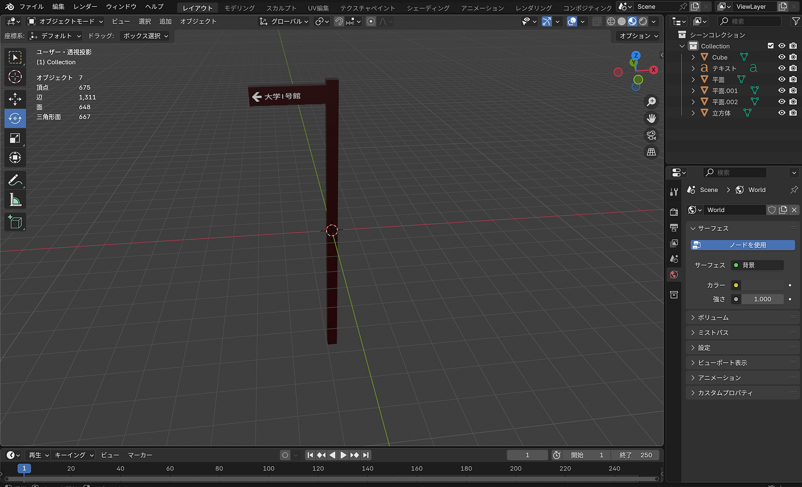
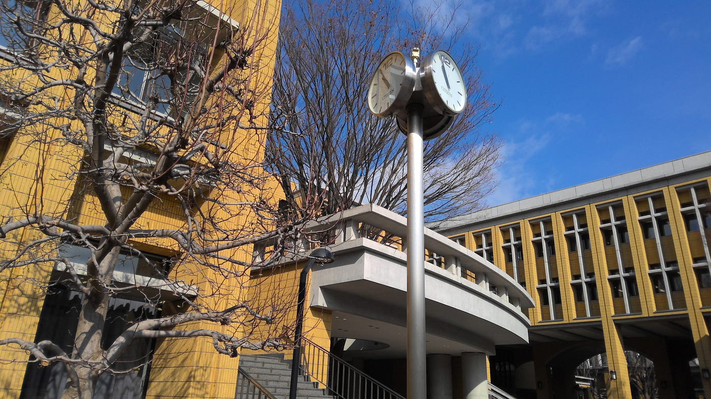
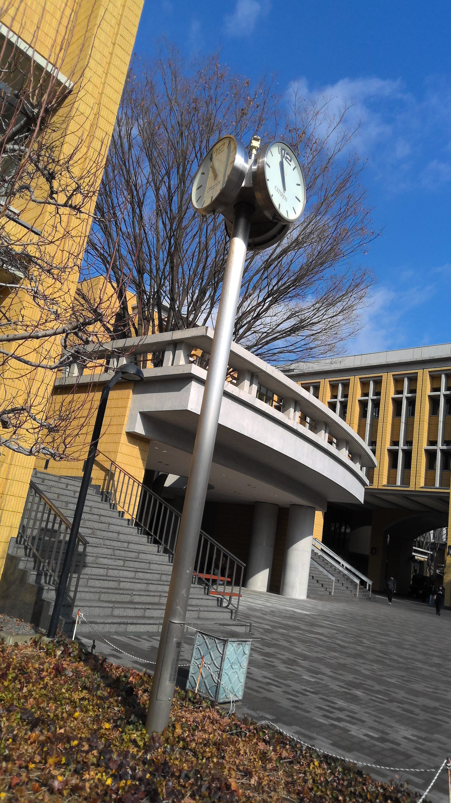
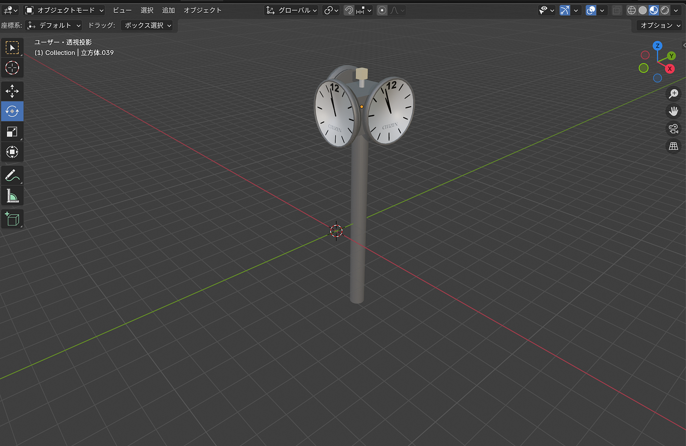
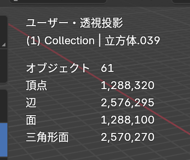
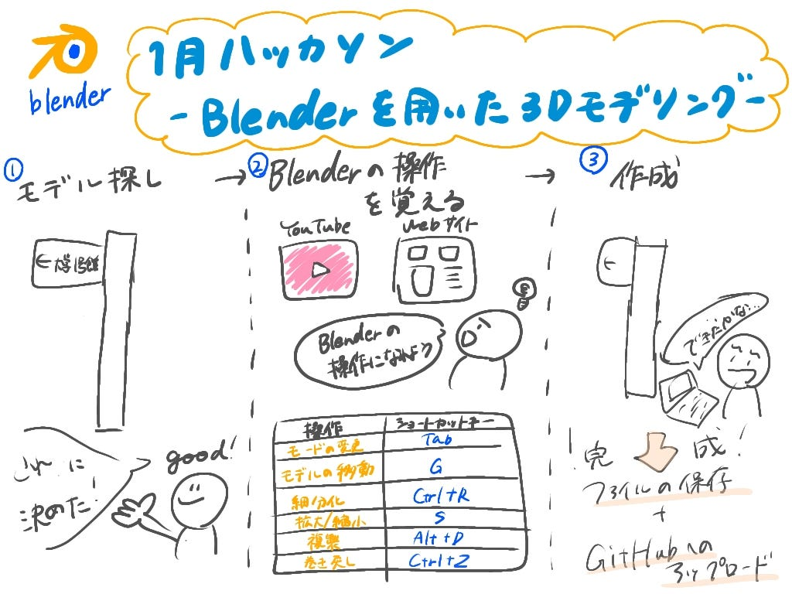

### 【1月ハッカソン】初めてBlenderをさわってみた！！

こんにちは。3年林優香里です。

1月のハッカソンの成果物を報告します。

#### 今回モデルにしたアセット

青学の渋谷キャンパスにある案内板です。

#### モデリングするにあたって

Blenderを使うのは今回が初めてで、操作方法が全くわかりませんでした。そこで、YouTubeを活用して基本的な使い方を学びました。特に、以下の動画を参考にして勉強しました。

**（基本操作編）**

[【初心者向け】世界一やさしいBlender入門！使い方＆導入〜画像作成までを徹底解説【最新版対応】](https://www.youtube.com/watch?v=S6aAvxUx2ko&t=2228s)

[【Blender超入門】使い方を初心者向けにやさしく解説！](https://www.youtube.com/watch?v=gynkpxRZUn8&list=PLVPonnbjWCTTnccbFjKK_tBBpkQCOwU0B)

**（色付け編）**

[Blender3 超入門⑯【マテリアルの超基本！色を付けよう！】 — YouTube](https://www.youtube.com/watch?v=SRqWhE7oyRo&list=PLVPonnbjWCTTnccbFjKK_tBBpkQCOwU0B&index=16)

#### **今回の成果物**

以下に5種類のファイルをまとめています。

[blenderhackathon2025jan/data/yukarihayashi at main · furuhashilab/blenderhackathon2025jan](https://github.com/furuhashilab/blenderhackathon2025jan/tree/main/data/yukarihayashi)

↓↓成果物はこんな感じです。

#### 工夫した点

・本物のモデルに色を寄せた

・矢印を平面から作成するのに少し時間がかかった。

#### 失敗点

実は、この前に作成したものがあったのですが、ポリゴン数1000以内という規定を破っていることに気づかず、完成してから気づくという大失敗をおかしました。

それがこちらです。

#### モデルにしたアセット

#### 完成品

#### ポリゴン数学多くなった理由

・テキストを入れるとかなりポリゴン数が増える。（フォントを設定するとより増加）

・時計の丸みを自然にさせるためにスムーズシェイドという機能を使ってしまった。

・単純に工数のおおいモデリングをしていた

#### 感想

・Blenderの触りたての時は、何が何だか分かりませんでしたが、YouTubeなどで調べながら操作に慣れていくうちに、だんだん楽しくなってきました。Blenderの作品例を見て、アニメーションをつけたり高度なモデリングをしている人たちに感動しました。自分もそんな作品が作れるよう、技術を磨きたいと思います。

・ショートカットキーを覚えるのが少し大変だったのと、私はマウスを持っていないので使用していなかったのですが、マウスがあれば作業効率があがりそうだと感じました。

・できれば、次回のBlenderハッカソンの際はポリゴン数の制限をもう少し増やしていただきたいです！！

