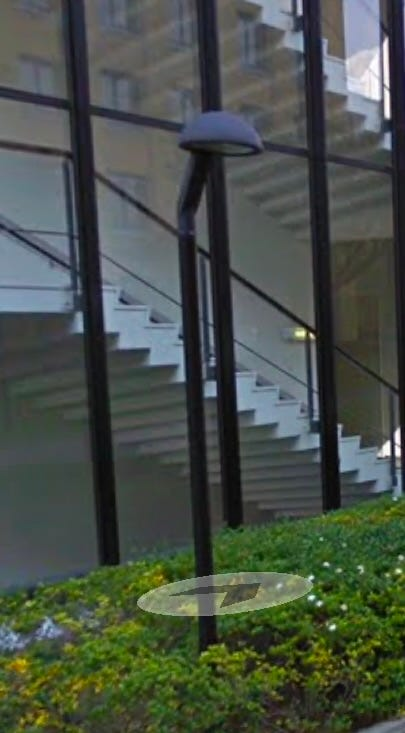
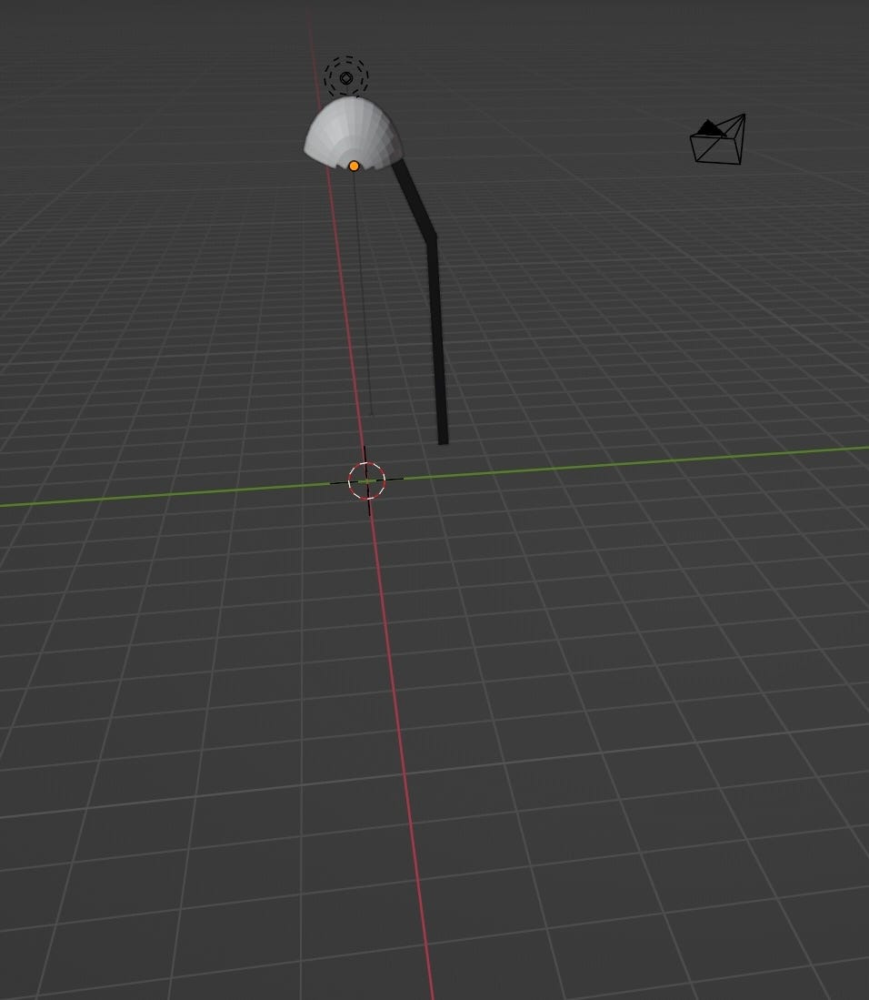
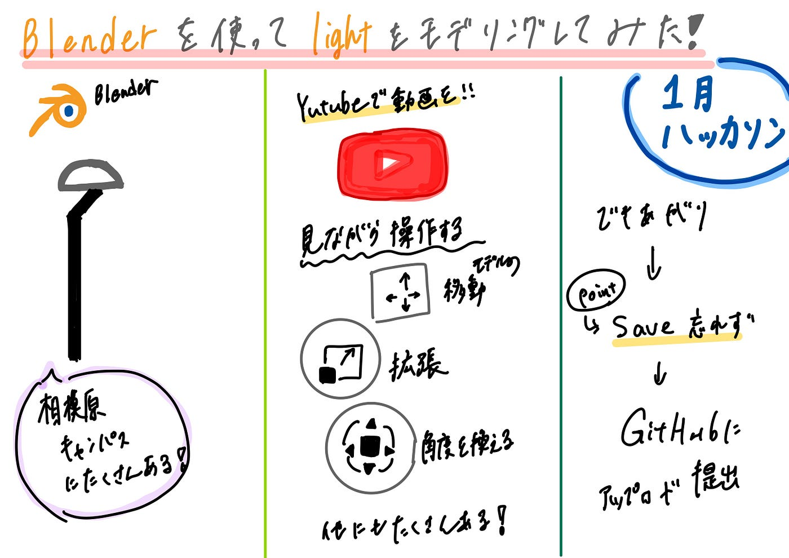

### 【1月ハッカソン】Blenderを使ってみた！

こんにちは、三年の福田です。

一月のハッカソンの結果報告です。

GitHubに５つのファイルをダウンロードしました。[https://github.com/furuhashilab/blenderhackathon2025jan/tree/ab245ea06badc6e303cee242cecf19225cfc1b17/data/KounaFukuda](https://github.com/furuhashilab/blenderhackathon2025jan/tree/ab245ea06badc6e303cee242cecf19225cfc1b17/data/KounaFukuda)

**今回のモデル**

相模原キャンパス内にあるライトです。

**Blenderを使ってみて**

今までの授業でも使ったことがなく、正直にいうと難しい感じがしました。どこを押したかわからなく、変に変形したり、伸びてしまったりと何回もやり直しをしました。モデリングするにあたってYutubeの動画も参考にしました。

棒の作り方はいじってみてわかったので半球はこちらをみながら作りました。

**結果**

なんとなく似ているでしょうか

**失敗点**

何回かやってみましたが、半円にする時に頂点が少し削れてしまいました。方法があっていないのかなと思い、何回かやってみましたがどうしても頂点が消えてしまうという結果で今回は半円に一番近い形のこれにしました。

**良かった点**

思ったより早く操作に慣れて、色付けも動画の途中まで見て、試してみたらできたという感じでした。

**Blenderを使ってみての感想**

時間がある時にゆっくり何モデリングしたいと思うようになりました。（好きなキャラクターを作ってみたりするなど）操作はもちろん難しい点があって何かよくわからないボタンも多いのですが、動画を探して少しずつ作ることができるのでやってみようと思っています。（できたら報告します笑）

グラレコ

