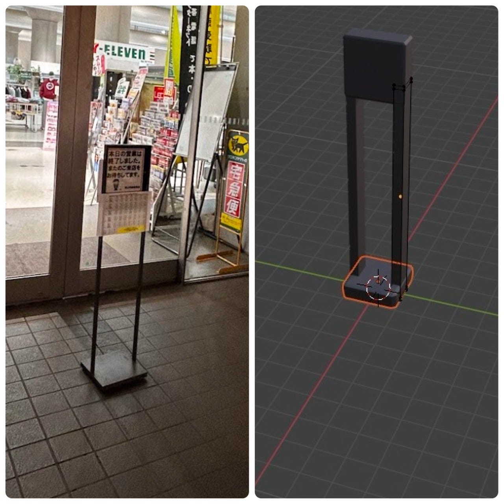

### 1月ハッカソン・ゼミ論

お世話になっております三年の伊藤です。今週の週報は、ゼミ論と一月に行われたゼミ内ハッカソンについてまとめます。

### １．ゼミ論

葉山町における津波避難ルートの作成と実践的検証

1. Introduction (序論)

1.1 研究背景

日本は地震や津波のリスクが高い国であり、特に浜沿い地域では速やかな避難が求められる。葉山町も例外ではなく、地震発生時には津波の発生が想定されている。しかし、現地の住民やヨット関係者の間での避難意識や行動の実用性には問題がある。本研究は、葉山町における津波避難ルートの作成とその実務性の検証を目的とする。

1.2 研究目的

本研究は、葉山町における津波避難ルートを設計し、その有効性を検証することを目的とする。特に、以下の点に焦点をあてる。

ヨット関係者を含む地域住民の避難意識の向上

実際の避難訓練を通じたルートの検証

2. Methods (方法)

2.1 調査対象

葉山町の住民およびヨット関係者を調査対象とする。特に、練習場（葉山マリーナ）から一次避難場所へのルートを検証する。

2.2 データ収集方法

文献調査：葉山町の既存の防災計画や津波対策の資料を収集し、分析する。

現地調査：避難ルートの地形や障害物の確認を行い、実際の移動経路を検証する。

ヒアリング調査：葉山町の衆々ヨット関係者、地域住民にインタビューを実施し、避難意識や課題を明らかにする。

避難訓練：ヨット部員や住民を対象に避難訓練を実施し、その結果を分析する。

3. Results (結果)

住民やヨット関係者の多くが「津波のリスクを認識しているが、実際の避難ルートを知らない」ことが明らかになった。

避難訓練の結果、移動時間にばらつきがあり、一部の経路では時間内の避難が困難であることが分かった。

4. Discussion (考察)

研究の結果から、避難ルートの明確化、避難訓練の定期化が必要であることが明らかになった。

5. Conclusion (結論)

本研究は葉山町の津波避難ルートの有効性を検証し、住民の避難意識の向上が必要であることが明らかになった。

### ２．一月ハッカソン

一月のハッカソン課題は[Blender](https://www.blender.org/)を用いた3Dモデリングでした。具体的な課題として、[青山学院大学のキャンパス3Dデータ](https://sketchfab.com/mapconcierge/collections/b4d7c2f179534d1daf5118ebbb83c6e1-df275ec44c0943cc9b031075cd1bccac) を充実させるために、青学キャンパス内の3Dアセットデータを１つ作成する。

私は、この課題に対して校舎内や食堂に設置してある立て看板を作成しました。[Blender](https://www.blender.org/)を活用するのが初めてで、右も左もわからない状態でしたが、いくつかのYouTubeの動画を参考に作成しました。クオリティはあまりよくないですが、とても良い経験になりました。

【参考にしたYouTube動画】

[【初心者向け】世界一やさしいBlender入門！使い方＆導入〜画像作成までを徹底解説【最新版対応】](https://www.youtube.com/watch?v=S6aAvxUx2ko&t=3251s)

[マテリアルの超基本！設定と使い方【Blender初心者】](https://www.youtube.com/watch?v=-gVHgBqI4fQ&t=322s)
