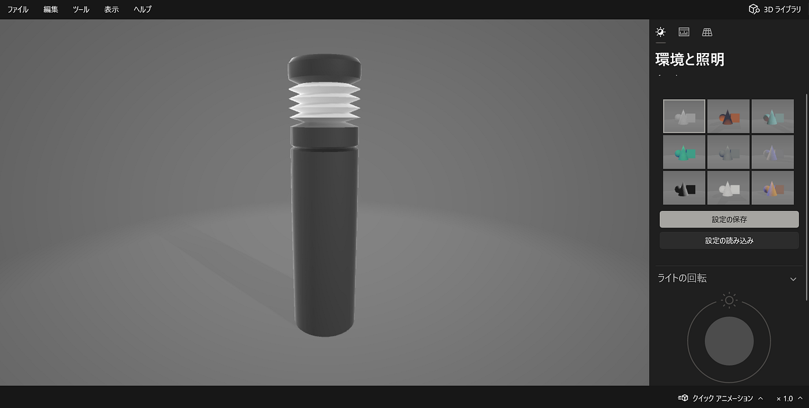
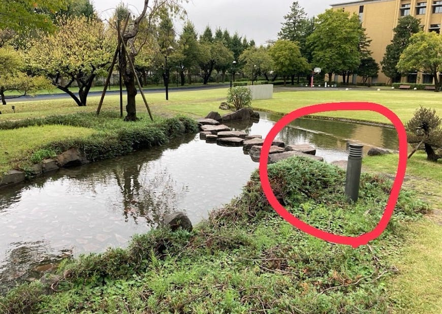
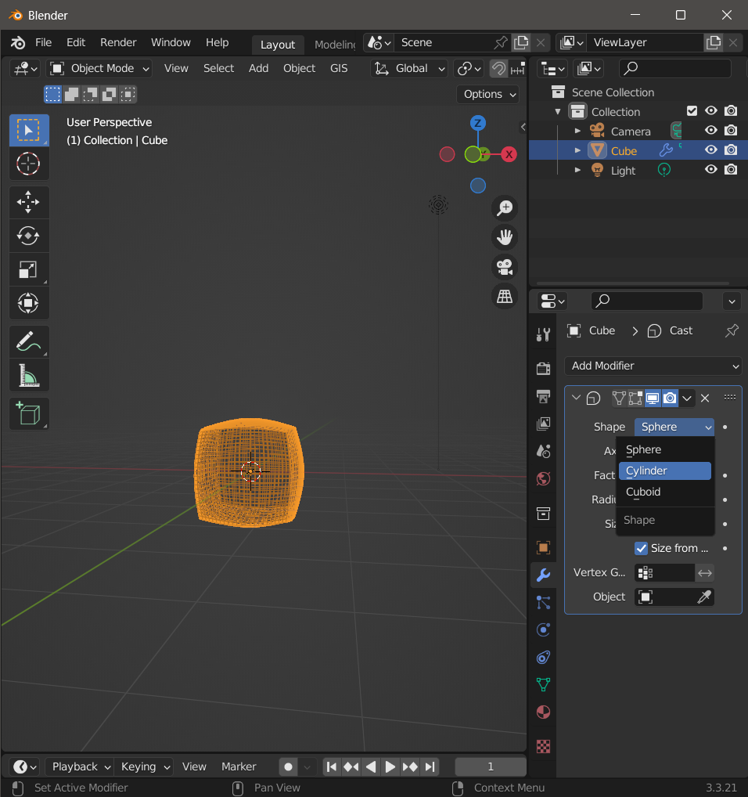
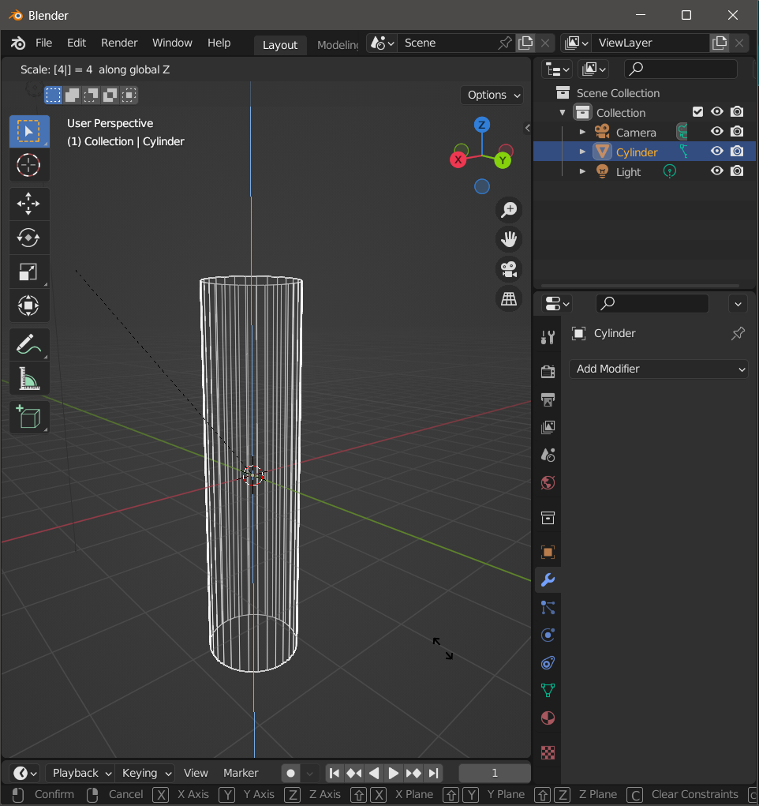
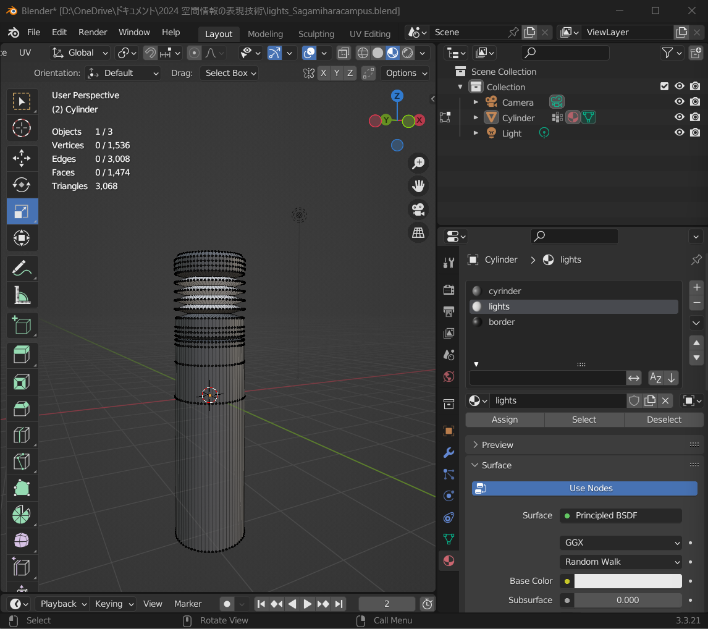
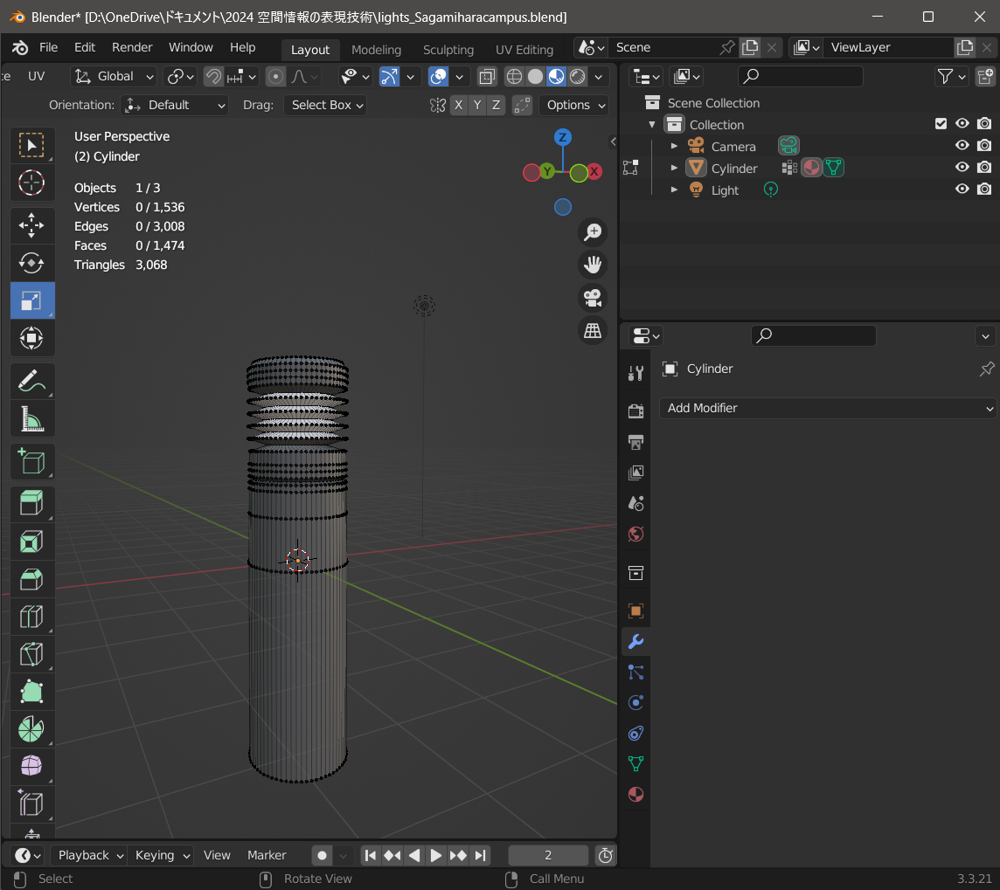
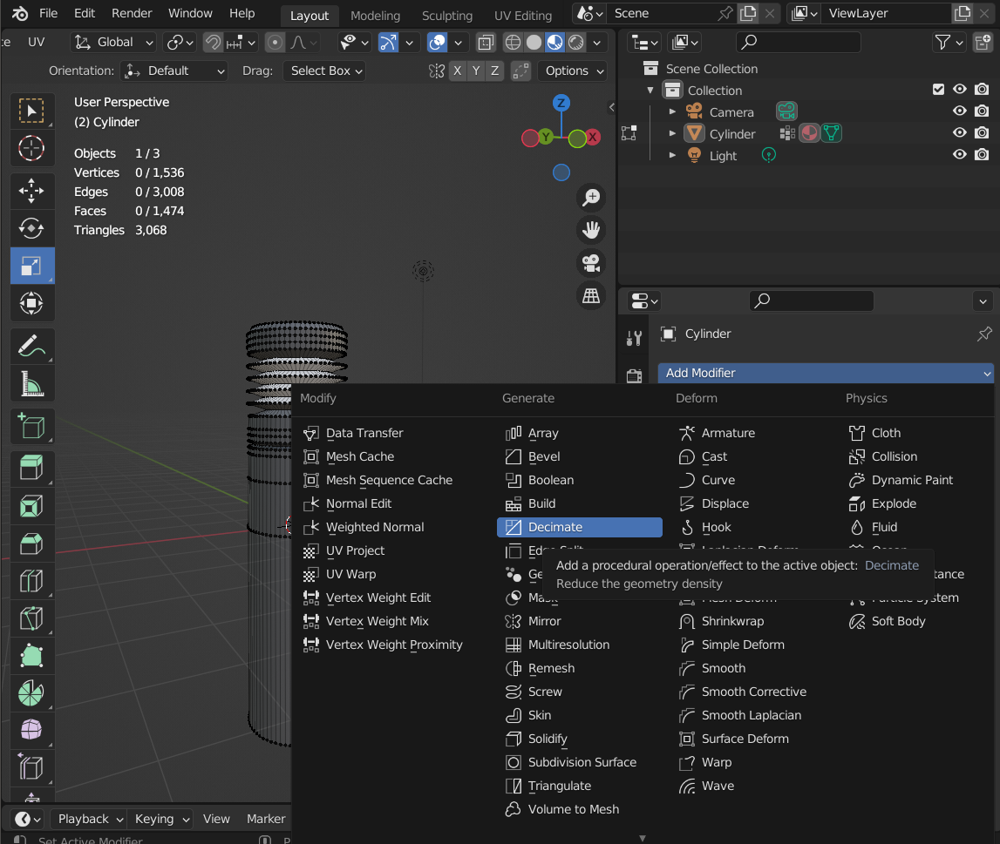
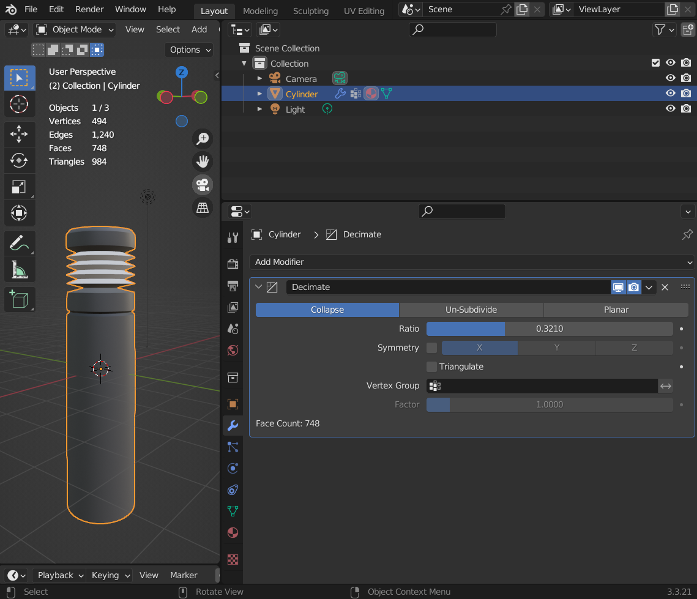
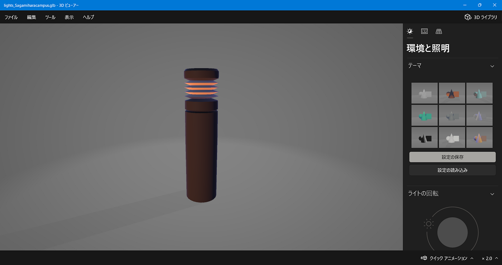
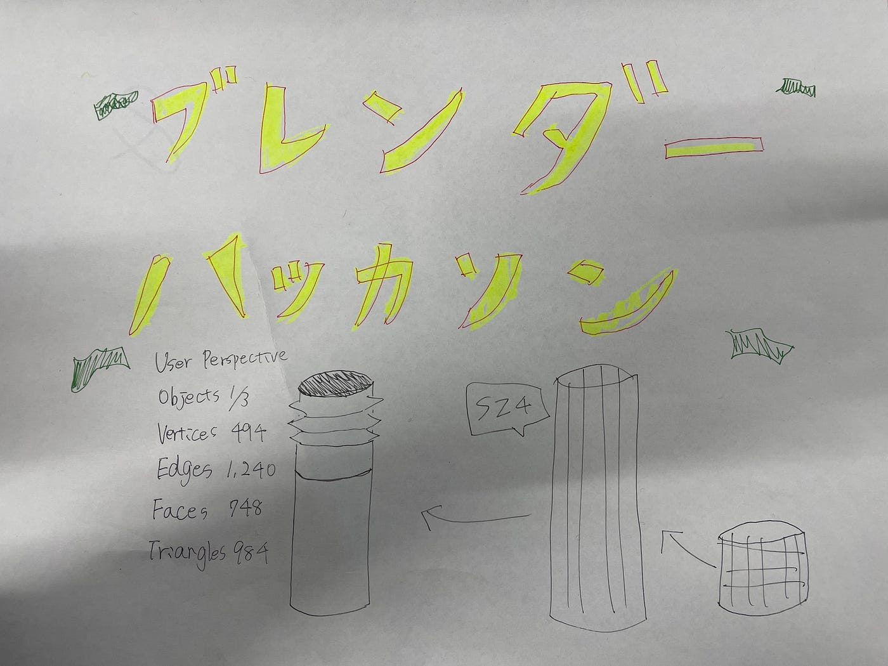

### satoaki報告_Blenderハッカソン

[blenderhackathon2025jan/data/satoaki at main · furuhashilab/blenderhackathon2025jan
Blenderハッカソン2025 成果物置き場. Contribute to furuhashilab/blenderhackathon2025jan development by creating an account on…github.com](https://github.com/furuhashilab/blenderhackathon2025jan/tree/main/data/satoaki)

佐藤愛妃（satoaki）です。今回は、ブレンダーを用いて相模原キャンパス内のオブジェクトを3Dモデリングしました。

### 芝生エリア内にある池近くの背の低い街灯

今回は、芝生エリア内にある池近くの背の低い街灯をモデリングしました。ポリゴン数に制限があったので、細分化し過ぎず、表面が滑らかになるように工夫しました。

元の画像↓

### 作業概要

### body部分

まず、構造物は円柱（シリンダー）を選択して設置します。 それから、Add ModifierのSubdivisionでオブジェクトを10に分割し、円柱を滑らかにします。

s z 4で縦（+z軸方向）に4倍（×4拡大）します。これで、街灯らしくなります。

### ライト部分

ループカット多めに入れて凹凸を再現します。ループカット→辺を選択→スケールでxとy軸方向に同間隔で調整します。 ここら辺は集中して作業したのでスクリーンショット撮り忘れました。この段階での完成物はこんなかんじでした。

### 色付け

色も付けました。今回はシンプルなので、3色です。

### ポリゴン数削除

今回はポリゴン数が1000以下と指定ですが、細分化した状態では3000近くなってしまうので、メッシュを荒くしていきます。 ↓修正前はこんなかんじです。

↓ポリゴン数を減らすため、Add modifier→Decimateを選択します。

Ratioを調節し、984まで落としました。所感として、800以下にすると、街灯上部分がカクカクし始めます。

### 完成形

完成形です。エクスポート後に3Dビューワーで見てみました。

ライトの色変えて遊んでみました。

### 感想

今回の作業では、最後にポリゴン数が1000よりオーバーしていると気づき、修正をいれました。ただ、初めから少ないポリゴン数で作業するより、細分化しておいた方が調整が楽でした。形を調節するときは丁寧に作業を進めたので、出来上がったときに達成感がありました。本物と比率や頭身が若干違うところもあるので、次は細かいところもクリアしていきたいです。ショートカットキーもマスターして、作業を楽に進められるようにしたいです。

