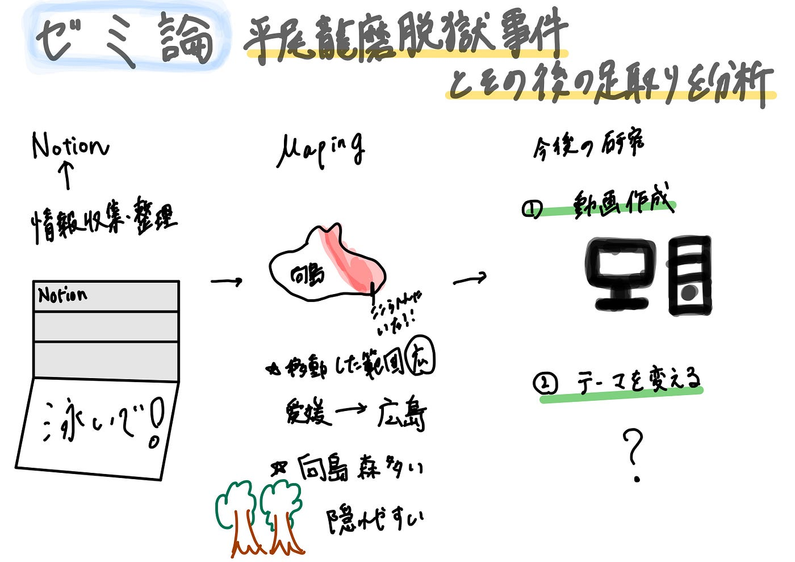

### 「ゼミ論最終発表」脱獄事件を調べてみた！

こんにちは、三年の福田です。

ゼミ論の最終発表をします。

GitHub：[https://github.com/furuhashilab/2024AGU-KounaFukuda/blob/fdf7acde45684fb8bee537bdbfacfcb26ebfbdbc/README.md](https://github.com/furuhashilab/2024AGU-KounaFukuda/blob/fdf7acde45684fb8bee537bdbfacfcb26ebfbdbc/README.md)

PowerPoint：[https://aoyamajp-my.sharepoint.com/:p:/g/personal/aa122028_aoyama_jp/EWIx9qm2HPRHp0kko9jgK2cBGzj5vD9DqdbhamOInRvB8A?e=v938I0](https://aoyamajp-my.sharepoint.com/:p:/g/personal/aa122028_aoyama_jp/EWIx9qm2HPRHp0kko9jgK2cBGzj5vD9DqdbhamOInRvB8A?e=v938I0)

#### Introduction

2018年に愛媛県で起きた平野龍磨脱獄事件は全国を驚かし、警察や支援者の動員で捜査を行うものの22日後にやっと逮捕できた。本プロジェクトは、この事件における特徴、どのような経路で逃走したのかを調査分析し、事件の説明を地図上での可視化と一緒に、ミステリー・事件系が好きな人に事件についてだけでなく、地図からの逃走経路でその事件との関連を楽しんでもらい、地図・マッピングの使い方の多様性を理解し、興味を持ってもらうことを目的にする。

#### Methods

①2018年までに起きた有名脱獄事件を整理し、Notion にまとめる

＝先行研究

②公開されている情報から足取りまとめ・分析

③まとめと分析に基づきGoogle Earth にマッピング

**定義**

各有名事件は何で有名かを調査し、今回調べる事件の特徴を明示し、その足取りを可視化すること。

#### Results

①1882年以降2018年までの有名な脱獄事件とその詳細について

[脱獄事件のまとめ | Notion
ここでは1882年以降から2018年までの有名な脱獄事件と人の詳細がまとめられています。 時代ごとに検索をかける（明治大正時代 脱獄など） ↓ 出てきた人物・事件についてそれぞれ調べるclever-corn-957.notion.site](https://clever-corn-957.notion.site/ae110f08fa3c48d2b392fe5edc9acddc?pvs=4)

②脱獄から逮捕までの足取り（古橋先生にご修正いただいた版）

[https://earth.google.com/earth/d/1fTKvVaK886nBjT9ht09OPnukgA3qeSLF?usp=sharing](https://earth.google.com/earth/d/1fTKvVaK886nBjT9ht09OPnukgA3qeSLF?usp=sharing)

#### Discussion

（マッピングをする・した後）

1．POIデータの「詳細設定」でカメラワークを調整

「このビューをキャッチアップする」こと←先生から！

2．情報が少ないからこそ工夫を

事件であるため、公開されている情報には限りがある

地域がわかる場合は、範囲を囲んで紹介する

3.地図上でみてわかる距離

4.逃走の範囲・距離の広さ

5.地形の特徴からなぜ22日間逃走可能だったか理解する

6.この事件で最も重要な泳いだ経路が公開されていない（推測した）

**個人的な感想**

・事件の紹介だけではわからないことが地図を見てわかる

・実際に行くことが難しい場所でもストリートビューで！

・正解かはわからないが、地図があるから推測を可能にしたり。過程を楽しむことができる。

**問題点**

・事件であるため、公開されている情報は限られていて、今後の予定としては動画作成のみになってしまう。（動画はゼミ論ではなく作ってみたい）

・2月中旬からしばらく海外にいる予定なので、そこで実施可能な新しいテーマを見つけられたらいいかと

グラレコ

