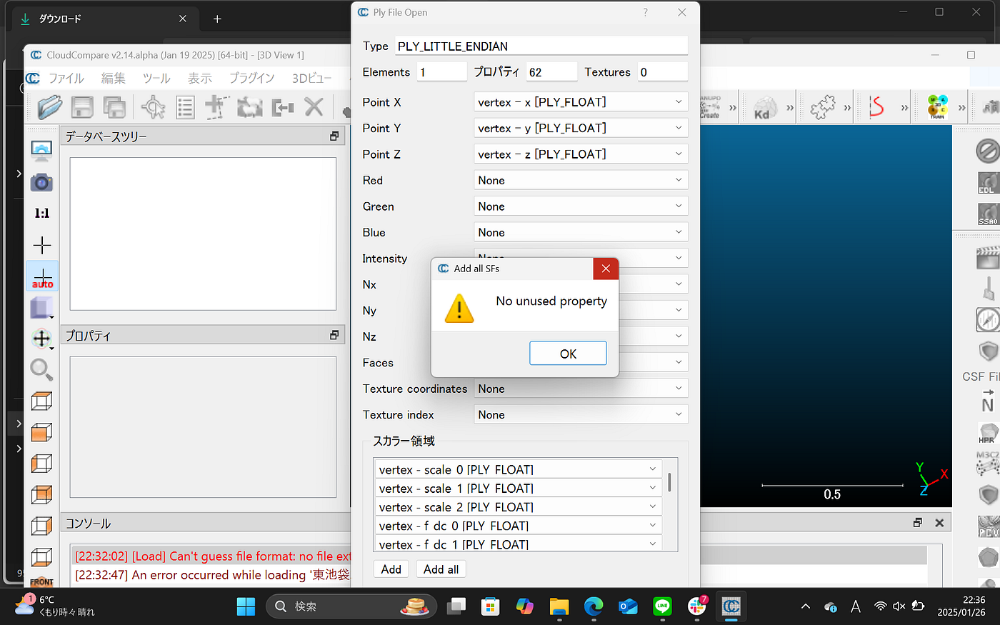
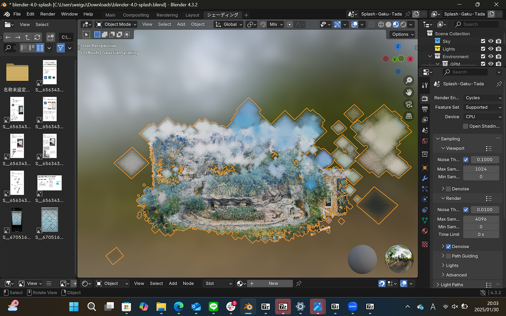
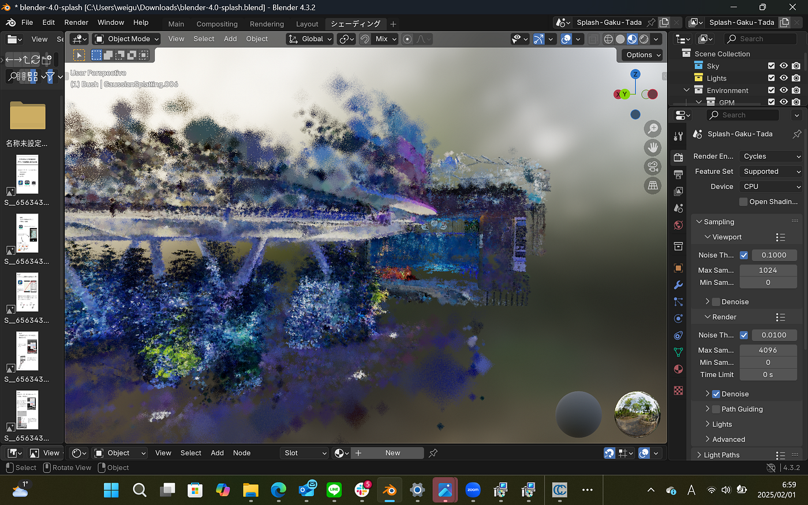
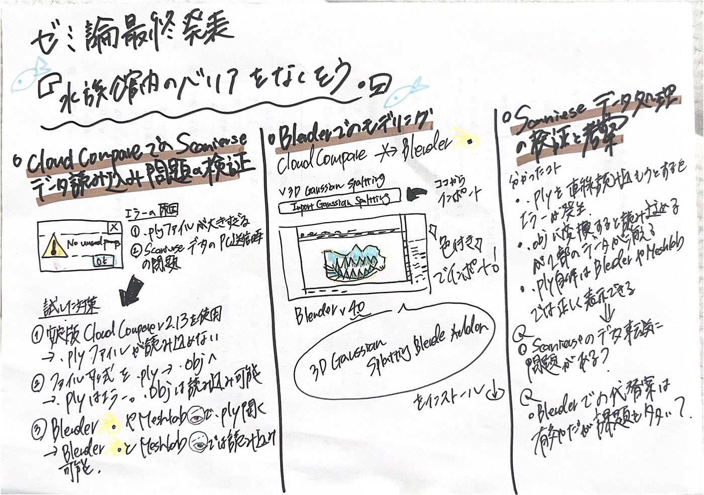

### データの扱い方に苦戦【ゼミ論最終発表】

こんにちは、3年の滝沢です。今回は約半年かけて作成させたゼミ論の最終発表について記事を書きます。

GitHubに挙げている[ゼミ論](https://github.com/furuhashilab/2024gsc_takizawamihiro-zemireport/blob/main/README.md)はこちらです。そして[発表資料](https://www.canva.com/design/DAGdyeQ7LrU/HjaBZiSrS3EebDMiUn_E5w/edit?utm_content=DAGdyeQ7LrU&utm_campaign=designshare&utm_medium=link2&utm_source=sharebutton)はこちらです。

> ゼミ論のテーマ

### 水族館内のバリアをなくそう。

「水族館の問題を3Dデータにより可視化し、その課題を解決する。」

青山学院大学 地球社会共生学部 地球社会共生学科

> Introduction

水族館の訪問者の減少、少子高齢化に伴い水族館の需要は年々低下していっている。また今後は、様々なバックグラウンドをもった人、異なる言語を話す人、自分とは異なるセクシュアリティをもっている人との交流が盛んになり、より多様性をより認め合う社会になるだろう。この現状を受け水族館が、障害を持つ方、高齢の方、外国の方、どなたでも楽しめる場所になって欲しいという思いから、水族館の３Dデータを用いて水族館の可視化することによってその課題を解決することを目指す。大の水族館好きな私が、この活動を通して水族館の魅力を伝えることができたらなお良い。

> Methods

Step1.水族館の屋外をScaniverseでスキャンし、３Dデータをとる。３Dデータを扱いやすくするため、使えそうにない部分のデータはトリミングして、なるべく100BM内に収められるようにする。

Step2.ScaniverseのデータをCloudCompareでマージ(結合)させる。

Step3.マージさせたデータをBlenderに移し調整する。

Step4.３Dモデルが完成したら、PLATEAUのデータCityGMLに変換し属性を付与する

> Results

#### 【CloudCompareでのScaniverseデータ読み込み問題の検証】

試したステップと結果 Step 1: 基本的な確認

- `.ply` ファイルの拡張子を確認し、正しく設定されていることを確認 → 問題なし Step 2: CloudCompareでのマージ時の問題

- ScaniverseのデータをCloudCompareにドラッグ＆ドロップ
→ エラーが表示され、データを移せない

試した対策

1. 安定版 CloudCompare v2.13 を使用

- 結果: v2.14 と同様に `.ply` ファイルが読み込めず、改善せず。

1. ファイル形式を `.obj` に変更

- 結果: `.ply` はエラーが出たが、`.obj` は読み込み可能。

- 問題点: `.obj` ファイルでは一部データが表示されない。

1. Blender や Meshlab で `.ply` を開く

- 結果: 両ソフトで `.ply` が正常に表示された。

- 考察: .ply ファイル自体には問題がない可能性が高い。

考えられる原因

1. CloudCompareで `.ply` のファイルサイズが大きすぎる可能性

- CloudCompare自体に ファイルサイズ制限はない が、10GB を超えると読み込みに時間がかかるとの情報あり。

- 大容量ファイルの処理が原因でエラーが出ている可能性がある。

1. ScaniverseデータのPC送信時の問題

- iPhoneからPCへ Slack / Google Drive 経由で送信

- 問題点: 7-Zip で開こうとするとデータが壊れている。

- 考察: 送信方法に問題があるのか、7-Zip に問題があるのか未確定。

これらの疑問を解決するため、.plyファイルをGitHubにアップロードし古橋先生にチェックしていただこうと思ったが、ファイルが25MBを超えていたためアップロードできなかった。ファイルを圧縮してアップロードするもファイルの中身がなく失敗してしまった。

#### 【Blenderでのモデリング】

CloudCompareの代替手段としてBlenderを使用 CloudCompareがうまく使えないため、ScaniverseのデータをBlenderに移行して処理を試みた。
単にデータのみを移すと、どのデータなのか判別が難しくなるため、色付きのままデータをBlenderに取り込む方法を検討した。

試した方法 参考記事: [https://jhviz.com/240726bl/](https://jhviz.com/240726bl/)

**手順**

1. 3D Gaussian Splatting Blender Addon をインストール

1. Blender 4.0 を開き、3D Gaussian Splatting のタブから `.ply` ファイルをインポート

- 注意: 最新バージョンではなく v4.0 を使用
→ このバージョンでしか色付きのデータを正しく取り込めない

失敗点

- 複数のデータを同時にインポートするとBlenderが重くなり、操作が鈍くなる

- 最新バージョンではないため、機能や性能が劣る

- ファイルの大きさに関係なく、一部の `.ply` ファイルが読み込めなかった

成功点

- 色付きで出力できるため、どのデータがどのデータなのか判別しやすい

今後の課題

- Blenderのパフォーマンス向上のため、データを分割して読み込む

- 最新バージョンで色付きデータを扱える方法を模索

- `.ply` の読み込みに失敗する原因を特定し、別の形式でのインポートも検討

> Discussion

#### CloudCompareとBlenderを用いたScaniverseデータ処理の検証と考察

この研究で分かったこと 1. CloudCompareは `.ply` ファイルの処理に適していない可能性がある CloudCompareを用いた `.ply` データのマージを試みたが、以下の問題が発生した。

- `.ply` を直接読み込もうとするとエラーが発生し、データを扱えない。

- `.obj` に変換すると読み込めるが、一部のデータが消失する。

- `.ply` 自体は Blender や Meshlab では正しく表示できるため、ファイルの破損ではないと考えられる。

このことから、CloudCompareは 特定の `.ply` の仕様（特にScaniverseが出力するもの）に適合していない可能性が高い。また、ファイルサイズの影響で読み込みが不安定になる可能性も考えられる。

#### Scaniverseのデータ転送に問題がある可能性

- iPhoneからPCへ Slack や Google Drive で送信した際、データが破損することがあった。

- 7-Zip で解凍しようとするとエラーが発生し、データを開けない場合があった。

- 一部の `.ply` ファイルはサイズに関係なくCloudCompareで開けなかった。

これらの問題から、ファイル転送の過程でデータが破損する可能性があると推測される。
特に `.ply` はバイナリデータであるため、転送時の圧縮やファイル管理の影響を受けやすいのではないか。

#### Blenderでの代替案は有効だが課題も多い

- `3D Gaussian Splatting Blender Addon` を使用することで、色付きの `.ply` データを正しく表示できた。

- ただし、最新バージョンのBlenderでは動作しないため、v4.0 を使用する必要があった。

- 複数のデータをインポートするとBlenderが重くなり、操作が遅延する問題が発生。

- 一部の `.ply` ファイルはサイズに関係なく読み込めなかった。

このことから、Blenderでの処理は有効だが、以下のような対策が必要になる。

- 最新のBlenderでも動作する `.ply` 読み込み手法の検討。

- データを小さく分割して処理する手順の確立。

- より軽量なレンダリング方法の導入（例：LODの最適化、メッシュリダクション）。

#### 議論したポイント

1. CloudCompareが `.ply` を正しく処理できないのはなぜか？

- Scaniverseが出力する `.ply` のフォーマットに何らかの違いがあるのではないか？

- CloudCompareの `.ply` インポート機能に制限があるのではないか？

- 大容量ファイルの読み込み時のメモリ制約が関係しているのではないか？

2．データ転送時の破損を防ぐには？

- iPhoneからの直接転送（AirDrop や USB経由）がより安定するのでは？

- Google Drive のダウンロード方法を変更する（ZIPでなく `.tar.gz` を試す）。

- 転送後にファイルの整合性チェックを行う（ハッシュ値比較など）。

3．Blenderを使った処理の最適化

- 色付き `.ply` を正しく扱える方法を探る（最新バージョンでの対応）。

- データを分割して軽量化し、負荷を軽減する手法を確立。

- 別のツールを用いた `.ply` → `.gltf` 変換を試す。

> Conclusions

#### 結論と今後の方針

- CloudCompareは `.ply` データの処理に適していない可能性があるため、Blenderを中心に作業を進めるのが現実的。

- `.ply` の取り扱いを改善するために、ファイル転送方法の見直しが必要。

- Scaniverseでスキャンするときに、なるべく小さいデータを取得する

- データの分割・トリミングを複数回行い、不要な部分を削減。

・CloudCompareやBlenderへの出力の改善を行う。

- 今年の3月からトルコに1年間滞在するため、このゼミ論を継続的に進めることは難しい可能性がある。

- トルコでは現地のマッパーと協力し、さまざまな活動を行う予定。

- その中で新たに興味を持つテーマがあれば、卒論の内容を変更することも検討する。

