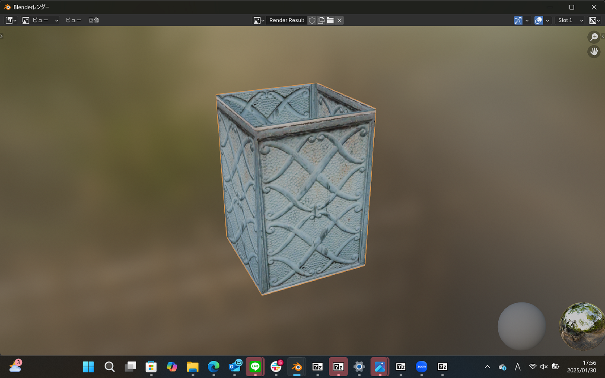
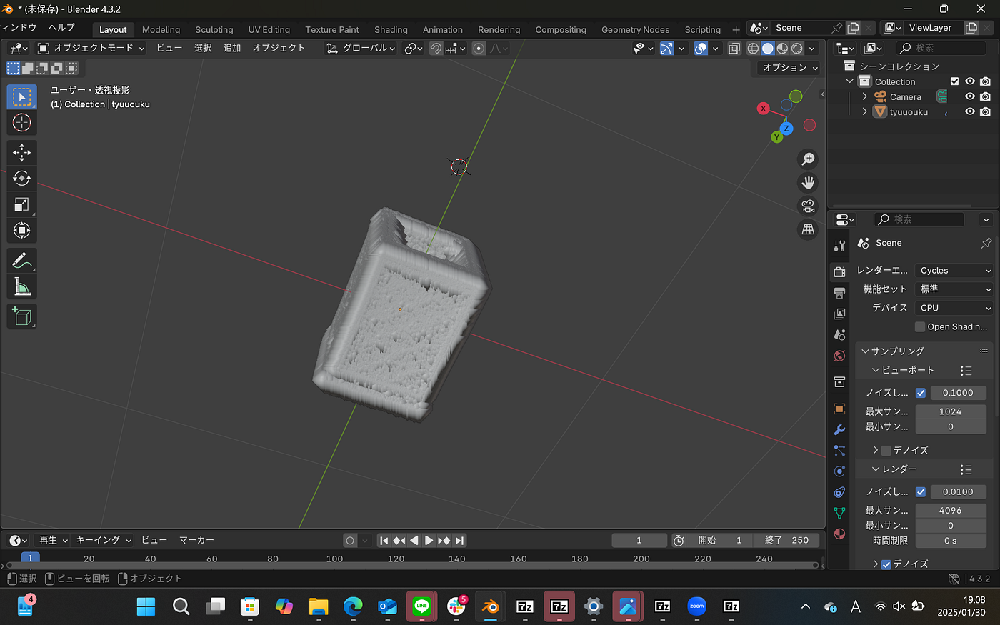
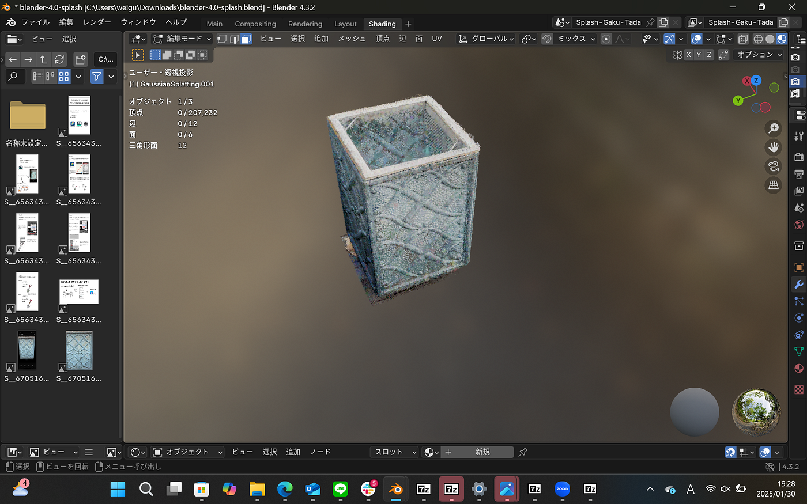
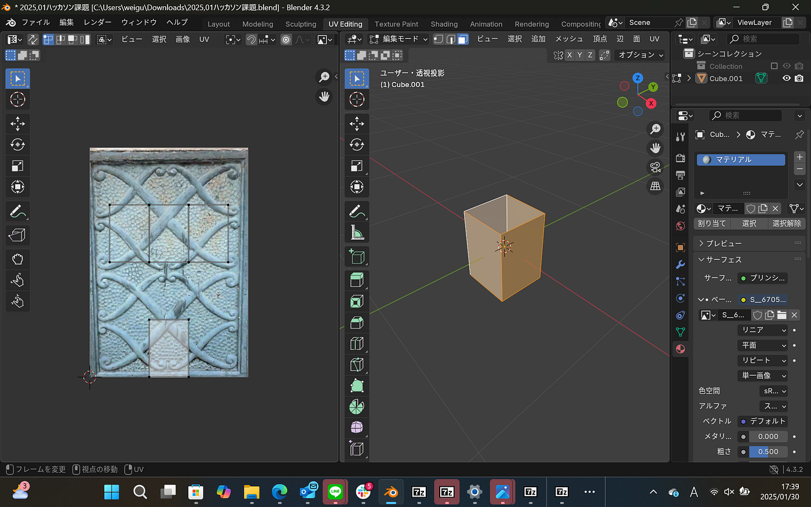
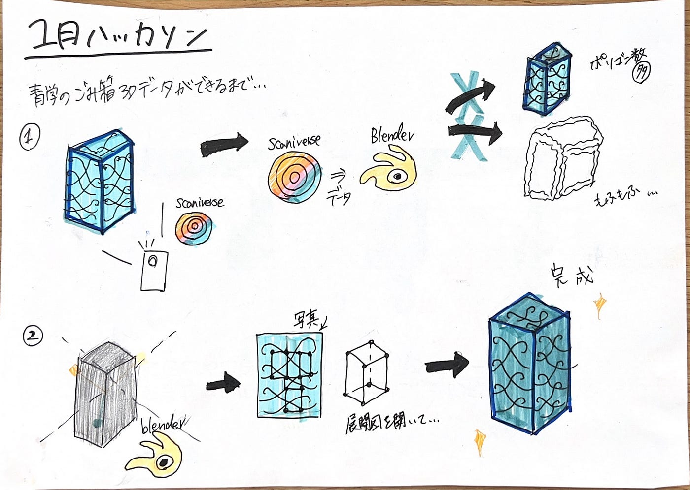

### 試行錯誤を重ねたごみ箱【1月ハッカソン】

こんにちは、３年の滝沢です！今回は2025年2月1日(土)に行われる1月のハッカソンについて記事を書きます。

今回のハッカソンのテーマは、「Blenderを用いて青山学院大学のキャンパス3Dデータ を充実させるために、青学キャンパス内の3Dアセットデータを１つ作成する」というものです。

#### １成果物

今回はキャンパス内のごみ箱を作成してみました。成果物について[GitHub](https://github.com/furuhashilab/blenderhackathon2025jan/tree/main/data/MihiroTakizawa)に保管してあるのでぜひご覧ください。

#### **２成果物を作った過程**

①scaniverseの活用

初め私は、ごみ箱を[scaniverse](https://scaniverse.com/scan/jbjoid2bswkotwqh)で記録しそれをBlenderに落とし込みモデリングをしようと考えていました。しかし実際にscaniverseからモデリングディ用とすると、ポリゴン数が多くてもふもふ(？)のごみ箱ができてしまいました…(以下写真)

見ての通り、これは見た目がごみ箱でもなんでもなさそうなのでscaniverseのデータは諦めて1からモデリングすることに決めました…ごみ箱の大きさは、scaniverseからのデータを参考に縦(1.285)と横(885)の比率をそれそれ考えて作りました。

②色付きごみ箱を作りたい

また、scaniverseから色付きのままでデータを移せないかと考えました。そして試行錯誤し、[この記事を参考に、](https://jhviz.com/240726bl/)Blenderの最新バージョン(4.32)ではなくBlender4.0なら色付きのままでデータを移せることが分かりました。以下の写真のように、本当にリアルなごみ箱を作成することができました。今回はポリゴン数に制限があるので、この3Dモデルは却下(泣)

③他の方法でごみ箱に色を付けたい

色付きのリアルなごみ箱を成果物として提出できないのは悔しい…とのことでほかの方法でごみ箱に色を付けたい！！そこで、ごみ箱の写真を各面に張り付けたらどうか？と考えました。下の写真のように、[こちらのYouTubeを参考にし](https://www.youtube.com/watch?si=h8to-oUcDuteReC6&v=3e7M7YsEKeU&feature=youtu.be)、ごみ箱の展開図に写真を面ごとに張り付けていきました。

↓

#### ３Blenderを使ってみての感想

どのようにしたらよりリアルなごみ箱を作成できるのか、scaniverseのデータからモデリングしようとしたり…色付きのままデータを移そうとしたり…でもポリゴン数が多いから他の方法を考えたり…そしたら写真を張り付けるという斬新な方法に行きついて…と個人的にこの成果物を作成するのにとても試行錯誤したなあという感想です。１つ１つの過程がうまくいかず苦戦し、多くの時間を労力を費やしました。しかしこの過程は、私の「水族館の３Dデータを作る」というゼミ論に関係しているのでとてもいい経験となりました。Blenderは１度授業で触ったことがありますが、使い方を既に忘れていてほぼ０の知識からBlenderを使った感じでした。それにしては、ここまでよく作れたなとは思います…

