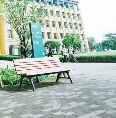
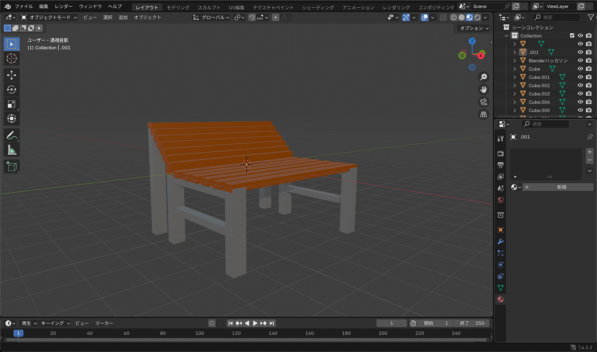
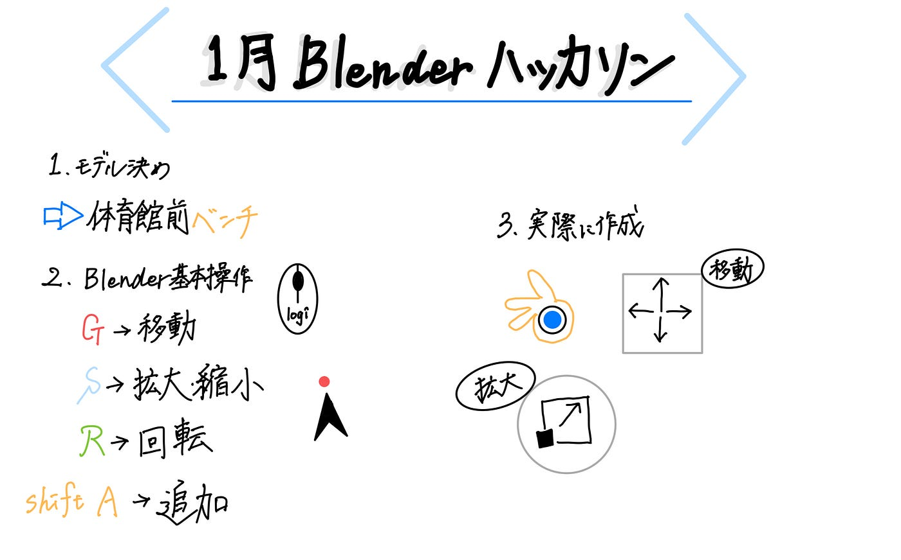

### 【１月ハッカソン】Blender初心者の苦戦と格闘の記録

こんにちは、3年の古内千聖です。

1月のハッカソン成果物を報告します。

**モデルとしたアセット**

青山学院大学相模原キャンパス内に点在するベンチです。

**参考にしたもの**

[3DCGソフト「Blender」の使い方！インストール方法から初心者向けに解説](https://udemy.benesse.co.jp/design/3d/blender.html)

[【初心者向け】世界一やさしいBlender入門！使い方＆導入〜画像作成までを徹底解説【最新版対応】](https://www.youtube.com/watch?v=S6aAvxUx2ko&t=2228s)

[Blender3 超入門⑯【マテリアルの超基本！色を付けよう！】](https://www.youtube.com/watch?v=SRqWhE7oyRo&list=PLVPonnbjWCTTnccbFjKK_tBBpkQCOwU0B&index=17)

**作成した成果物**

以下に5種類のファイルをまとめました。

[blenderhackathon2025jan/data/ChisatoFuruuchi at main · furuhashilab/blenderhackathon2025jan
Blenderハッカソン2025 成果物置き場. Contribute to furuhashilab/blenderhackathon2025jan development by creating an account on…github.com](https://github.com/furuhashilab/blenderhackathon2025jan/tree/main/data/ChisatoFuruuchi)

完成した成果物は以下の画像の通りです。

**感想**

とにかく何もかもが初めてで、動画やサイトを見ながら手探りでなんとか形にしました。

作業を進めるうちに、だんだんショートカットキーを覚えて、後半は作業効率が上がっていっていることを実感することができました。

もっと時間をかければかけるほど、完成度の高いものを作成することができるように思います。

**グラレコ**

