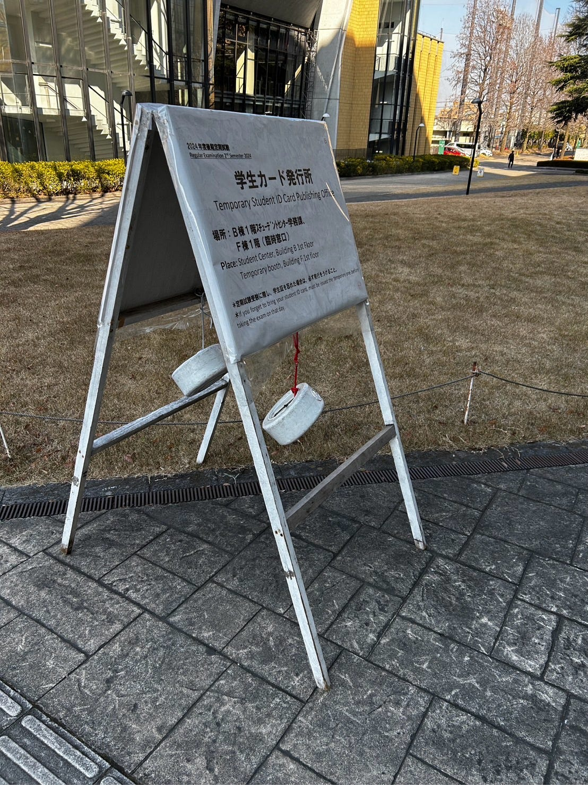
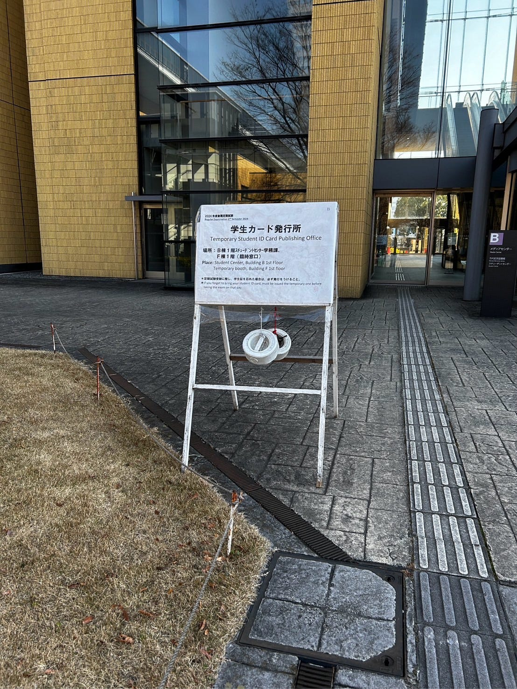

## 1月　Blenderハッカソン

3年の金澤です。

初めてのBlender、本当に大変でした。

研究室の仲間に手伝ってもらい、頑張って作成しました！

今回はこちらの看板を作りました。

成果物はこちらです。

[GitHub - furuhashilab/blenderhackathon2025jan: Blenderハッカソン2025 成果物置き場
Blenderハッカソン2025 成果物置き場. Contribute to furuhashilab/blenderhackathon2025jan development by creating an account on…github.com](https://github.com/furuhashilab/blenderhackathon2025jan)

Blenderの基本操作に慣れていないこと、キーを覚えないのでぐだぐだだったこと、木のテクスチャーを作りたかったけど、今の実力では無理でした💦
