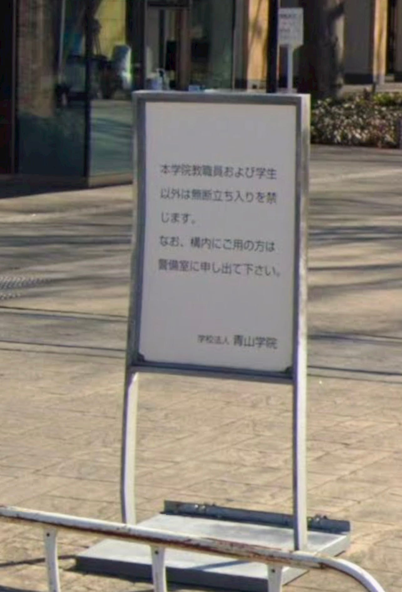
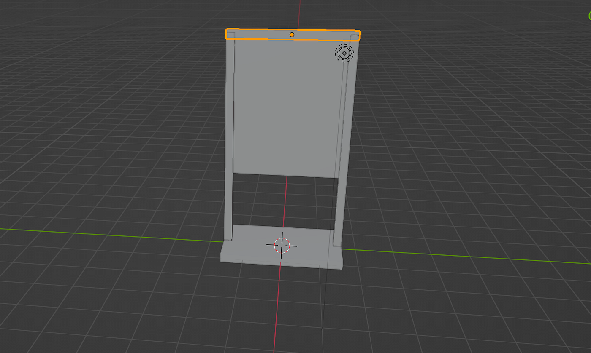

### Blender 1月ハッカソン

こんにちは！

3年の林です。

1月のハッカソンはBlenderを用いて、青山学院大学のオブジェクトを何か1つ作るというものでした。

私は、その中で、相模原キャンパスの看板を選びました！

看板と言っても、キャンパス内には沢山看板があるので、その中で、キャンパスの入り口、正門付近にある、看板を選びました。

選んだ看板はこちらです。

こちらのオブジェクトをBlenderで作っていきます！

作成は、YouTubeなどで動画を探して、それらを参考にして作ってみました。

完成したものは、こちらになります。

作成していて、難しかったところは、オブジェクトの柱を左右対称にすることでした。

Blenderは初めてではなかったため、そこまで難しくはなかったのですが、久しぶりに触ったため、操作方法を忘れているものが多かったです。

Blenderで何かを作るのが楽しかったので、今後も趣味程度で作っていきたいです。
