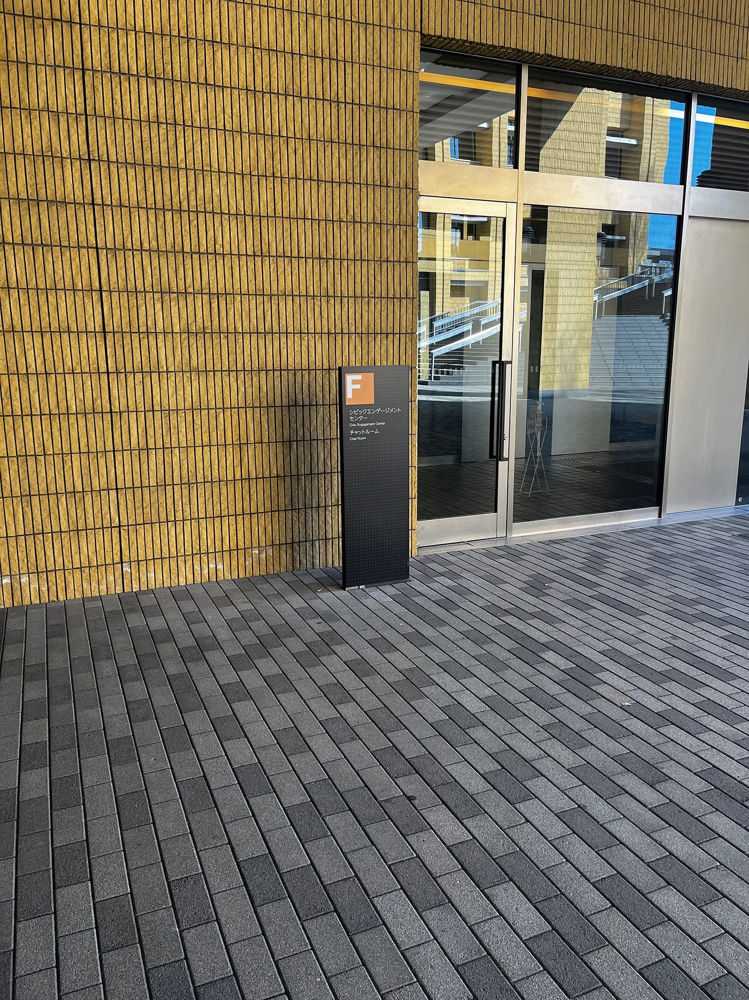
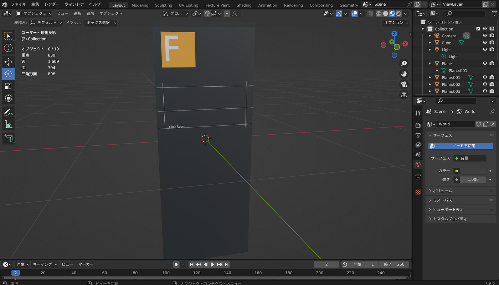
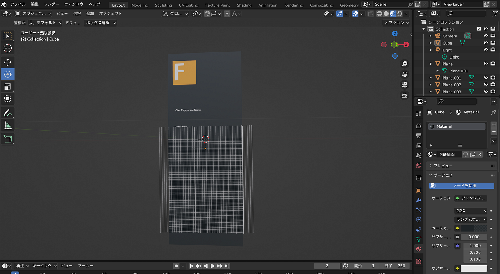

### Blenderハッカソン

3年の高井です。

1月に行われたBlenderハッカソンの報告をします。
私が作成したのは、F棟の前にある看板です。

こちらを再現しました。

今回、初めてBlenderを利用したので、YouTubeの初心者向けの動画を参考にダウンロードから行いました。

こちらの動画を参考にしました。
ダウンロードからオブジェクト作成まで丁寧に解説されていてわかりやすかったです。

この動画を参考に作成したものがこちらです。

Blederで日本語の追加ができなかったので、英語のみ追加しました。

また、Civic Engagement Centerを打ち込むとポリゴン数がオーバーしてしまったので、Chat Roomのみ打ち込みました。

また看板の格子柄を再現したかったので、それについて調べて見たところ、[こちらのサイト](https://shuzo-kino.hateblo.jp/entry/2018/01/21/235006)に記載されている「配列複製」を探して見たのですが、見つけることができませんでした。

なので、平面のオブジェクトを直線にして、それを複製していったのですが、見た目がごちゃごちゃになってしまいました。

なのでこれはなくして、上の英語のみ表記しました。

難しかったですが、Fの表記などは再現できたと思います。

データは[こちら](https://github.com/furuhashilab/blenderhackathon2025jan/tree/main/data/KentaroTakai)に格納しました。
