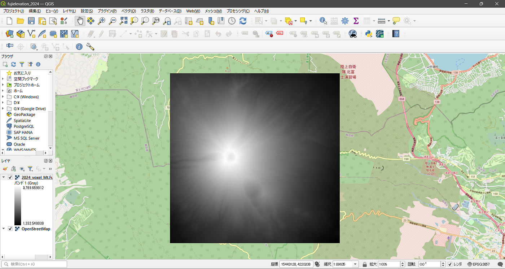
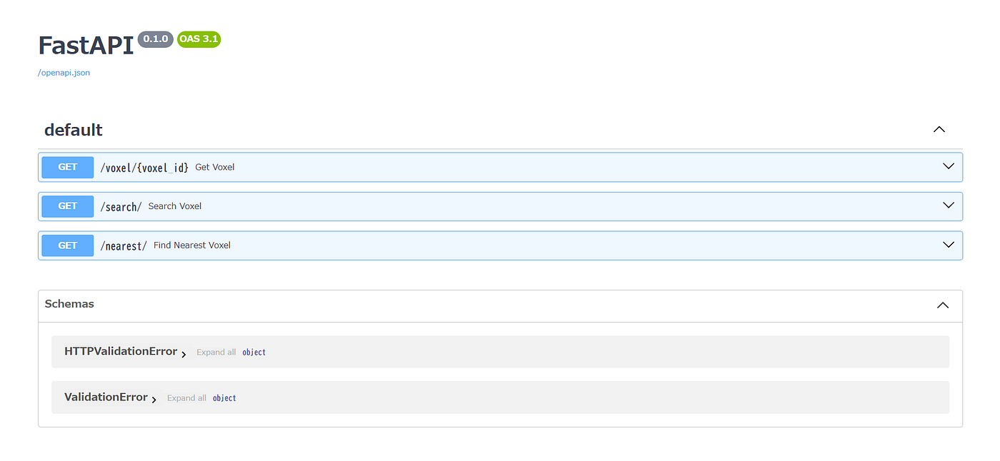

### voxel data_satoakiゼミ論最終発表

こんにちは、3年佐藤愛妃です。

### ラズパイ連携を視野に入れた ボクセルデータ処理と API 開発の手順

以下はGitHubのリポジトリです！こちらの方が詳しい情報載ってます！

[https://github.com/furuhashilab/2024GSC_SatoAki/blob/main/README.md](https://github.com/furuhashilab/2024GSC_SatoAki/blob/main/README.md)

### 1. はじめに

今回は **3Dボクセルデータの生成**、**ハッシュ値を用いたID付与**、**検索APIの開発** を行い、最終的に **Raspberry Pi（ラズパイ）での活用** も視野に入れたシステムを構築しました。本記事では、作業手順を振り返りながら、具体的な技術や今後の展望を整理します。

### 2. ボクセルデータの作成

### 2.1 標高データの取得

- **使用データ**: `ElevationTile4JP`（ズームレベル14）

- **変換**: `GDAL` を用いて標高データ (`GeoTIFF`) を取得し、ピクセルサイズを `5m` に補正

```css
gdalwarp -tr 5 5 -r bilinear input.tiff output_5m.tiff
```



### 2.2 ボクセルデータの生成

- `250m × 250m × 250m` のボクセル単位で標高データを区切り、**3Dのボクセル化**

- Z値（標高）を考慮しながら `numpy` を用いて `x, y, z` の分割を計算

```javascript
import numpy as np
```

```
voxel_size = 250
x_range = np.arange(0, x_length, voxel_size)
y_range = np.arange(0, y_length, voxel_size)
z_range = np.arange(min_elevation, max_elevation + voxel_size, voxel_size)
```

```
voxel_data = [(x, y, z, voxel_size) for x in x_range for y in y_range for z in z_range]
```

### 3. ハッシュ値を用いたユニークIDの付与

- `X, Y, Z` に対して `MD5 ハッシュ` を生成し、**冗長性を考慮した5桁の識別子** を付与

```cpp
import hashlib
```

```
def generate_voxel_id(x, y, z):
    hash_part = hashlib.md5(f"{x}_{y}_{z}".encode()).hexdigest()[:5]
    return f"{x}_{y}_{z}_{hash_part}"
```

- これにより、各ボクセルにユニークなIDを持たせ、検索やデータ管理が容易に

### 4. データの出力と可視化

### 4.1 GeoJSON 形式で出力

`GeoJSON` 形式で出力し、**QGISでの可視化** を可能に

```cpp
import json
```

```
geojson_data = {"type": "FeatureCollection", "features": []}
for x, y, z, size in voxel_data:
    voxel_id = generate_voxel_id(x, y, z)
    geojson_data["features"].append({
        "type": "Feature",
        "properties": {"Voxel_ID": voxel_id, "X": x, "Y": y, "Z": z, "Size": size},
        "geometry": {"type": "Point", "coordinates": [x, y, z]}
    })
```

```
with open("3d_voxel_data_with_id.geojson", "w") as f:
    json.dump(geojson_data, f, indent=4)
```

### 5. API を用いたボクセル検索

### 5.1 FastAPI でローカル検索APIを構築

- `FastAPI` を使用して **ボクセルID や X, Y, Z を基にデータを検索できるAPI** を作成

```javascript
from fastapi import FastAPI
import json
```

```
app = FastAPI()
```

```
with open("voxel_dict.ver2.json", "r", encoding="utf-8") as f:
    voxel_dict = json.load(f)
```

```
@app.get("/voxel/{voxel_id}")
def get_voxel(voxel_id: str):
    return voxel_dict.get(voxel_id, {"error": "Voxel ID not found"})
```

```
@app.get("/search/")
def search_voxel(x: int, y: int, z: float):
    for voxel_id, data in voxel_dict.items():
        if data["X"] == x and data["Y"] == y and data["Z"] == z:
            return {"Voxel_ID": voxel_id, "Data": data}
    return {"error": "No matching voxel found"}
```

- API起動

```lua
uvicorn voxel_api:app --reload
```

- `http://127.0.0.1:8000/docs` にアクセスすると、APIドキュメントを確認可能



### 6. 成果物の整理

`3d_voxel_data_with_id.geojson`:ボクセルID付きの3Dデータ、**QGISでの可視化**

`voxel_dict.ver2.json` :ハッシュID付きのボクセル辞書データ **API検索用（FastAPI）**

`voxel_api.py` :FastAPIのスクリプト **ボクセル検索API**

### 7. 今後の展望

- **ラズパイと 連携**し、ボクセル生成

### 8. まとめ

今回のプロジェクトでは、標高データを基に3Dボクセルを作成し、FastAPIを用いて検索可能なシステムを構築しました。今後はラズパイとの連携や、より高度な可視化・データ管理の仕組みを整えていきます。

**GitHub もみてください。**
