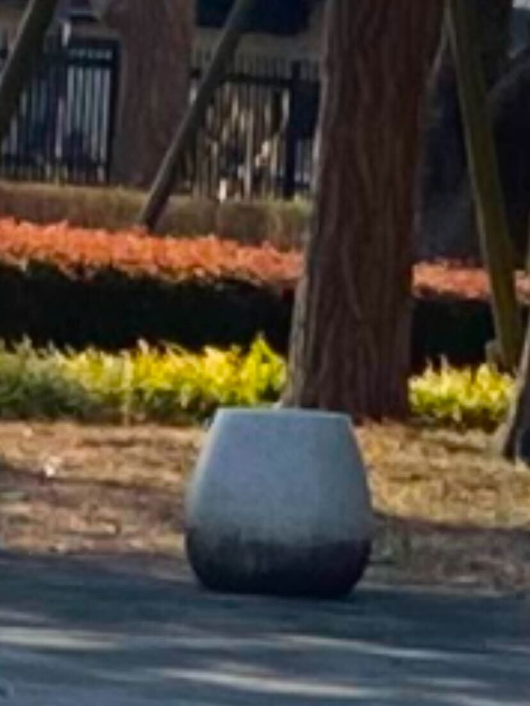
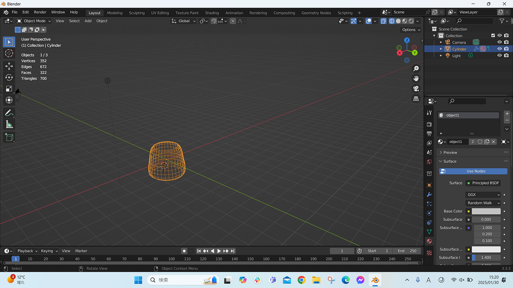
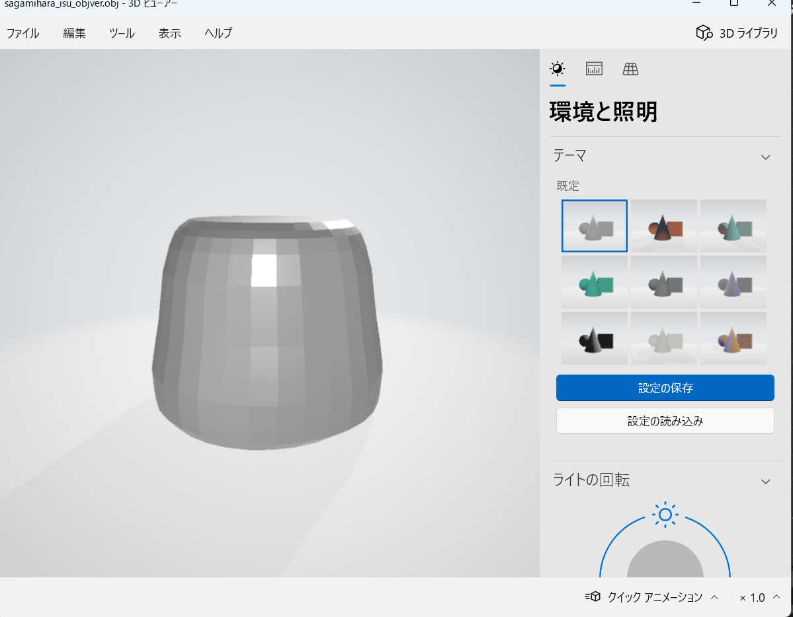
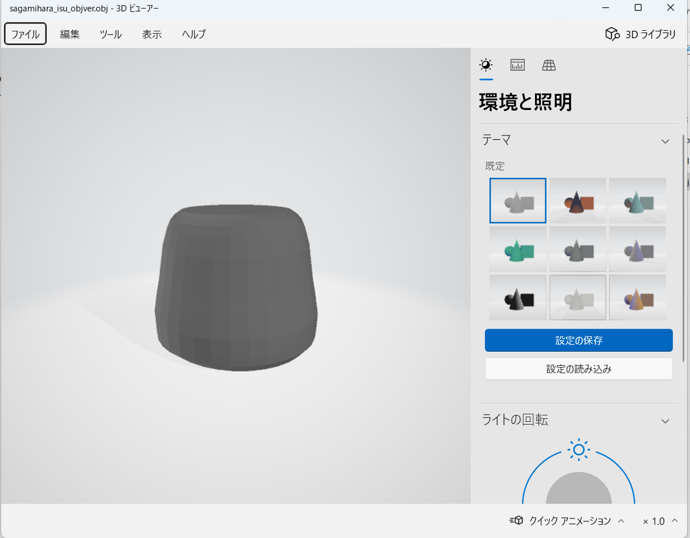
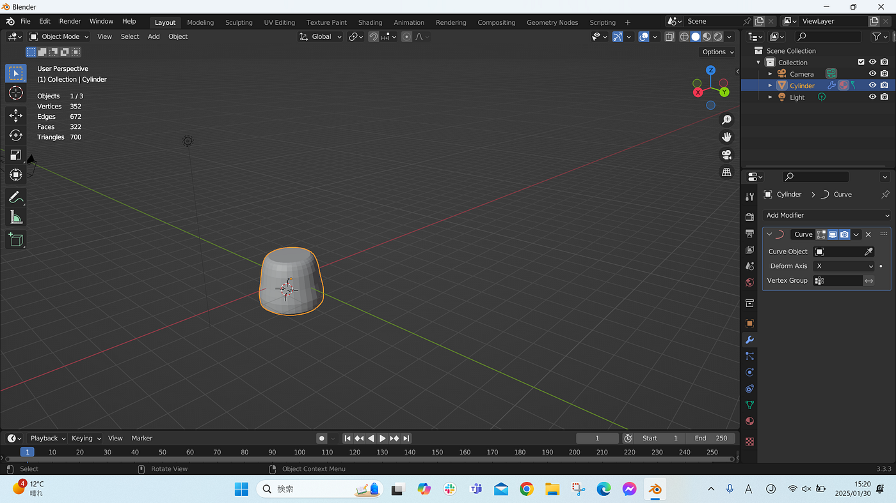

### あのトラウマが帰ってきた…

こんにちは！4年の上原です。ついにゼミ最後のハッカソンになってしまいました。その成果について報告します。

1月のハッカソンは、Blender ハッカソンでした。3年次の5月にドローンのモデリングをBlenderで行うハッカソンがあったのですが、センス皆無で大変苦戦したことが思い出され、とても辛かったです。

私が選んだ地物は、相模原キャンパスのバスケットコート近くにある石のスツールです（キャンパスに行ける時間が取れず、映り込んでいた写真を拡大したため粗くなっています）。

### 作業log

①Cylinderを選択

②ループカットで細分化（輪切り）

③上部と下部をライン選択し、スケールで丸みをつける

④逆つぼ型に形を整える

⑤色をつける

完成したファイルは各種[GitHub](https://github.com/furuhashilab/blenderhackathon2025jan/tree/main/data/ShioriUehara)にアップロードしています。

ポリゴン数も700におさえることができました。

モデリングの技術を進歩させることができたのは、[空間情報の表現技術](https://syllabus.aoyama.ac.jp/shousai_view2.aspx?YR=2020&FN=4611A10-0096)の授業と友達の助けのおかげです。ありがとうございました。空間情報の表現技術の授業はBlenderについてがっつりと基礎から学べるのでおすすめです！

### おまけ~Before & After~

