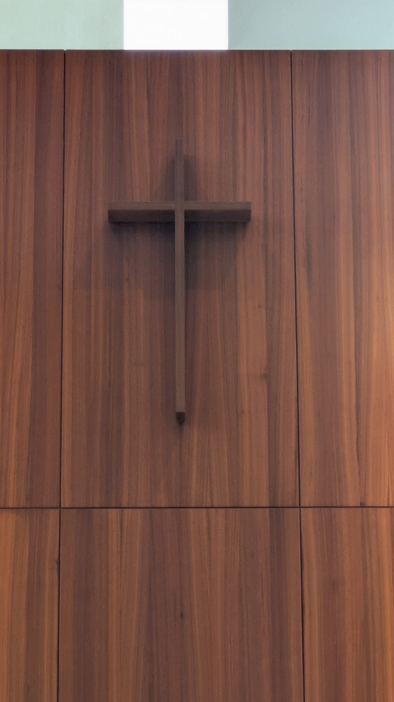
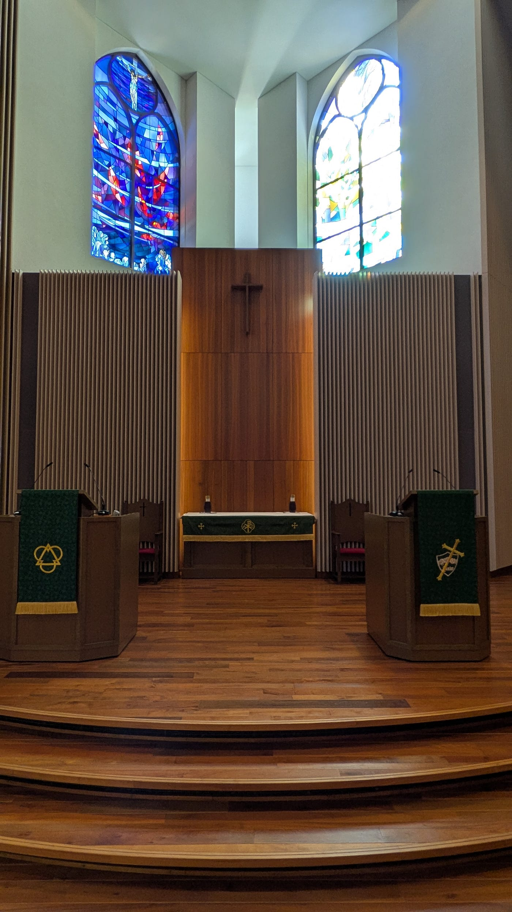
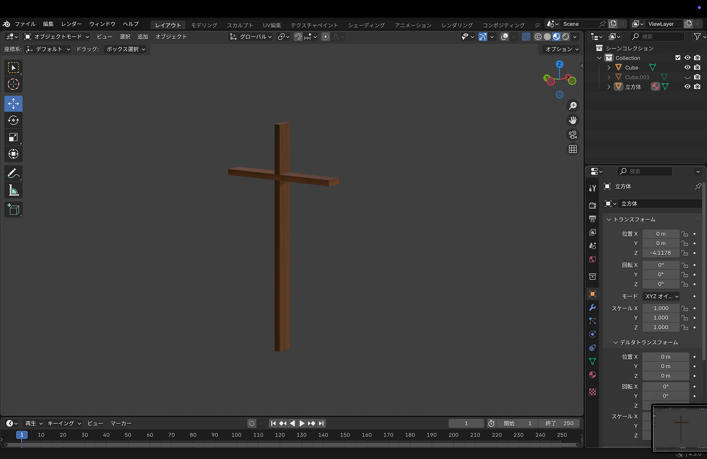
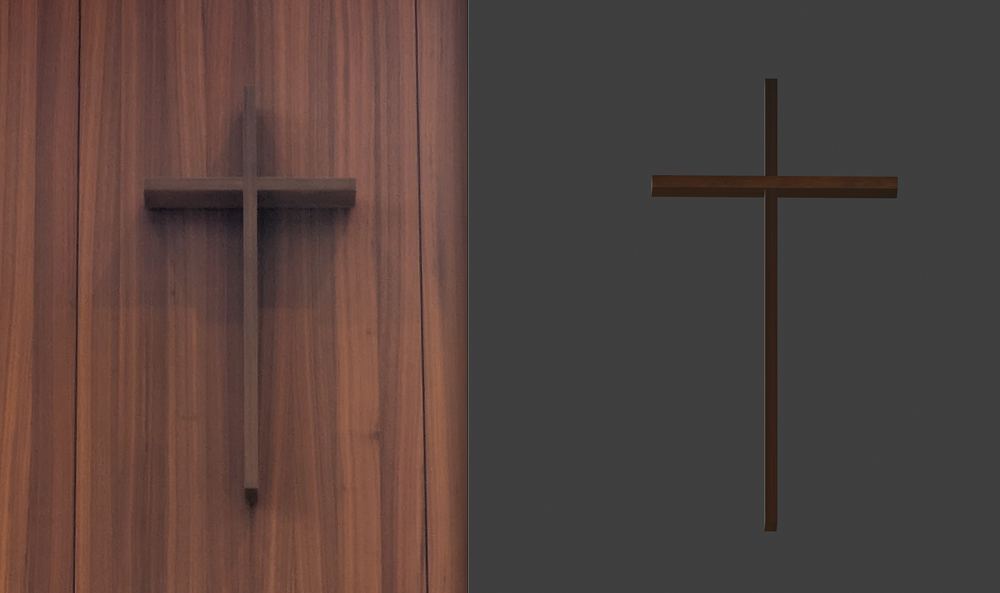
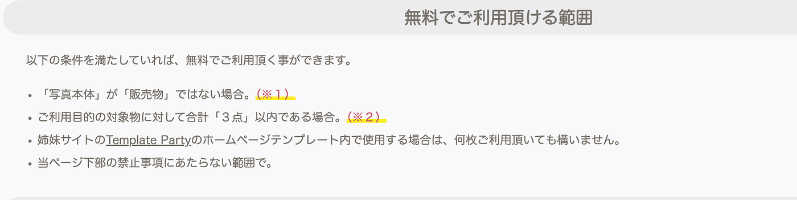

### さがキャンのチャペルにある十字架を3Dモデリングしました

お疲れ様です。深水です。

1月のハッカソンでは、Blenderを使って３Dモデリングを行いました。

青学構内のオブジェクトを１つ選んでモデリングすることが今回の課題でした。

そこで僕が選んだオブジェクトがこちらです。

相模原キャンパスのチャペル内に飾られている十字架です。

食堂の柱にするか悩んだのですが、十字架の方が簡単そうだったので十字架にしました。

完成したものがこちらです。

データは[こちら](https://github.com/furuhashilab/blenderhackathon2025jan/tree/main/data/Tomoki%20Fukamizu)

こだわったポイントとしては、

・十字架の比率（定規で測った）

・テクスチャを似せた

の２つです。

テクスチャは[こちら](https://photo-chips.com/)からダウンロードしました。

以上です。
