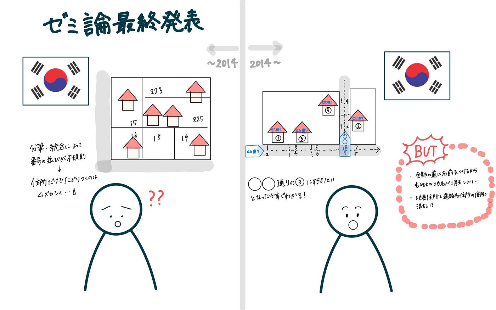

## ゼミ論最終発表

こんにちは！3年の末木です！

ついにゼミ論最終発表となりました…！

私のゼミ論のテーマは【韓国における住所体系の変化に伴う現状と課題】で、研究を進めてきました。

ゼミ論のGitHubはこちらです。主な内容はこちらのREADME.mdをご覧ください。

[GitHub - furuhashilab/2024gsc_RikoSueki
Contribute to furuhashilab/2024gsc_RikoSueki development by creating an account on GitHub.github.com](https://github.com/furuhashilab/2024gsc_RikoSueki)

#### 韓国の住所体系改革：道路名住所制度の現状と課題

韓国では2011年に道路名住所制度（도로명주소제도）が導入され、それまで使われていた地番住所（지번주소）から大きく変わりました。新制度は「道路名＋建物番号」を使うことで、行政効率化や緊急対応の迅速化を目指しています。しかし、10年以上経った今でも多くの住民が旧住所を使い続けているのが現状です。

#### なぜ新制度が定着しないのか？

1.	住民の適応の遅れ

•	認知度は58.2%あるが、実際に使っているのは18.8%のみ。

•	高齢者や地方住民にとって、旧住所のほうが馴染みやすい。

2.	文化的・社会的影響

•	伝統的な地名が消え、地域のアイデンティティが薄れる。

•	観光地では新旧住所のズレで混乱が発生。

3.	地域間格差

•	都市部では普及が進むが、地方では建物番号の整備が遅れ、定着が進んでいない。

#### 今後の課題と対策

- 住民向けの広報活動を強化（特に高齢者向けの周知が必要）

- 地域の文化を尊重した制度設計（伝統地名を活かす工夫）

- 行政のサポートを強化し、地方にも普及させる

#### 日本への示唆

韓国の事例は、日本の住所改革にも役立つポイントが多いです。特に、災害時の迅速な対応や外国人向けの住所のわかりやすさを考えると、住所体系の見直しは今後の課題になりそうです。

韓国の道路名住所制度は、メリットも多い一方で、住民の適応や文化的影響を考えた柔軟な運用が求められています。今後どのように改善されるのか、注目したいですね。

発表用のスライドは以下の通りです。

