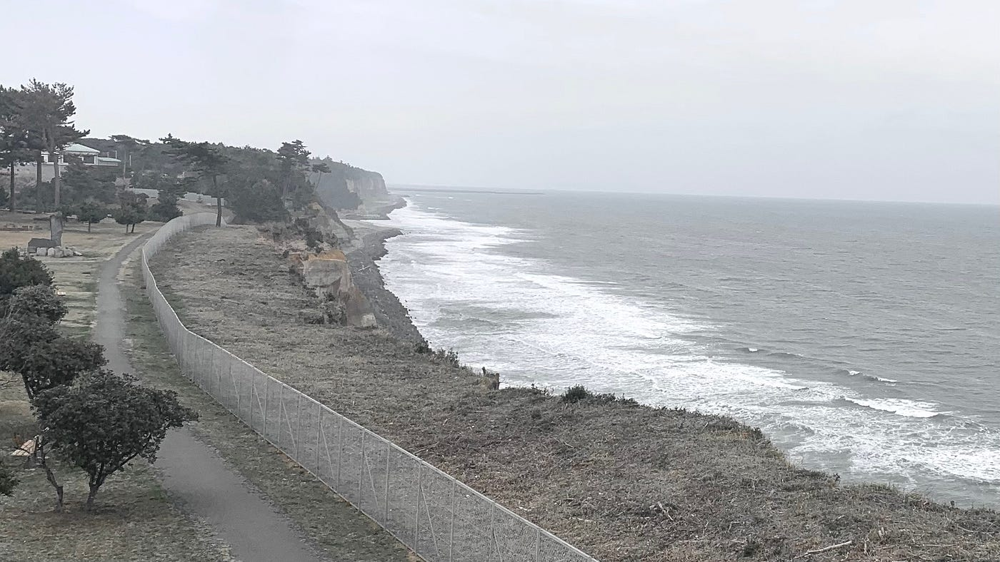

### 【ゼミ論最終発表】双葉郡楢葉町のデジタル災害アーカイブ作成

### Re:Earth を活用した楢葉町の震災アーカイブ構築

### 1. Introduction

2011年3月11日に発生した東日本大震災は、地震、津波、福島第一原子力発電所事故という複合災害を引き起こしました。福島県双葉郡楢葉町は甚大な被害を受け、多くの住民が避難を余儀なくされました。震災から13年が経過した現在、震災の記憶の風化が進んでいます。

当時小学生だった私たちは、自らの経験を語れる最後の世代であり、震災の記録を次世代へ伝える責任があります。本研究では、震災の記憶を残し、防災意識を高めるために「Re:Earth」を活用したデジタルアーカイブの構築を目指します。

### 2. Methods

本研究では、震災アーカイブの先行事例を調査し、それを基に楢葉町に特化したアーカイブを作成する方法を採用しました。

#### 2.1 先行研究の調査

震災の記録を残すための先行研究として、「ヒロシマ・アーカイブ」「ナガサキ・アーカイブ」「東日本大震災アーカイブ」などを分析しました。これらのアーカイブは以下の特徴を持っています。

- **地図上での可視化**：証言や写真、映像を地理情報と結びつけて表示。

- **マルチメディア統合**：テキスト、写真、動画、音声を活用。

- **市民参加型の仕組み**：被災者や関係者が証言や資料を提供し、情報を更新。

- **多言語対応**：国際的な発信を視野に入れた多言語化。

- **教育・防災への活用**：学校や研究機関での教材としての利用。

#### 2.2 楢葉町のデータ収集

楢葉町の震災アーカイブの構築にあたり、以下の方法で情報を収集します。

- 楢葉町出身の友人へのインタビュー

- ならはCANvasへの取材協力

- 震災後の復興状況の調査

### 3. Results

#### 3.1 現在の楢葉町アーカイブの課題

現在の東日本大震災アーカイブでは、楢葉町に関する記録が10名分しかなく、情報が2012年の朝日新聞社提供のものに限られています。そのため、以下の改善が必要です。

#### 3.2 改善策

- 震災後の復興状況や住民の最新の声を追加。

- 被災者のインタビューを収録。

- **動画の活用**：インタビュー動画を収録し、より感情や背景を伝える。

- **リンクの追加**：関連する新聞記事や研究論文、支援団体のウェブサイトを掲載。

### 4. Discussion

楢葉町の震災アーカイブをより充実させるためには、以下の点が重要です。

- インタビューの継続的な実施

- 震災遺構のデジタル化

- 地域住民の参加促進

本研究を通じて、震災の記録を風化させず、次世代に伝えるための具体的な方法が明らかになりました。

### 5. Conclusion

震災の記憶を次世代に伝えることは、防災意識を高めるだけでなく、地域の歴史を守る重要な取り組みです。Re:Earthを活用することで、楢葉町の震災アーカイブを持続的に発信し、記憶を風化させない仕組みを構築していきます。

