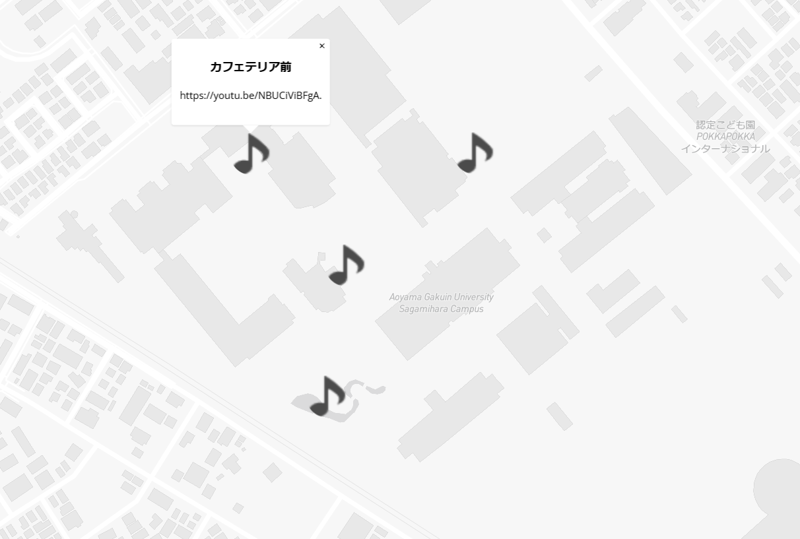
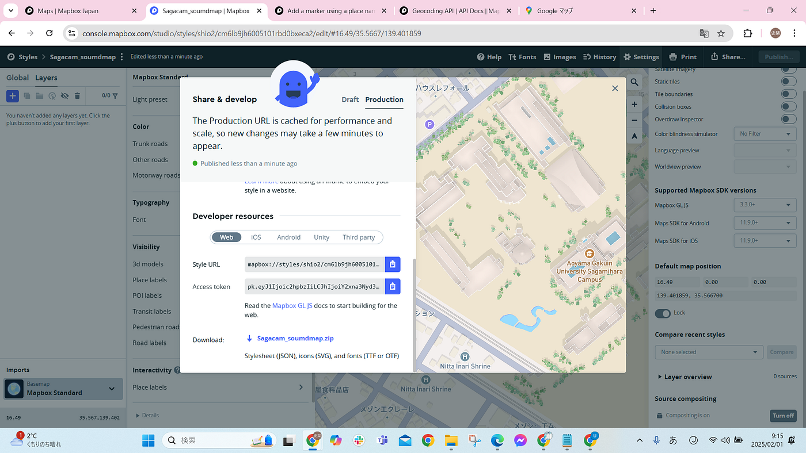
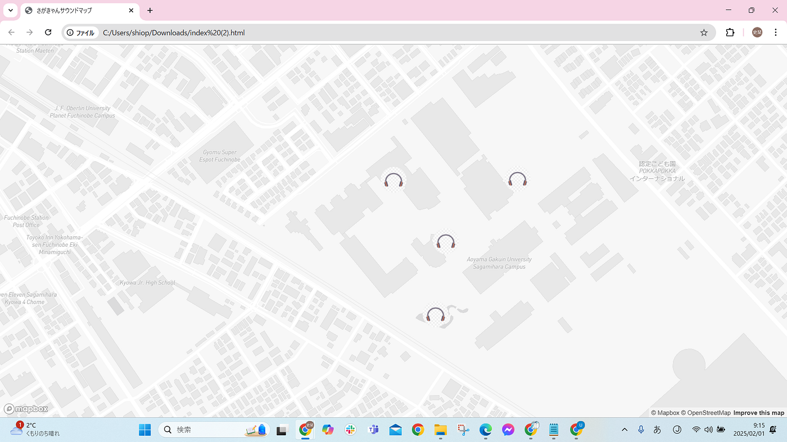

### 【卒論最終発表】都市空間における環境音のデジタルアーカイブ手法の検討ー相模原キャンパスを例にして

こんにちは！4年の上原です。卒論についての最終発表を行います。[GitHub](https://github.com/furuhashilab/2024gsc_ShioriUehara)にも同じ内容がまとまっていますのでよろしければそちらもご覧ください。

### Abstract

この研究は、都市空間のサウンドスケープを作成し、その特徴と影響を分析することを目的としている。都市空間の事例として、青山学院大学相模原キャンパスを取り上げ、キャンパス内の主要エリア（カフェテリア前、チャペル前、ガーデン、スタジアム前）において、iPhoneの「ボイスメモ」アプリを使って、音環境を記録した。その成果について、Mapbox 社から発表されている、相模原キャンパスの地図に落とし込む。 次章から研究内容についてIMRAD形式で論じていく。「Introduction」では、「サイバーフォレスト」の取り組みを中心に先行研究について紹介し、「Methods」では使用する地図やMODの紹介とともに研究の進行方向を示す。「Results」と「Discussion」では、キャンパス内を観測して得た知見についてまとめ、今後の展望や課題についてまとめている。

### Introduction

人間が生活する環境には多種多様な「音」が存在しており、街の騒音問題の例のように「音」が人間の心理的および生理的な状態に与える影響は大きい。日常に存在するすべての音について、「地球規模の自然界の音から、都市のざわめき、人工の音に至る我々を取り巻くさまざまな音をひとつの「風景」としてとらえる考え方（鳥越,1990）」がサウンドスケープである。

また、音地図は音楽教育にも用いられている。小林(2011)によると、音地図はいわば「空間の楽譜」ともいえ、音地図は地域の伝統文化を保存する意味でも重要であり、例えば先の東日本大震災のように、自然災害や人災によってその土地特有の音風景が損なわれる場合があるため、音地図はそうした貴重な音や風景のアーカイブとしての役割も果たすという。Joo Young HONGとJin Yong JEON(2014)によるソウル北部都市エリアの騒音マップの研究によれば、「音環境は通常、騒音、自然音、人間の活動音で構成されますが、騒音マップは一般的に単一の騒音源に基づいて作成される。特に、音圧レベルを可視化した騒音マップは、人間の音環境に対する知覚を正確に表現していない。 （原文：Sound environments normally consist of noise, natural sounds, and sounds from human activities, yet noise maps are generally based on a single noise source. In particular, noise maps that visualize sound pressure levels do not accurately represent human perceptions of acoustic environments.）」らしい。複数の音を様々な地点で収集し分析することの重要性について述べている。

サウンドマップの活用例で言えば、「ことばの観光地マップ」の作成（松本,内田,楊川,2000)がある。これは、音声ARアプリを作成し，視覚障碍者が街歩きする機会を増大することを目的としたものだ。視覚障碍者は，歩行の際，環境音（背景音）を通じて空間把握をしているため，「ことばの地図」を聞いただけでは空間イメージを形成しづらい。しかし，屋内実験であっても，環境音と整合した「ことばの地図」であれば，街や歩行経路のイメージ形成につながる可能性が見出せたと述べている。その他、

- [Locustream SoundMap](https://locusonus.org/soundmap/)

- [U-Tokyo Soundscape Home Page](http://gbs.um.u-tokyo.ac.jp/soundscape/)

- [CyberForest](https://landscape.nenv.k.u-tokyo.ac.jp/cyberforest/Welcome.html)の[ライブモニタリングアーカイブ集](http://cyberforest.nenv.k.u-tokyo.ac.jp/)

- [Forest Notes JVCケンウッド](https://www.forestnotes.jp/)

がアーカイブとしてライブ音源などを利用している。

特に、本論文で例として挙げる大学のキャンパスは、学習や研究など日常のコミュニケーションが行われる場所として多様な音環境が存在すると考えられる。そして、収集したサウンドスケープを相模原キャンパスの３Ｄマップへ展開することで、さらなる没入感のある地図の作成及び、環境音の可視化による快適な学習環境の実現への提案を行うことを目的とする。

### Methods

1. 録音 相模原キャンパスの4地点（カフェテリア前、チャペル前、ガーデン、スタジアム前）において、iPhoneの「ボイスメモ」アプリを用いて環境音の収集を行う。

1. 音源の保存 GoogleドライブへのアップロードとYouTubeへのアップロードを行う。

1. 地図への展開 Mapbox Standardで公開されている相模原キャンパスのマップに、Mapbox GL JSを使ってポイントマーカーを設定する。

### Results

#### 録音について

相模原キャンパス内の環境音を録音すると、以下のことが分かった。

1. カフェテリア前 学生が頻繁に行き来する場所のため、学生の話し声や足音がもっとも観測できた。

1. チャペル前 カフェテリア前よりは少ないが、ここでも学生の話す声や足音が観測された。授業開始のチャイムはどの地点でも聞こえるが、チャペルの特徴と言えばチャイムなので、地図に展開する際はチャペル前でチャイムを鳴らすようにする。

1. ガーデン 水が流れる音や風の音など、最も自然の音が多く聞こえた。また、すぐ横を走るJR横浜線が通る音も聞こえた。

1. スタジアム前 部活動の音を録音できることを期待して行ったがあいにく活動中ではなく、録ることができなかった。自動車が移動する音が聞こえた。

#### マップ作成について

[Mapbox Standard](https://www.mapbox.jp/news/newsrelease-20231205)と[Mapbox GL JS](https://docs.mapbox.com/help/ja/tutorials/custom-markers-gl-js/#:~:text=Mapbox%20GL%20JS%E3%81%A7%E3%82%AB%E3%82%B9%E3%82%BF%E3%83%A0%E3%83%9E%E3%83%BC%E3%82%AB%E3%83%BC%E3%82%92%E8%BF%BD%E5%8A%A0%E3%81%99%E3%82%8B%201%20%E5%89%8D%E6%8F%90%E6%9D%A1%E4%BB%B6%20%E3%81%93%E3%81%AE%E3%82%AC%E3%82%A4%E3%83%89%E3%81%AB%E5%BE%93%E3%81%86%E3%81%9F%E3%82%81%E3%81%AB%E5%BF%85%E8%A6%81%E3%81%AA%E3%82%82%E3%81%AE%EF%BC%9A%20...%202,...%207%20%E3%82%B9%E3%83%86%E3%83%83%E3%83%976%EF%BC%9A%E3%83%9E%E3%83%BC%E3%82%AB%E3%83%BC%E3%81%AB%E3%83%9D%E3%83%83%E3%83%97%E3%82%A2%E3%83%83%E3%83%97%E3%82%92%E6%B7%BB%E4%BB%98%E3%81%99%E3%82%8B%20...%208%20%E3%82%B9%E3%83%86%E3%83%83%E3%83%977%EF%BC%9ACSS%E3%82%92%E4%BD%BF%E7%94%A8%E3%81%97%E3%81%A6%E3%83%9D%E3%83%83%E3%83%97%E3%82%A2%E3%83%83%E3%83%97%E3%81%AE%E3%82%B9%E3%82%BF%E3%82%A4%E3%83%AB%E3%82%92%E8%A8%AD%E5%AE%9A%E3%81%99%E3%82%8B%20...%20%E3%81%9D%E3%81%AE%E4%BB%96%E3%81%AE%E3%82%A2%E3%82%A4%E3%83%86%E3%83%A0)を使い、ポイントマーカーをセットした。

#### [出来上がったマップ](https://github.com/furuhashilab/2024gsc_ShioriUehara/blob/main/index.html)

### Discussion

本研究では、「カフェテリア前、チャペル前、スタジアム前、ガーデンの順で音量が大きく、観測される音も多様である」と仮説を立てて研究を進めた。実際は、ガーデンにおいて自然音とJR横浜線の走る音が観測でき、一方で、スタジアム前で部活動の活動音が観測できなかったことから、「カフェテリア前、チャペル前、ガーデン、スタジアム前」の順でにぎやかだった。比較収録したことで、地点によって録音される音の種類に顕著な違いが見られ、学生の移動パターンが分析できた。 課題として、録音した環境音を３Ｄマップに展開し、没入感のあるマップ体験を実現する予定だったが、ポイントマーカーをセットするのみにとどまり、上手く落とし込むことができなかった。

また、アクセストークンが上手く機能していないのか、3Dマップとして作成したはずが2Dのものとして反映されてしまい上手くビジュアライズできなかった。

↑Mapbox Studioで作成した地図

↑実際にindex.htmlに反映された地図

### Conclusions

本研究によって、相模原キャンパス内の環境音は地点によって大きく異なることが分かり、その原因は学生の移動パターンによるところが大きいと考える。観測したデータを地図に展開することによって可視化するつもりだったが、システムの相性の問題で上手くいかなかったため、より没入感の高い相模原キャンパスの音入り３Ｄマップを開発することを目標に、今後も研究を進めていきたい。

### 謝辞

本研究を進めるにあたり古橋教授をはじめ多くの方々より多大な助言を賜りました。厚く感謝を申し上げます。

### 参考文献リスト

[https://docs.google.com/spreadsheets/d/19FtBXse1hFvAzg9a3EQk9c9AlYJWK0-m7P_nXpGIJ4c/edit?usp=sharing](https://docs.google.com/spreadsheets/d/19FtBXse1hFvAzg9a3EQk9c9AlYJWK0-m7P_nXpGIJ4c/edit?usp=sharing)
