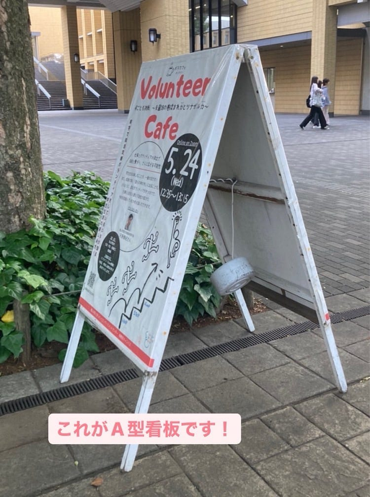
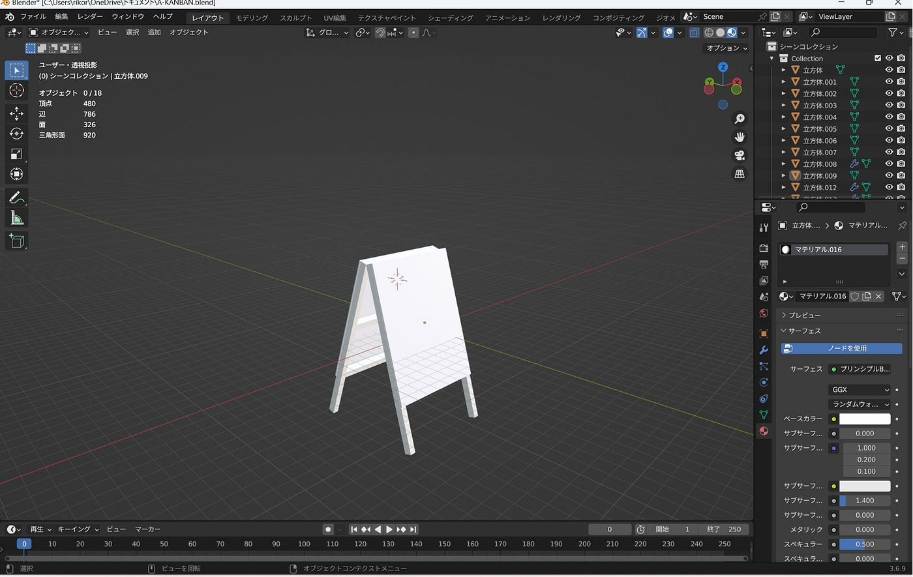
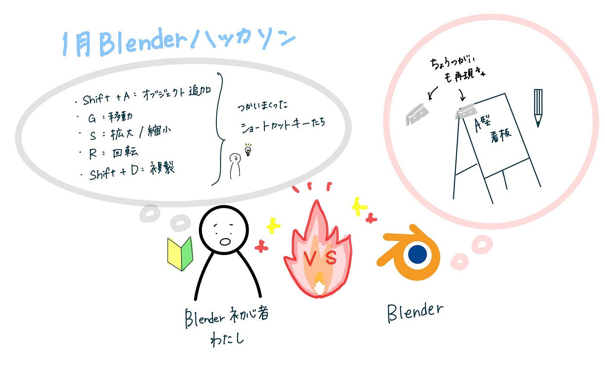

## 大健闘！1月Blenderハッカソン

こんにちは！3年の末木です。

2024年度最後のハッカソンは[Blender](https://www.blender.org/)を使った3Dモデリング作業でした。

今回初めてBlenderを使ってみるということでかなり苦戦しました…

何から始めたら良いかわからなかったのでまずは、YouTubeで初心者向けの動画を見て一緒に手を動かしてみました。

参考にしたのは以下の動画です。

インストールの仕方から基本操作、実際の作成まで一本の動画で教えてくれているので非常に参考になりました…！！

ある程度慣れてきたところで実際に相模原キャンパスにある立て看板？A型看板？を作成してみました！

私が所属している相模原祭実行委員会（通称さがさい）で毎年設置の作業があるな…と思いを馳せながらこちらをアセットに選ばせていただきました。

成果物はこちらです。

この[リンク](https://github.com/furuhashilab/blenderhackathon2025jan/tree/main/data/RikoSueki)からGitHubにまとめた5種類のデータをご覧いただけます。

#### 感想

何もかもが初めてで最初はわからないことだらけだったのですが、動画を見ながら一緒にやってみたり、手を動かしながらショートカットキーを覚えていくうちにだんだんと作業効率も上がり楽しくなってきました。最後いざ色をつけよう！と思ったところでパソコンが落ちまくるというトラブルもありましたが、なんとかやりきりました！また、いろんな作業を覚えていくうちに向上心もでてきて、1000ポリゴン超えない程度で蝶番まで再現するというところにこだわりました。ぜひご覧ください。

