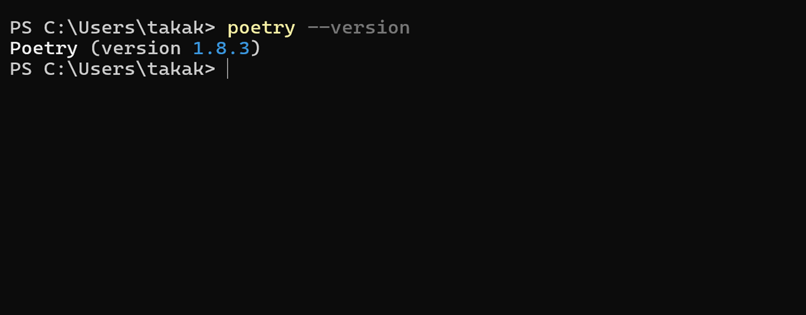
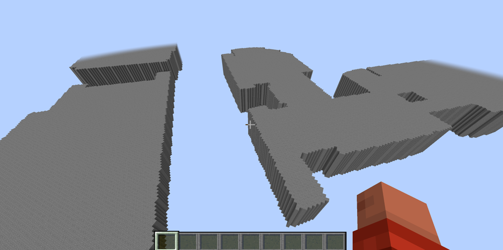
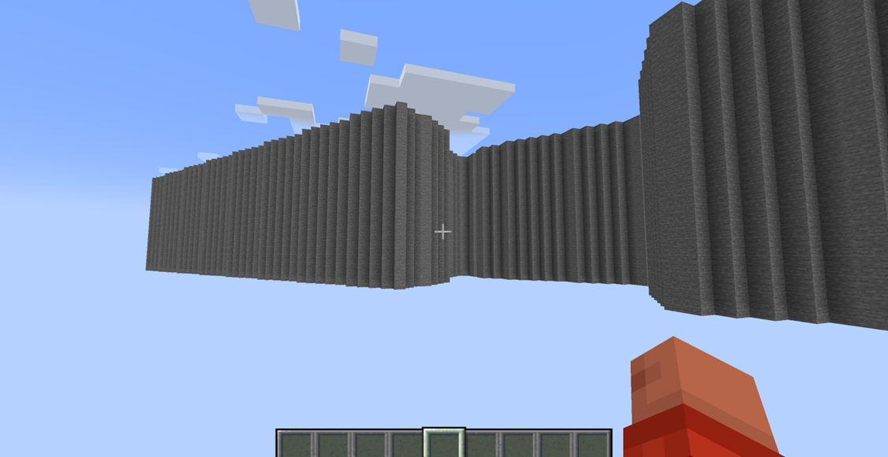
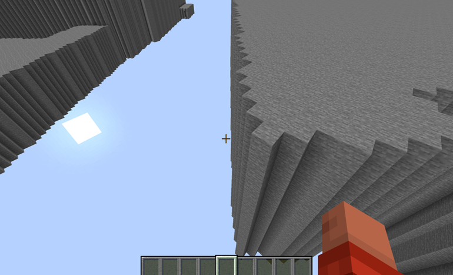
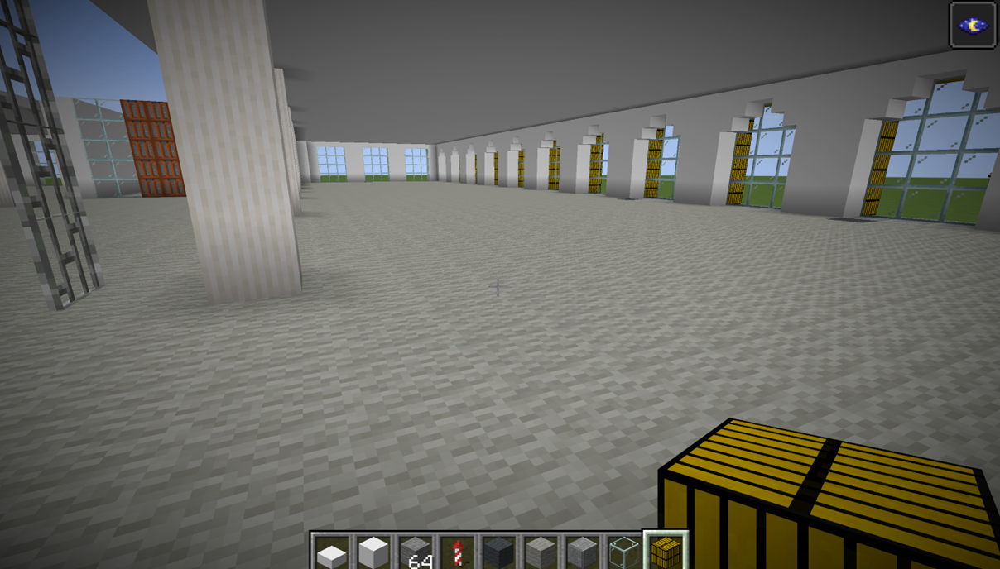
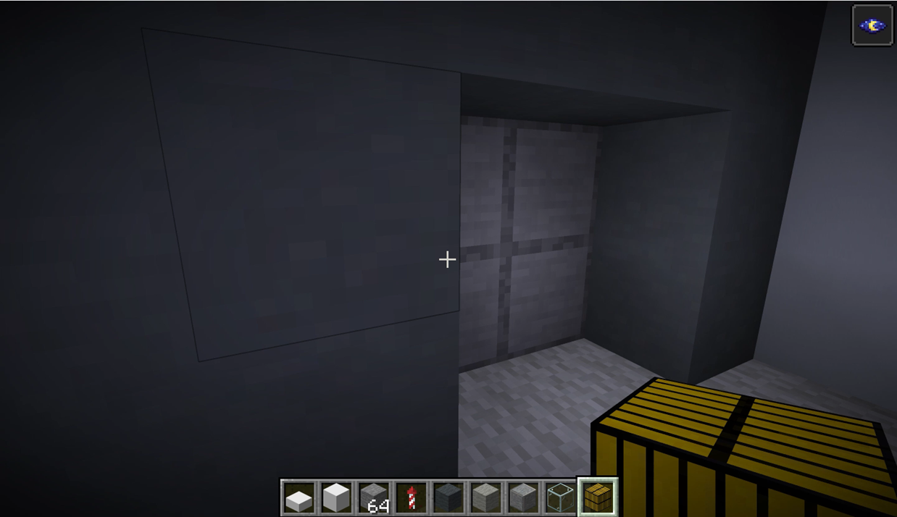

### サガキャン再現プロジェクトin Minecraft

3年の高井健太郎です。
ゼミ論が完成したので、共有いたします。
ゼミ論のGithubは[こちら](https://github.com/furuhashilab/2024gsc_Kentaro-Takai)からご覧ください。

> Introduction

### ゼミ論概要

**相模原キャンパス再現プロジェクトin Minecraft
→**Minecraftのワールドに相模原キャンパスを再現し、作成したワールドで鬼ごっこなどのゲームを開催する

### 先行研究

1.[小学校高学年を対象としたコンピューターゲームを活用した室内安全教育プログラムの検討](https://dlisv03.media.osaka-cu.ac.jp/contents/osakacu/kiyo/24354910-8-49.pdf)

→Minecraftを利用して地震や火災などの災害時の避難シュミレーションを実施することで、防災に関する知識が向上した

**2**. [Minecraftカップを通じた教育効果の検証](https://minecraftcup.com/2022/wp-content/themes/minecraft/img/pdf/minecraftcup2023_enquete.pdf)

→建物の建築を通じて思考の柔軟性が向上した

**3**.[小学校第6学年社会科におけるMinecraftを活用した実践](https://www.jaet.jp/repository/ronbun/JAET2017_I-1-1.pdf)

→建物作成を役割分担(共同作業)したことによって、言語活動、思考力が向上した

### 新規性

**教育×ゲーム性**

1.鬼ごっこ中に出すミッションの場所をAED、消火器などの設置場所にする

2.ミッションとして建物を作ってもらうことで、参加者の思考の柔軟性を養う

3.他の参加者とのミッションの共同作業を通して、言語活動、思考力の向上を目指す

> Methods

### 中間発表までの進捗状況

1. テクスチャの作成

•[ウェブサイト](https://minecraft.fandom.com/ja/wiki/%E3%83%81%E3%83%A5%E3%83%BC%E3%83%88%E3%83%AA%E3%82%A2%E3%83%AB/%E3%83%AA%E3%82%BD%E3%83%BC%E3%82%B9%E3%83%91%E3%83%83%E3%82%AF%E3%81%AE%E4%BD%9C%E6%88%90)を参考に、サガキャン建物の外観テクスチャを作成

2. PLATEAUの建物データをマイクラワールド内に移行

- [Project PLATEAU](https://github.com/Project-PLATEAU/plateau2minecraft)にある[3D 都市モデル to Minecraft ワールドデータ作成マニュアル](https://github.com/Project-PLATEAU/plateau2minecraft/blob/main/docs/Minecraft%E3%83%AF%E3%83%BC%E3%83%AB%E3%83%89%E3%83%87%E3%83%BC%E3%82%BF%E4%BD%9C%E6%88%90%E3%83%9E%E3%83%8B%E3%83%A5%E3%82%A2%E3%83%AB.pdf)を参考に建物データを移行

### しかし・・・

•PythonのPoetryをインストールする際、[エラー](https://github.com/furuhashilab/2024gsc_Kentaro-Takai/issues/8)が出てしまった。
 → 8/7・8日に開催された「こども霞が関2024」にスタッフとして参加させてもらい、Eukarya職員の方に質問してみた。

すると、「Poetryのインストールだけ別のウェブサイトを参考にしてみたらよいのではないか」と教わった。

### なので、

- マニュアルではなく、[ウェブサイト](https://qiita.com/IoriGunji/items/290db948c11fdc81046a)を参考にPoetryのインストールを試みた。

→成功！

### その後、

- [マニュアル](https://github.com/Project-PLATEAU/plateau2minecraft/blob/main/docs/Minecraft%E3%83%AF%E3%83%BC%E3%83%AB%E3%83%89%E3%83%87%E3%83%BC%E3%82%BF%E4%BD%9C%E6%88%90%E3%83%9E%E3%83%8B%E3%83%A5%E3%82%A2%E3%83%AB.pdf)を基に無事移行成功！

### しかし、

•結局、PLATEAUデータは使っていない

→ワールド内に読み込んだ際に、建物が宙に浮いていた。

### また、

[PLATEAUオープンデータポータルサイト](https://www.geospatial.jp/ckan/dataset/plateau-14150-sagamihara-shi-2023)から建物データをダウンロードする際、相模原キャンパスの建物の向きが元々斜めになっていた。

### これについての説明

- サガキャンの建物は基本的に正門からB棟に向かってある並木道に対して垂直に設置されているが、それを北を0゜としたときの緯度経度に合わせると、壁面の向きがずれるというジャギーが発生した。

### そのため、

PLATEAUの建物データを参考にしつつ、1から設計することに！

### 作成方法

1.測量

→iPhoneの計測アプリ

精度が不安だったため、7階の長い直線を計測アプリとメジャーのどっちもを利用して比べてみたところ、ほぼ同じだった。

2.動画撮影

→現場に毎回行かなくてもよいように、iPhoneで動画撮影して、その動画を元に作成した。

> Results

### 中間発表後に行った作業

1.B棟1階図書館の作成

### 2.B棟7階(地球研究室)フロアの作成

### 工夫点

・壁の色の再現

既存のブロックには綺麗な白がなかった。

→綺麗な白のテクスチャを作成して既存のブロックに貼り付けた。

・ポストの再現

古橋研究生にとってポストは重要な場所なので、忠実に再現した。

・研究室数、渡り廊下の再現

左右対称に見える7階フロアだが、古橋研究室側とエリック研究室側で教室の数が異なっていた。また、2つの渡り廊下の幅も異なっていた。そこを完全再現した。

> Discussion

### 改善点

・細部にこだわりすぎた

微妙な長さの違いやカーペットの色などにこだわりすぎて、まだ7階フロアしか完成していない。

・計画性のなさ

就活が本格的に始まるという事実を完全に無視していたため、計画が破綻してしまい、目標であったB棟の完成を達成することができなかった。

### 今後の予定

・現在～GW B棟の外観、内観のどちらとも仕上げる

・GW～6月 [息吹さんの研究](https://sketchfab.com/mapconcierge/collections/b4d7c2f179534d1daf5118ebbb83c6e1-df275ec44c0943cc9b031075cd1bccac)も参考に、D、E、F棟の外観を作成

・7～8月の構想発表まで すべての建物の外観を作成

・9~中間発表まで すべての建物の内観も完成

・中間発表後～卒論発表 ゲームイベントの実施
