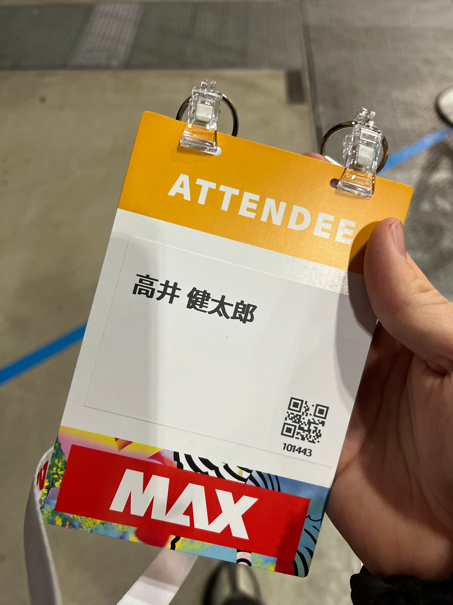
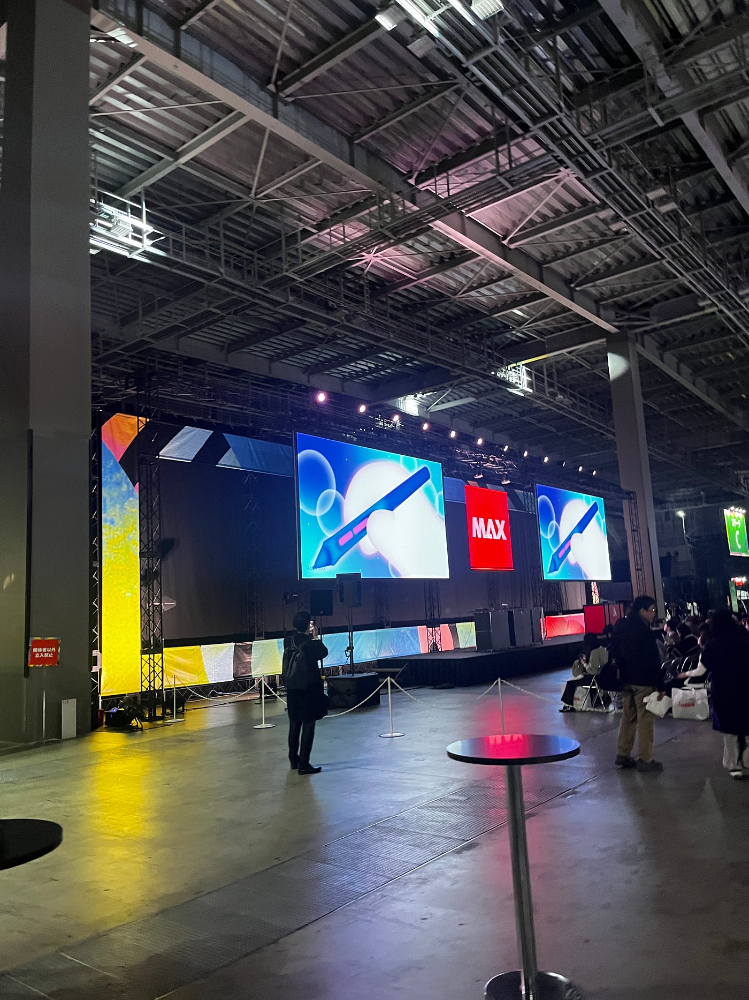
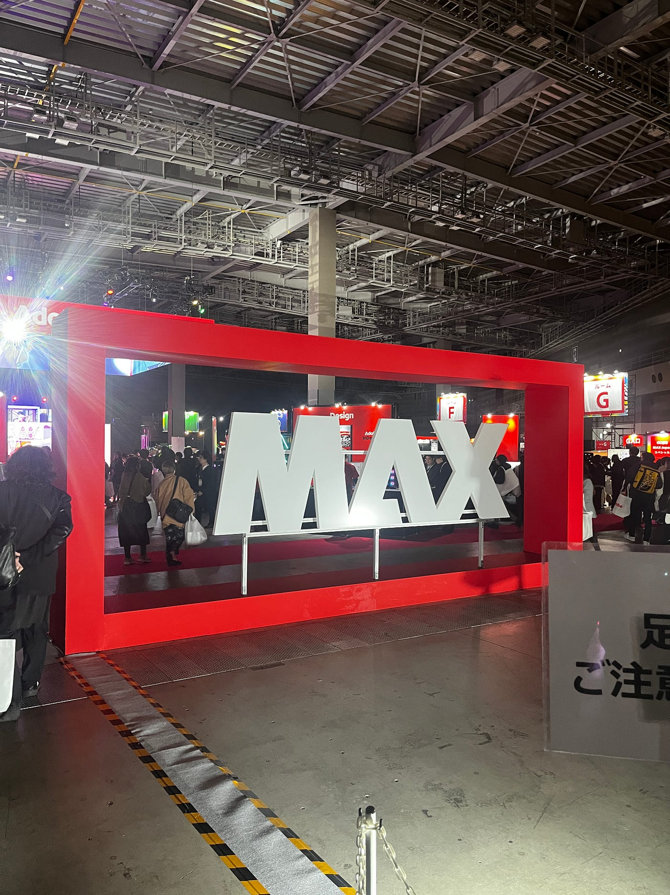
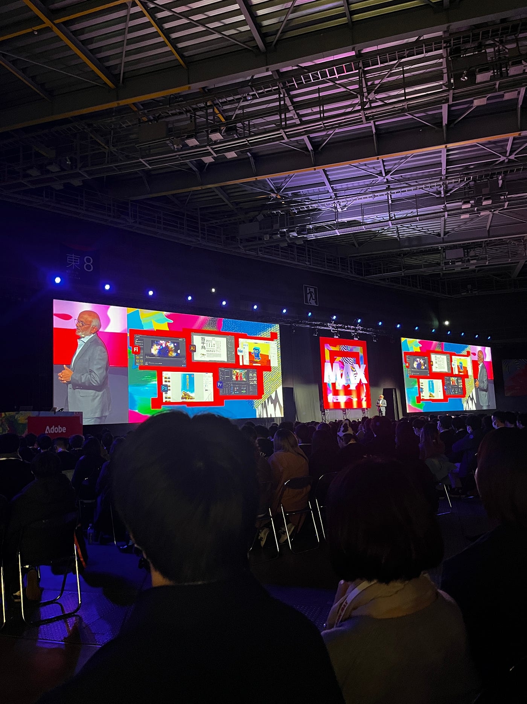
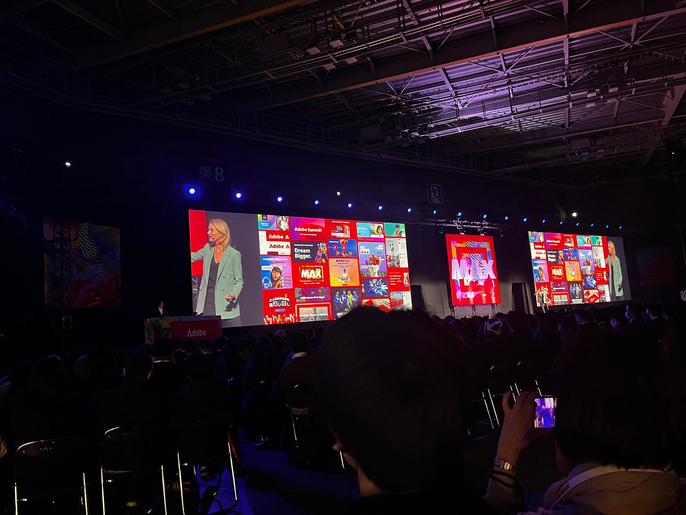
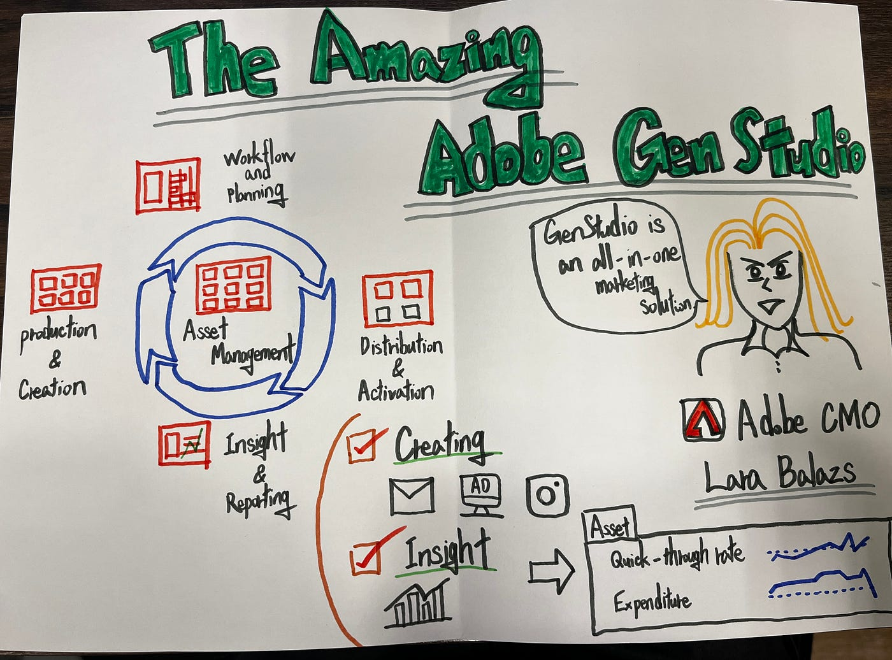
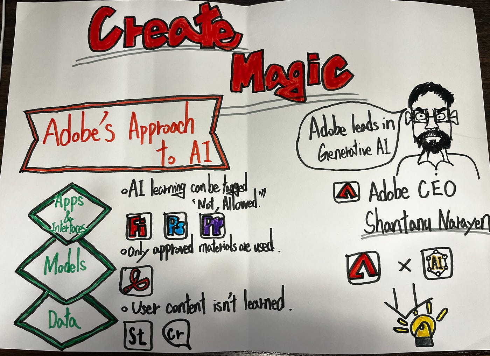
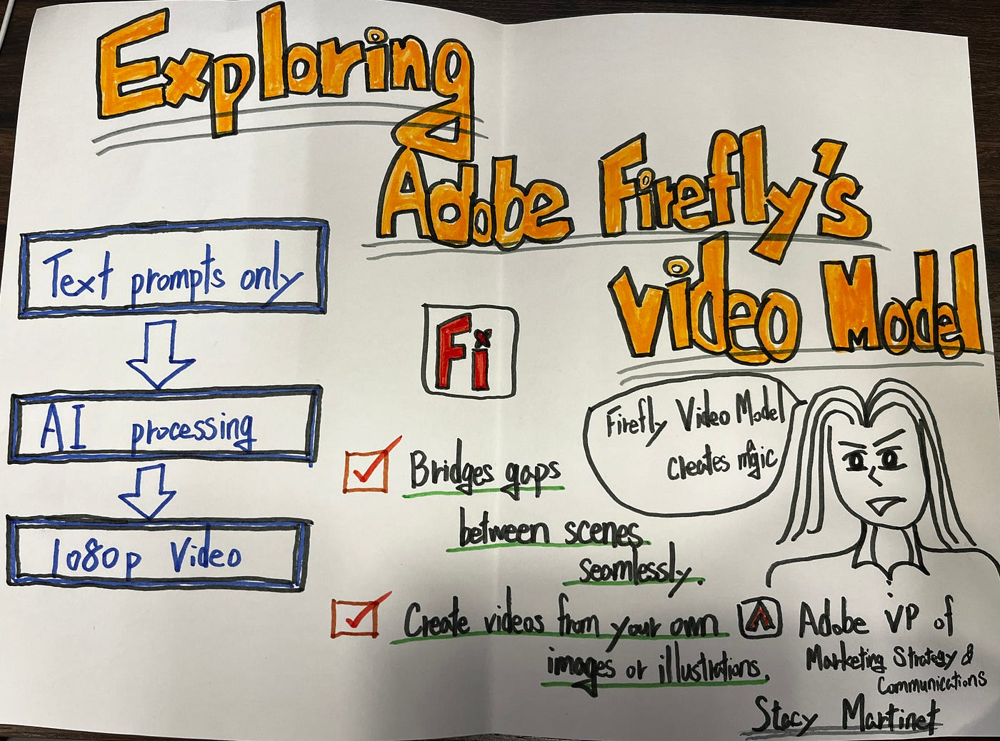

### Adobe Max Japan2025に参加しました！

お疲れ様です。3年の高井です。

先週の2月13日に、東京ビッグサイトにて開催された[Adobe Max Japan2025](https://maxjapan.adobe.com/)に参加したので、その報告を行います。

> Adobe Maxとは

クリエイターのための祭典であり、様々な著名人やエキスパートからインスピレーションとクリエイティブな刺激を得たり、すぐに役立つテクニックを学ぶことができる場所のことを言います。

> 参加の経緯

私はもともとAdobeのCreative Cloudプランを契約しており、日頃からPremiere Proなどのツールを利用しています。そんな中、今回のイベントが開催されることを知り、せっかくの機会だと思い参加を決めました。

> 参加してみて

イベントに参加して特に印象に残ったのは、**Adobe本社の役員のスピーチ** でした。
スピーチの中で、「日本はAdobeにとって非常に重要なマーケットである」という言葉が何度も強調されていました。このことから、日本市場がAdobeにとって戦略的に重要なポジションを占めていることが改めて理解できました。

> 移動記録

[Adobe Max Japan | Strava
View 健太郎 高井's walk on February 13, 2025 | Stravawww.strava.com](https://www.strava.com/activities/13615055706)

> グラレコ

### 完成品

こちらが完成のグラレコになります。

しかし、このグラレコが完成するまでには、大きく以下2つの課題がありました。

### ①登壇者との撮影不可

登壇者は、AdobeのCEOや役員だったので、ダメもとで問い合わせてみましたが、安全面の考慮ということで記念写真を撮ることができませんでした。

### ②グラレコ不成立

実は、このグラレコは 後日書き直したもの です。
最初に自分なりに描いたものの、古橋先生から「グラレコに必要な要素が不足している」とのご指摘を受けました。そのため、大幅な修正が必要になり、時間をかけて書き直しました。
振り返ると、この一年間、私は グラレコをあまり真剣に取り組んでこなかった部分があり、そのツケが回ってきた のだと痛感しました。
これから新しく三年生になる皆さんは、毎回しっかりとグラレコを描くことをおすすめします！

> 終わりに

今回の国際会議では、登壇者とグラレコの写真を撮ることはできませんでしたが、映像に興味のある私にとって、とても学びの多い機会となりました。また、自分のグラレコスキルを見直す良いきっかけにもなったと思います。来年の国際会議では、さらにレベルアップしたグラレコが描けるように、この一年間しっかりと頑張ります！
