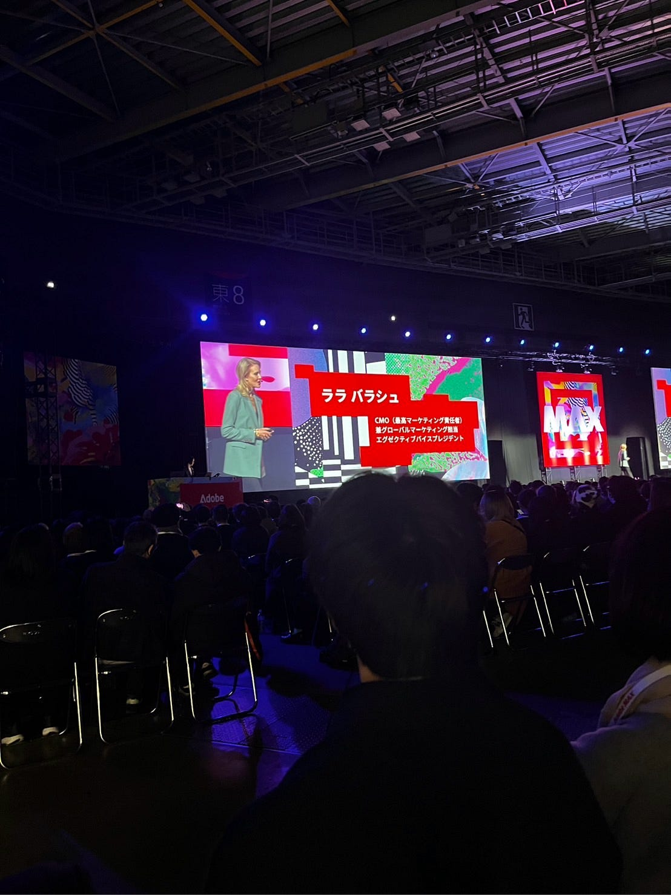
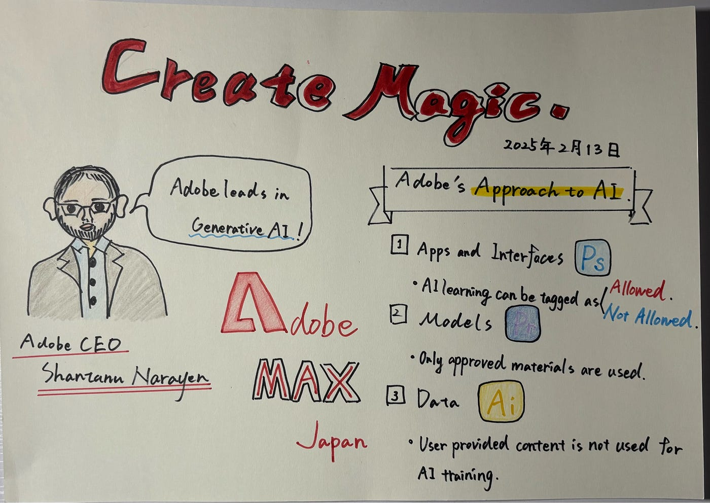
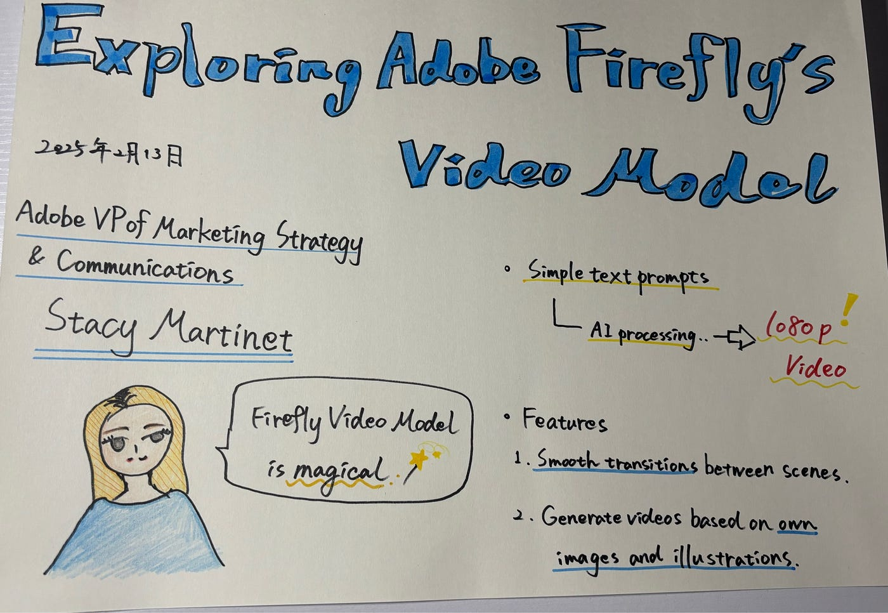

### Adobe MAX Japan 2025に参加しました！

こんにちは、3年の古内です。

今回は、2025年2月13日に東京ビッグサイトにて開催されたAdobe MAX Japan 2025に参加した報告を行います。

### はじめに

Adobe MAXは、Adobeが主催する世界最大級のクリエイティブカンファレンスで、最新のAdobe製品情報やクリエイティブの未来について学ぶことができる場です。今年はチケットが1ヶ月前に完売するなど、クリエイターからの期待が非常に高いイベントでした。

### 印象に残ったセッション

特に印象的だったのは、Adobe本社役員によるスピーチです。その中で「日本はAdobeにとって非常に重要なマーケットである」という言葉が何度も強調されていました。これにより、日本市場がAdobeの戦略において重要な位置を占めていることを改めて実感しました。

### 反省点

今回のイベントを通じて、**2つの課題**を感じました。

1. **登壇者との撮影不可**
AdobeのCEOや役員が登壇していたため、安全面の配慮から記念写真の撮影が禁止されていました。貴重な機会だっただけに、写真として残せなかったのは少し残念でした。

1. **Adobe製品に関する知識不足**
**Adobe Creative Cloudに契約しているものの、活用できていないツールが多い**ことを痛感しました。高度なツールについてもっと知識を深めておけば、セッションの内容をさらに活かせたと感じています。

### この経験を通じて

イベントを通じて、**Premiere Proを活用した動画制作に挑戦してみたい**という新たな目標が生まれました。特に、AIを活用した編集ワークフローや高度な映像加工テクニックに触れたことで、動画制作の可能性が一気に広がりました。

### まとめ

今回のAdobe MAX Japan 2025は、映像制作に興味を持つ私にとって非常に刺激的で学びの多い機会となりました。業界の最前線で活躍するクリエイターの講演を通じて、最新の映像トレンドや技術を深く理解できたことは、今後のスキル向上に大いに役立つと感じています。

今後もAdobeのツールを積極的に活用しながらスキルを磨き、クリエイティブの幅を広げていきたいと思います。そして、来年のAdobe MAX Japanにもぜひ参加し、新たな挑戦とさらなる成長につなげていきます！

### 移動記録

[https://strava.app.link/HMpurv6NiRb](https://strava.app.link/HMpurv6NiRb)

### グラレコ

