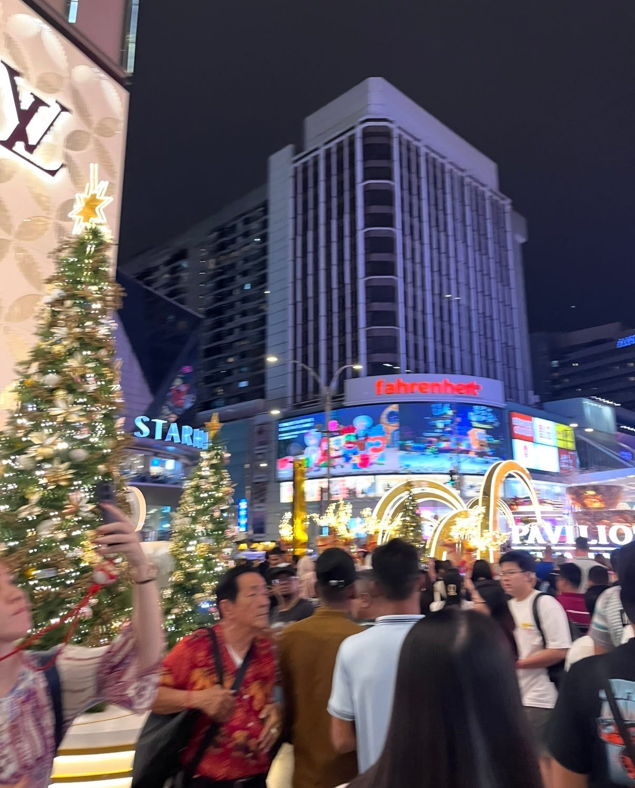

### マレーシア留学中のストーリーテリング作品

こんにちは。3年の小崎実亜です。

私は2024年8月下旬から2025年1月上旬までの約5ヶ月間、マレーシアに留学していました。その期間中に様々な場所に旅行に行ったのですが、今回は初の海外での年越しを経験したため、マレーシアでの元旦の過ごし方を記録したストーリーテリング作品を制作しました。

今回私が訪れたクアラルンプールはマレーシアの首都でありいちばん大きな都市です。クアラルンプールには留学中に何度か訪れましたが、年明けはどんな感じになるんだろう、とワクワクした気持ちで行きました。マレーシアは多文化国家であり、新年が3回あります。その中でも1番盛り上がるのは旧正月のため、1/1はただカレンダーが新年になるというくらいの感覚らしく、盛大に祝う！という空気感は特に見られませんでした。そんなマレーシアでの元旦の過ごし方を記録とともに紹介します。

まず、ストーリーテリング地図としてまとめたものがこちらです。

[Google Earth
Aw snap! Google Earth isn't supported on your browser. You may need to update your browser or use a different browser…docs.google.com](https://docs.google.com/open?id=1PuhQmSDZrq9GzjlRpYropt3Qv3z53rRg)

[https://docs.google.com/open?id=1PuhQmSDZrq9GzjlRpYropt3Qv3z53rRg](https://docs.google.com/open?id=1PuhQmSDZrq9GzjlRpYropt3Qv3z53rRg)

この地図上で目印が置かれているのが私が行った主な観光地です。その地点の写真と感想をコメントとして付け加えました。前日、年越しのカウントダウンもクアラルンプールで過ごしていたのですが、ホテルまでのタクシーがなかなか見つからずに沢山歩いたため、結局ホテルに着いたのは午前3時くらいでした。しかし、日の出を見れて写真もとれたため早起きして良かったなと思いました。

次に、Stravaで記録したログのPermalinkURLがこちらにです。

[https://strava.app.link/A46PzMVhnSb](https://strava.app.link/A46PzMVhnSb)

私は今回のツアー中、常にStravaを起動させていました。フィールドトリップ課題をきっかけにStravaをインストールしたので、きちんと記録をつけるのは今回が初めてでした。自分の記録を改めて見返した時に、車で移動した部分は比較的線が綺麗に描かれていて、徒歩で移動した部分はジグザグに描かれていました。位置情報の精度の高さと、もっと効率的に観光できたのではないかということを感じました。写真だけでなく、自分の行動の記録が残っていると行った場所や歩いた場所が視覚的にわかるため、今後旅行に行くことがあればまた記録をつけてみようと思いました。

最後に、キメのスクリーンショットがこちらです。

この画像は、クアラルンプールで有名なショッピングモールであるパビリオンの前で撮った画像です。

先述した通り、マレーシアでは1/1をそこまで特別な日だと考えていないため、特に元旦の飾り等はなくまだクリスマスの飾りが残っていました。また、マレーシアは国全体としてとても活気があり、特にクアラルンプールはいつ行っても人が多く賑やかで行くたびに自分も元気になりました。普段よりも写真を撮ることを意識しましたが、見返してみると写真で撮ったもの以上にもっと色んな思い出があったなあと思います。自分の記憶に残すことも大切ですが、次はたくさん写真を撮りたいです！
