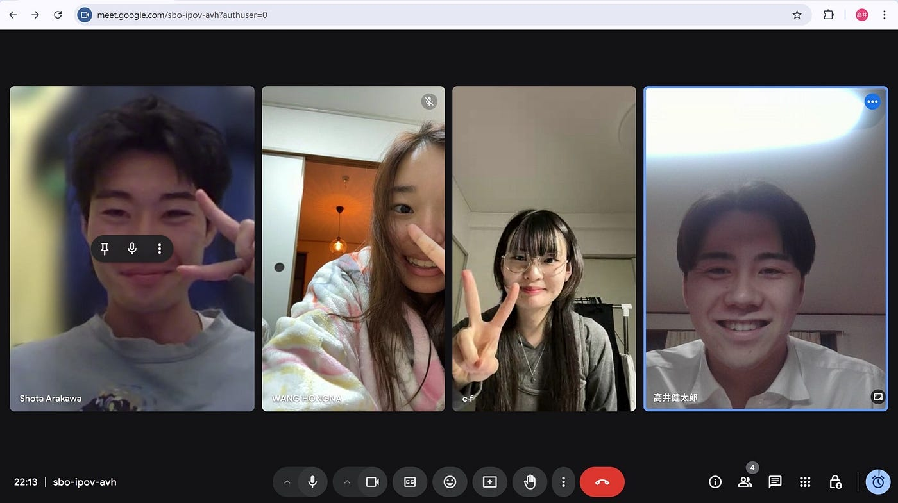
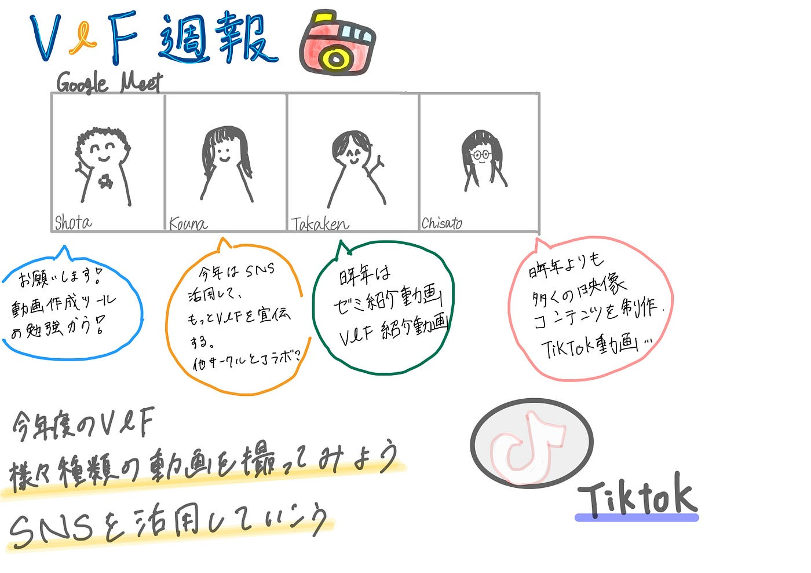

### 今年は“攻め”のV&F。【V＆F週報 4/15】

お疲れ様です。4年の古内です。

今週のV&Fは、現時点でサークル参加予定のメンバー4人で「自己紹介」と「今年度の活動方針の共有」について、[Google Meet](https://meet.google.com/landing)を使用して話し合いを行いました。

### 自己紹介

4年生は、昨年度のゼミ活動を振り返るとともに、現在取り組んでいるゼミ論の内容について発表しました。また、今年度のV&F活動で目指す方向性や取り組みたい内容についても共有しました。
 3年生は、V&Fを選んだ理由や、今後取り組んでみたい活動について発表を行いました。

**各メンバーの発表内容：**

- **高井：**青山学院大学相模原キャンパスをマインクラフト上に再現し、仮想空間を通じて地理情報の伝達力を探っている。4年次には、このデータを活用し、参加者の防災意識を高める体験型イベントを開催する予定。

- **福田：**今年はSNSを活用してもっとV&Fを宣伝したい！去年はV＆Fの紹介動画を作成したので、今年は他サークルとコラボしてみたい。

- **古内：**ゼミ論のテーマは「[Re:Earth](https://reearth.io/ja/)を活用した福島県双葉郡楢葉町の災害アーカイブの作成」。今年度は、昨年度よりも多くの映像コンテンツを制作し、古橋ゼミらしさを取り入れたTikTok動画など、SNSを活用した情報発信にも積極的に取り組みたい。

- **荒川：**動画編集の知識・技術を学ぶためにV＆Fへの所属を決めた。[TikTok](https://www.tiktok.com/ja-JP/)などのSNS を通して、古橋ゼミの魅力や個性的なコンテンツを発信していきたい。

### 今年度のV&F活動方針

目標: [TikTok](https://www.tiktok.com/@vfofficials?is_from_webapp=1&sender_device=pc)フォロワー1000人突破！

4〜6月 攻めの仕込み期間として、編集スキルとチーム体制を強化します。

①編集ツールの理解（4〜5月上旬）

4人で以下を担当し、週報で情報を共有します：

• [CapCut](https://www.capcut.com/ja-jp/)／[Premiere Pro](https://www.adobe.com/jp/products/premiere.html?sdid=WPHDJ43D&mv=search&mv2=paidsearch&ef_id=Cj0KCQjwh_i_BhCzARIsANimeoEelRxwqjrHHGMANNNlrXxYbSRDsOK96sxZeBOJCwnk8KC39p7LgAUaAqP_EALw_wcB:G:s&s_kwcid=AL!3085!3!446333984564!e!!g!!premiere%20pro!739872410!102573497454&gad_source=1&gbraid=0AAAAAD7v3ar1OxG4rXOpdXAGYLezclphM&gclid=Cj0KCQjwh_i_BhCzARIsANimeoEelRxwqjrHHGMANNNlrXxYbSRDsOK96sxZeBOJCwnk8KC39p7LgAUaAqP_EALw_wcB)／[DaVinci Resolve](https://www.blackmagicdesign.com/jp/products/davinciresolve)／SNSアルゴリズム

→ 各ツールの特徴・活用事例・ビジネスモデルを調査

②15秒動画制作＆比較（5月中旬〜）

• 各自、担当ツールで15秒動画を制作

• 同一素材、同一編集ツールで全員が編集 → 仕上がりの違いを比較し、編集スタイルを分析

③運用準備（6月）

• TikTok投稿体制の構築（役割分担／ジャンル設計）

• 週2投稿に向けた動画ストックづくり

7月からは週2本投稿を本格スタート。

「準備から攻める」姿勢で、1年を通して成長と成果を積み上げていきます。

動画投稿の管理は、昨年の[Notion](https://www.notion.com/ja)ハッカソンで作成したデータを使う予定です。

[https://www.notion.so/V-F-1823791036c680c2a9c2e39ab1ad5ac7?pvs=4](https://www.notion.so/V-F-1823791036c680c2a9c2e39ab1ad5ac7?pvs=4)

### グラレコ

