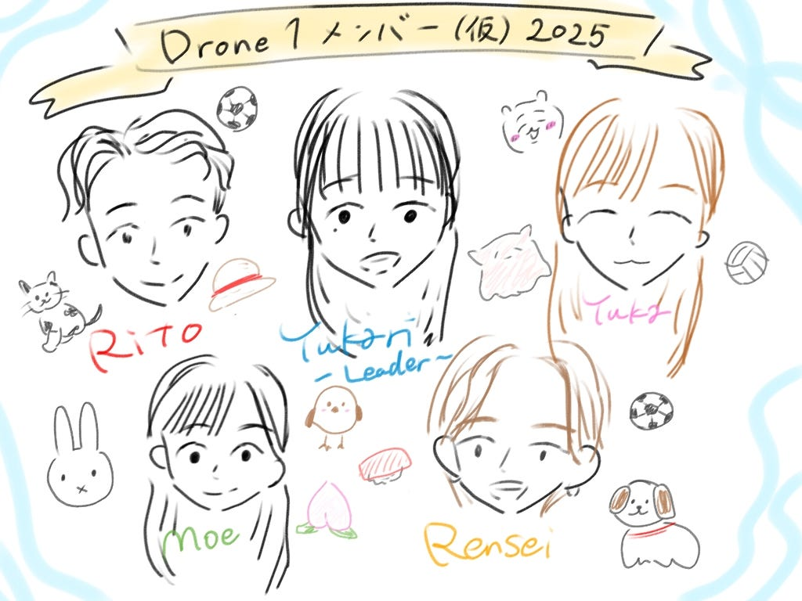

### 【Drone1 週報】ドローン部の魅力的な新メンバー紹介！！

こんにちは！ドローン部4年の林です！

この春から4年に進級し、ドローン部にも新たに3年生の仲間が加わり、新体制での活動がスタートしました！
 今週のドローン部の週報では、「2025年版 自己紹介テンプレート」をNotionで作成したことをご報告します。

▼作成したメンバーリストはこちら
 → [古橋研究室2025メンバーリスト](https://jumpy-felidae-2c2.notion.site/2025-1cfab1fa8a3b8037902fe537f0ef9152)

時間のある時に授業時間でこちらを作成したいです！ご検討お願いいたします！

また、今回のテンプレート作成には3年生メンバーにも協力してもらいました！
 みんなが書いてくれた自己紹介をもとに、Drone1メンバー（仮）として新メンバーの紹介文をまとめました。

以下は、各メンバーの自己紹介をChatGPT 4oに投げ、「〇〇さんの紹介文を作成して」と問いかけ作成した紹介文です。ぜひ読んでみてください～！

### 山﨑璃音（やまざき・りと）

**古橋研究室／ドローン部・3年生**

アニメや映画が大好きで、ジブリ・ワンピース・ナルト・シュタインズ・ゲートなどジャンル問わず幅広く鑑賞。小中高と長く続けたサッカーは今も週末に仲間と楽しむアクティブ派。ドローン部では旅行先での空撮を目指して操縦スキルを磨き中。

モットーは「なんでも挑戦！」。一人時間も家族や友達との時間も大切にしていて、朝シャワーで気持ちをリセットするのが日課。大学院ではセキュリティーマネジメントを学ぶ予定で、現在研究テーマを模索中。

性格は穏やかで親しみやすく、高身長で少し高圧的に見られがちだけど、実はとても話しやすいタイプ。猫2匹と家族4人で暮らす動物好きで、特にゴリラとチーターが好き。

### 稲田優花（いなだ・ゆうか）

**古橋研究室／ドローン部・3年生**

お散歩好きで、ピンクや水色のやさしい雰囲気が魅力の癒し系・ゆうかちゃん。亀やカタツムリ、金魚などユニークなペット経験があり、小動物やメンダコにきゅんとする一面も。

ドローンは初心者ながら、ドローン部で「精一杯がんばります！」と前向きに挑戦中。グラレコやイメージ表現が得意で、数学や理科はちょっと苦手。感性豊かで、「本当に大切なものは目に見えない」を大切にするあたたかい人柄。

最近はコンビニのお菓子探しにハマり中。『ルックバック』や『すずめの戸締まり』など、心を動かす作品や水族館にまつわる研究にも関心あり。

### 井上連成（いのうえ・れんせい）

**古橋研究室／ドローン部・3年生**

好奇心旺盛でチームワークを大切にするアクティブな大学生。ドローンや位置情報技術など初めての分野にも前向きに挑戦し、古橋研究室での活動にも意欲的に取り組んでいる。

小学生から続けてきたサッカーで仲間との協力を学び、人と一緒に作業するのが得意。休日はアラームなしでのんびり過ごす、おっとりした一面も。

モットーは「死ぬこと以外かすり傷」。帰宅後すぐアクセサリーとコンタクトを外すのが小さなこだわり。旅が好きで、タイ・パタヤや札幌にも訪れている。

将来は、地図や位置情報を活用して環境や人々の暮らしを守るような研究に取り組みたいと考えている。

### 安生萌（あんじょう・もえ）

**古橋研究室／ドローン部・3年生**

写真とお散歩が大好きで、音楽を聴きながら空や花を撮るのが日課。小さな美しさや「ありがとう」の気持ちを大切にする、心あたたかな人柄。

高校ではダンスに打ち込み、今は地球の学連にも所属。ドローン部では風景撮影に挑戦中で、「まだまだ学び途中」と素直に語る姿が魅力的。

穏やかで丁寧な性格で、百人一首やアニメ・映画も大好き。好きなものは桃、里芋のコロッケ、ウォンバット、シマエナガなど、ちょっとユニークでかわいい存在。

ご飯屋さんに興味津々なので、おすすめがあればぜひ教えてあげてくださいね！

2025年のドローン部もどうぞよろしくお願いいたします！！
