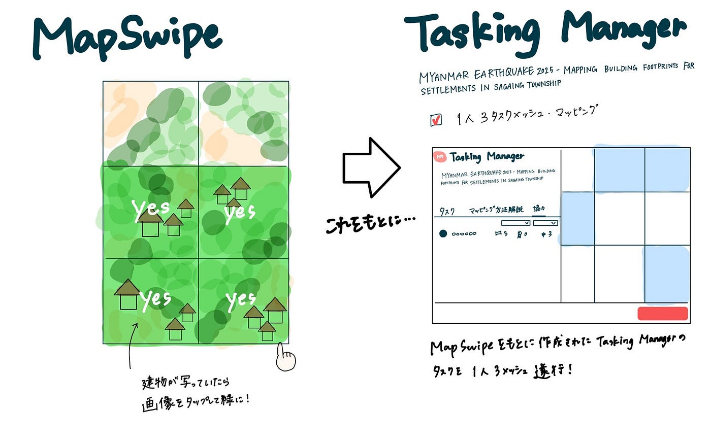

## Youth 週報 4/15

こんにちは！4月も始まって早2週間がすぎましたが、ついに学校始まってしまいました…

改めて4年になりました末木が今週のユースの週報を担当します！

今回は3月28日にあったミャンマーでの地震のクライシスマッピングを行ったので、その報告をさせていただきます！

> クライシスマッピングとは

自然災害等の危機的状況下で、その現場の状況がわかる地図を作り、世の中に発信することを指します。

（[Sony Acceleration Platform 古橋先生インタビュー](https://sony-acceleration-platform.com/article701.html#:~:text=%E2%80%95%E2%80%95%E3%81%BE%E3%81%9A%E3%80%81%E5%8F%A4%E6%A9%8B%E5%85%88%E7%94%9F%E3%81%AE,%E3%81%AB%E3%81%82%E3%81%9F%E3%82%8B%E4%BA%BA%E3%81%AE%E5%BD%B9%E3%81%AB%E7%AB%8B%E3%81%A1%E3%81%BE%E3%81%99%25E3%2580%2582)より）

→クライシスマッピングをすることで被災状況や支援ニーズ、避難経路などを地図上にリアルタイムで整理・共有することで、被害の全体像を把握しやすくなり、行政やNGO、市民などの連携を促進できるということです！

そんなわけで今回はミャンマー地震のクライシスマッピングを行いました。

方法としては

①[MapSwipe](https://web.mapswipe.org/#/en/projects)を用いたFind Buildingプロジェクトへの参加

②MapSwipeの成果を元に立ち上がった[Tasking Managerのプロジェクト](https://tasks.hotosm.org/projects/18577)への参加

でクライシスマッピングを行いました。

Tasking Managerにおいては1人3タスクメッシュ・マッピングというタスクを古橋先生に提示されましたが、昨年度の新3年生向けのマッパソンの成果をもあってか、新3年生もかなり容易にタスクをこなしていたのかなと見受けられました！ぜひ今後とも一緒にクライシスマッピングをしていけたらなと思います。

また、今年度のYouthMappers AGUでは、国際的にもマッパソンを開催したいという目標があるため、それに向けてマッパーとしての実績も積んでいきたいと考えています…！

グラレコ

