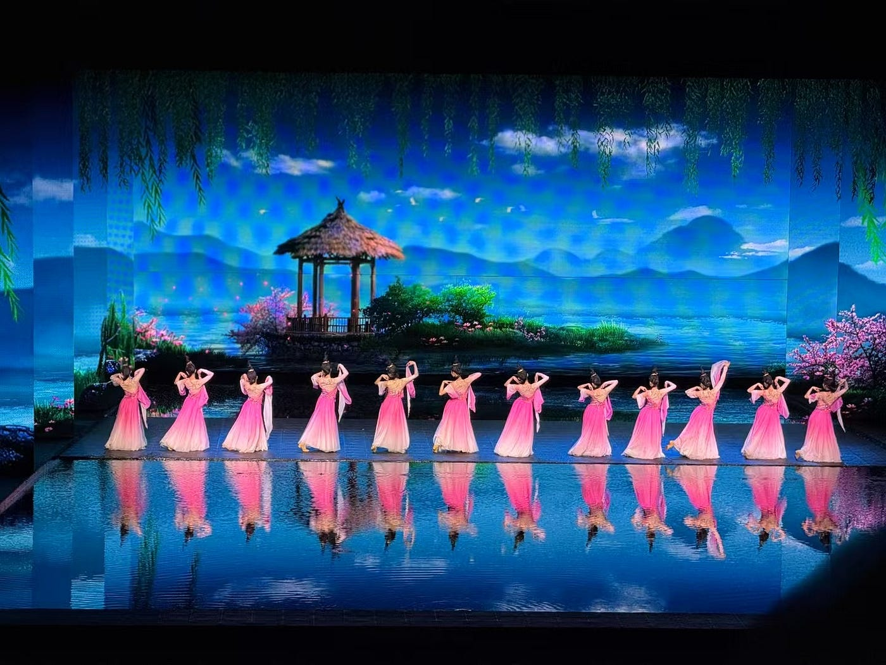
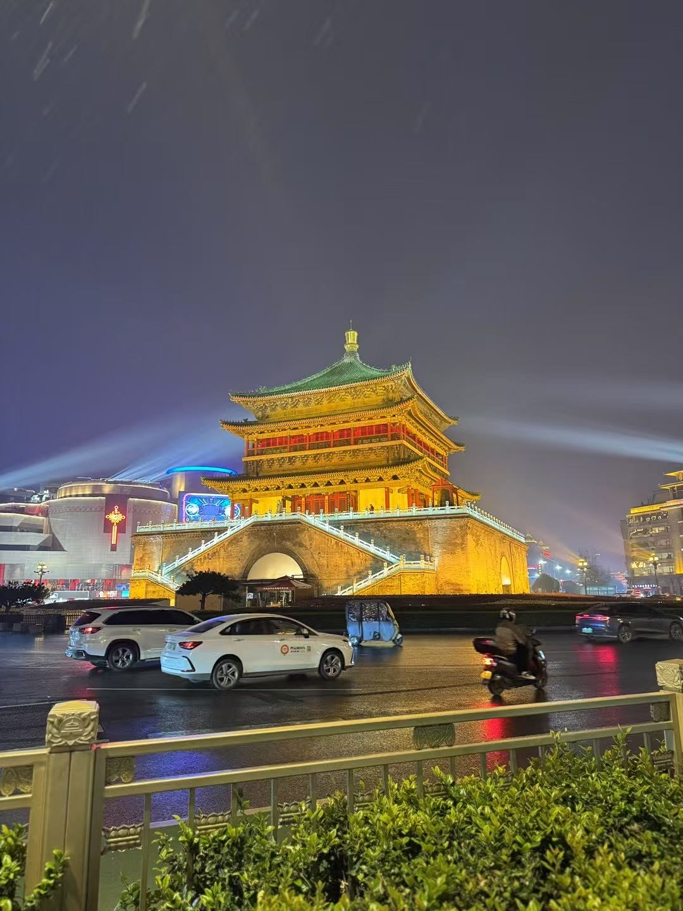
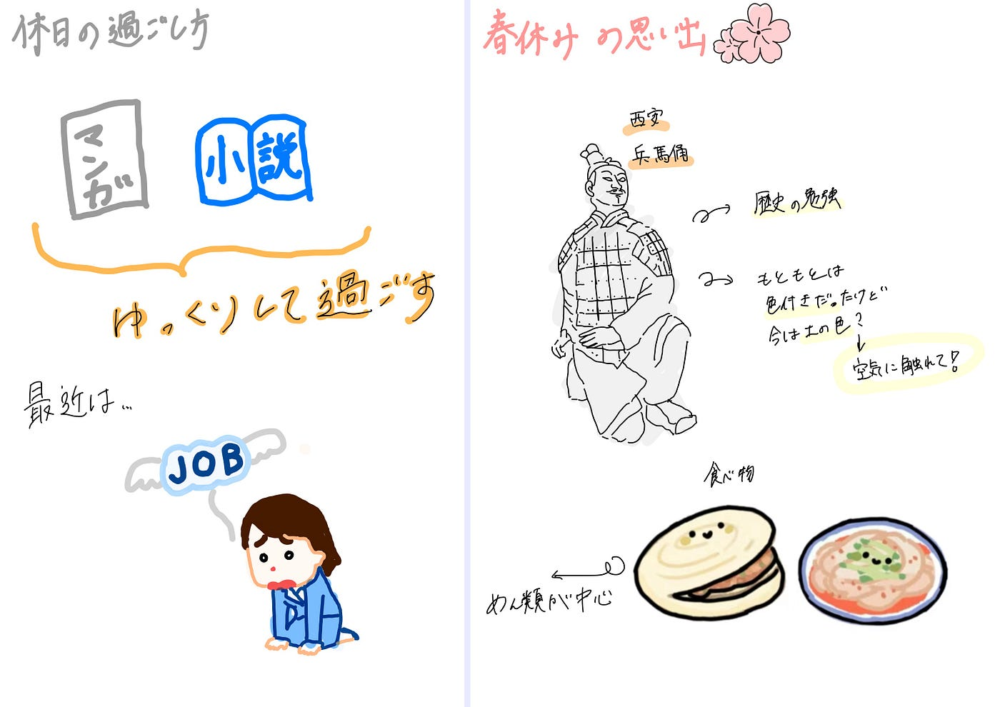
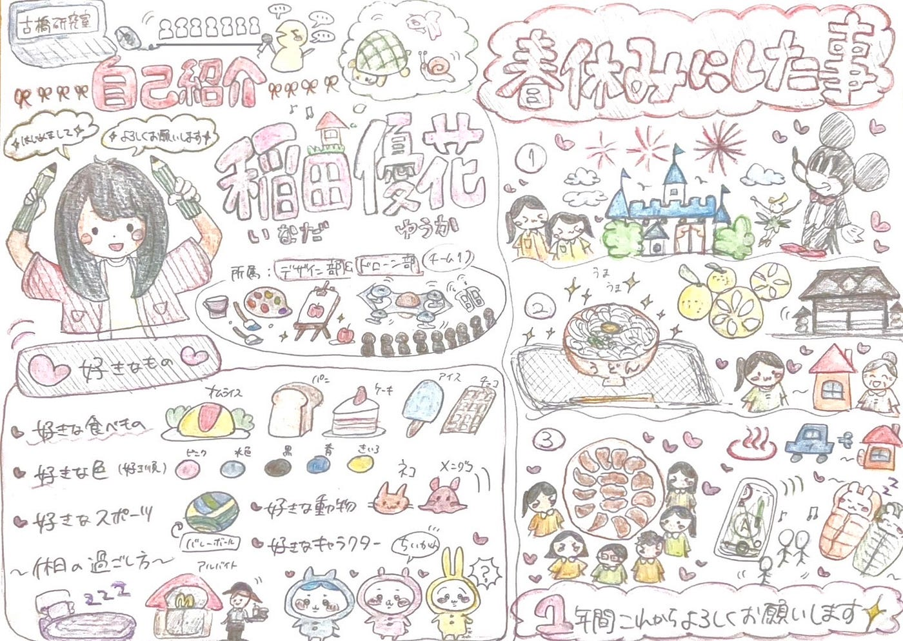
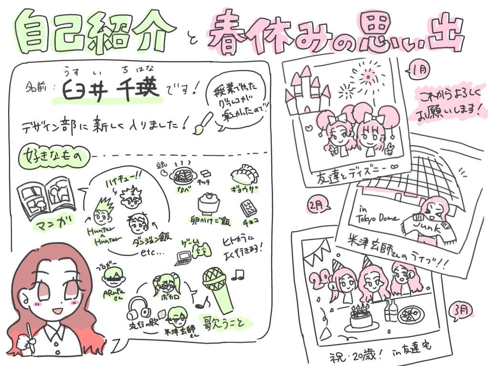

### デザイン部週報4/15

こんにちは！4年になりました福田です。

今年もよろしくお願い致します！

早速、今年のデザイン部のメンバーと春休みでの思い出を紹介していきたいと思います。

**1人目：**

4年の福田宏娜です！休日には、ゆっくりと小説や漫画を読んだり、映画を見たりして楽しむことが好きです。最近は就活に奮闘中です。

就活があるものの二月から1ヶ月近く中国にいました笑。この2枚の写真は西安で見た演出と有名なスポット钟楼、日本語で鐘堂？です。

景色が綺麗でご飯も美味しくて安くてという感じですごく楽しかったです。

2人目：

初めまして！3年の稲田優花です。

所属はデザイン部とドローン部を考えています。好きな食べものは、オムライス・パン・ケーキ・アイス・チョコレートなど沢山あり、好きな色は、ピンク・水色・黒・青・黄です。スポーツはバレーボールが好きで、動物は亀やカタツムリを飼っていましたが、猫が好きなので将来飼ってみたいと思っています。休みは睡眠・アルバイトをしています。

春休みの思い出としては、留学から帰国してから友人とディズニーランドに行きました。また、母の実家である四国に行き、香川でうどんを食べたり徳島の温泉に浸かりました。旅行の後も、従兄弟も家に泊まり親戚で集まってのんびりとした休みを過ごしました。ゼミの合宿にも参加し、皆さんと過ごせて良かったです。

**3人目：**

こんにちは、3年の臼井千瑛（うすいちはな）です！

グラレコはまだ経験が浅いですが、デザイン部の一員として楽しく頑張りたいです。

趣味は漫画やアニメで、『Hunter×Hunter』や『ハイキュー‼︎』、『ダンジョン飯』が好きです。歌うのも好きで、よくヒトカラに行きます。

好きな食べ物は餃子、鍋、チョコレート、卵かけご飯です。

春休みには友達とディズニー行ったり、米津玄師のライブに行ったり、友達の家で誕生日を祝ってもらったりしました。

これからよろしくお願いします！

以上で私たちの自己紹介と春休みの思い出紹介です！

これからよろしくお願いします！
