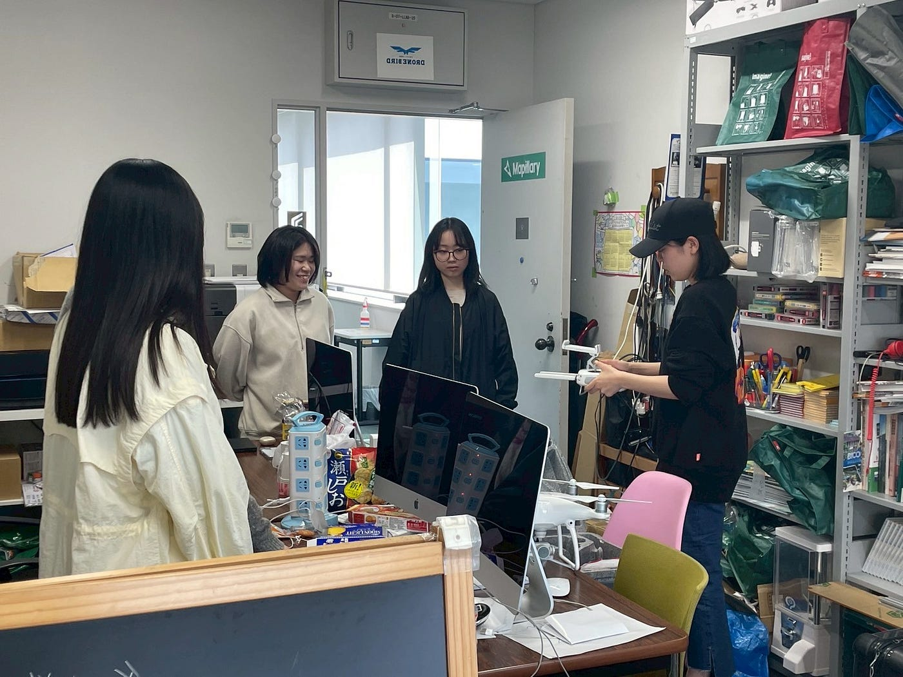
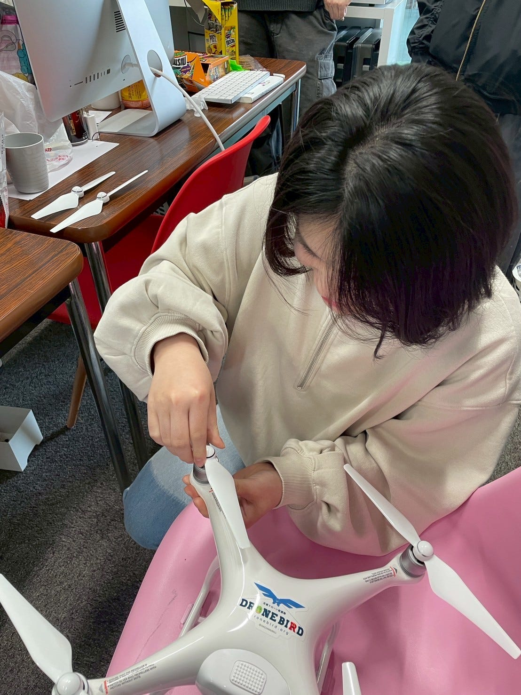
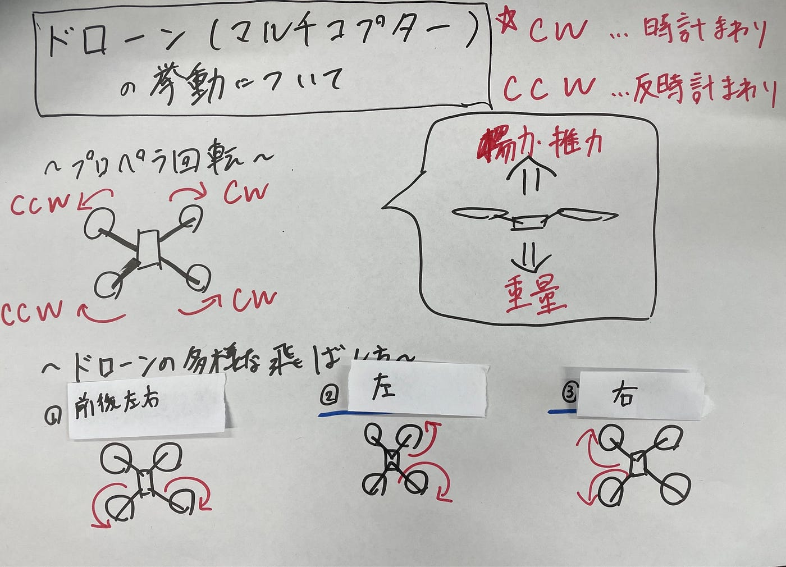
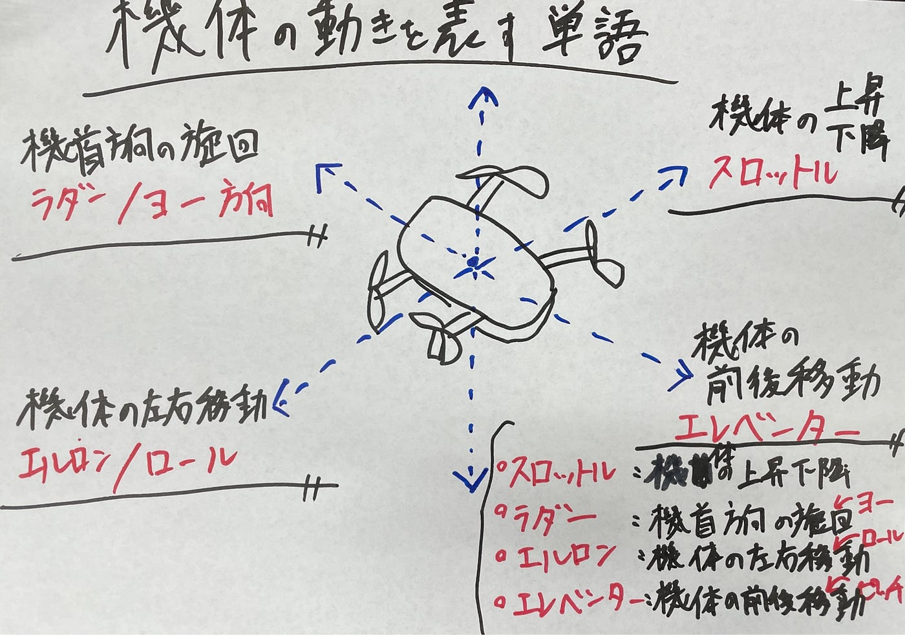

### [PHANTOM 4デモンストレーション]ドローン部Ⅱ週報

こんにちは、ドローン部4年の佐藤です！

今年度、ドローン部は10人の大所帯になったので、2つに分割して作業をすすめることになりました！

今週の週報では、ドローン部Ⅱのメンバー紹介と簡単なドローンのセッティングデモンストレーションについて報告します！

djのPHANTOM 4を使って、部品の名称や羽のセッティング方法について、簡単に解説しました。

以下、メンバー紹介です。

佐藤：4年。趣味は登山とトレッキングなどです。古橋研究室では、去年からドローン部に所属して、防災イベントなど子供向けのドローン講習会で、操縦補助など行っていました。今年は、ブレンダーとプリンターでドローンをつくってみたいです。

ひなこ：3年。趣味は、アニメみたり、オーボエ吹いたり、読書したり旅行行ったりすることです。古橋研に興味を持ったきっかけは、入学前の古橋先生の体験授業で面白そうな分野だと思ったのと活発そうな研究室だと感じたからです。ドローン部ではドローンの飛ば方や飛ばす上での注意点などの理解に努めたいです。

あきら：3年。趣味はハイキングやキャンプ、ツーリングやバイクレース観戦です。入試のために大学を調べていた際に一風変わったゼミがあると思い興味を惹かれ、古橋研究室に入りました。ドローン部では操作に慣れ、いずれ自分の趣味にもできたらと考えています。よろしくお願いします。

ふうか：3年。海外ドラマや映画が趣味で、最近は中国アニメ「王焕君和张缤智」にもハマっています。旅行や散策も好きで、休みがあれば国内外問わず出かけています。古橋研究室には、ゼミで異色の存在感を放っていたことがきっかけで興味を持ちました。ドローンを使った新しい挑戦に惹かれており、まずは操縦に慣れつつ、ギネス世界記録にも挑戦してみたいです。

実亜：3年。趣味はスポーツ観戦で、特に野球が大好きです！古橋研に興味を持ったきっかけは、地球社会共生学部の中でも珍しいテーマを扱っていて面白そうだと思ったのと、ゼミの活動がアクティブでいろんな経験ができそうだと感じたからです。ドローン部では、まずは操縦ができるようになることを目標に、空撮や地形調査などにも挑戦してみたいです！よろしくお願いします。

1年間、よろしくお願いします！

