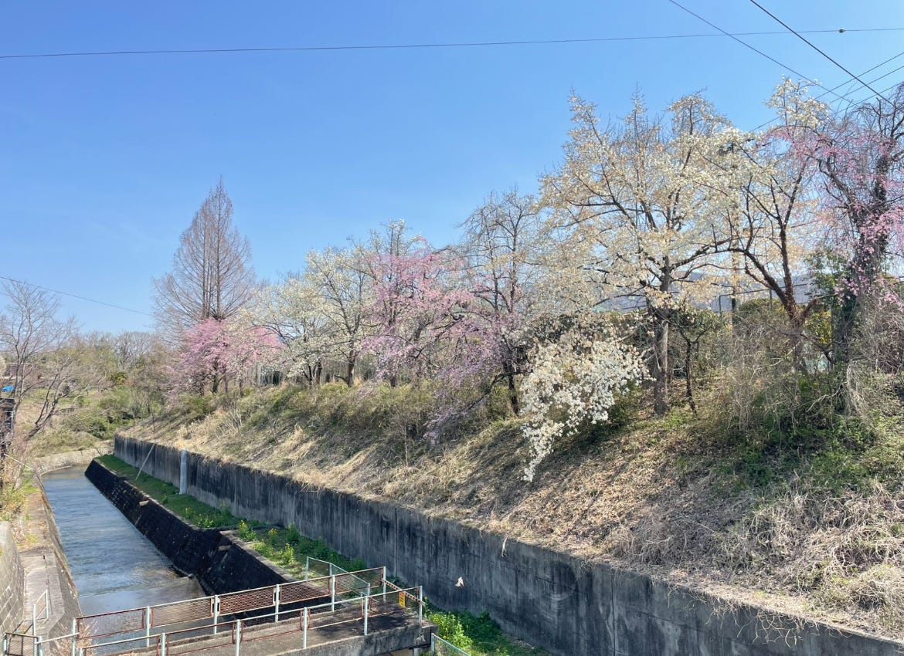
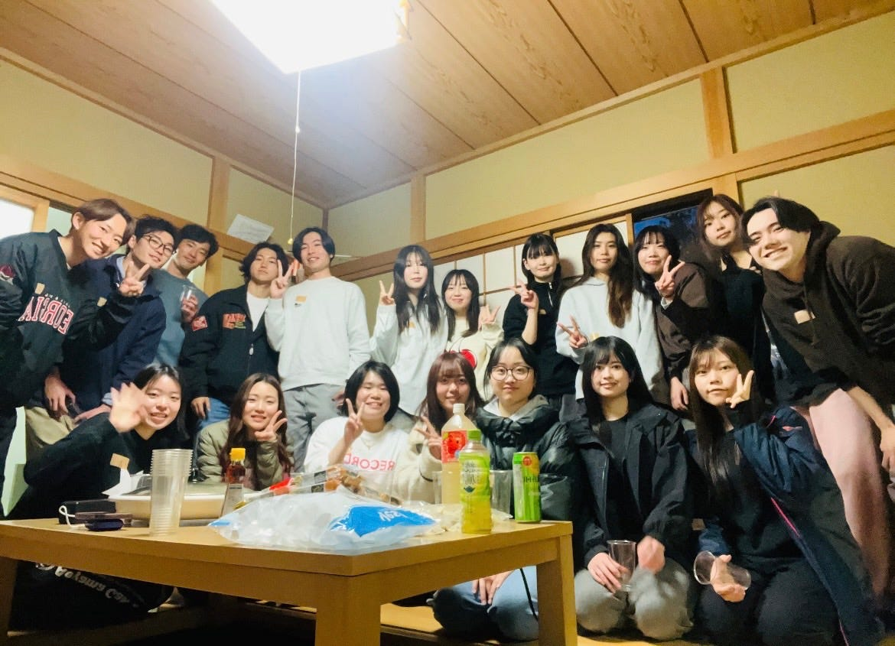
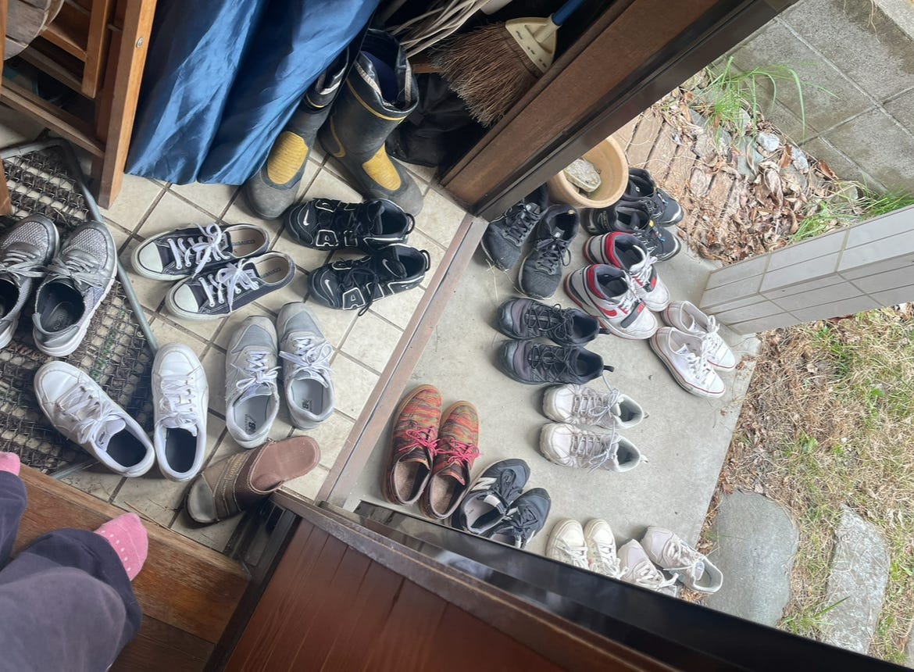
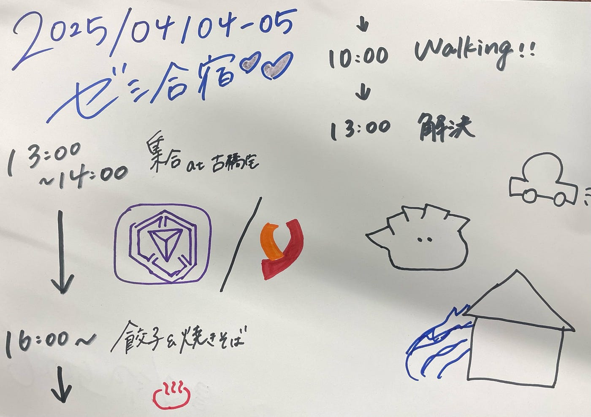

### 週報

こんにちは。

新4年生になった、ユース①リーダーの金澤です。

4/4(土)〜4/5(日)で行われたゼミ合宿についてお話します。

主に4年の林(ゆ)、金澤、佐藤、高井が話し合って計画を立てました。

#### **【当日のスケジュール】**

4/4(土)

14:00 全員集合

14:30–16:00 買い出し/イングレス勉強会

16:00- 親睦会、温泉等

4/5(日)

各自行動、古橋宅片付け後、解散

#### 【横瀬WalkingのStrava Permalink】

[https://strava.app.link/BtDVQbn9xSb](https://strava.app.link/BtDVQbn9xSb) (朝)

[https://strava.app.link/DMdbg7r9xSb](https://strava.app.link/DMdbg7r9xSb) (夜)

#### 【感想】

合宿の計画を立てるにあたり予算内でいかに食費を抑えるか、空いた時間をどう有効活用するかや、当日のハプニング（水道局や車移動による遅延等）大変なこともありましたが、何より新3年生の親睦が深まっている姿を見れて嬉しかったです。

個人的に、イングレス勉強会を行なったことと、メニュー変更（鍋→焼きそば）が功を奏した気がします‼︎

これから新3年生とより親睦を深め、一緒に多くの学びを得られたら良いと思います。

