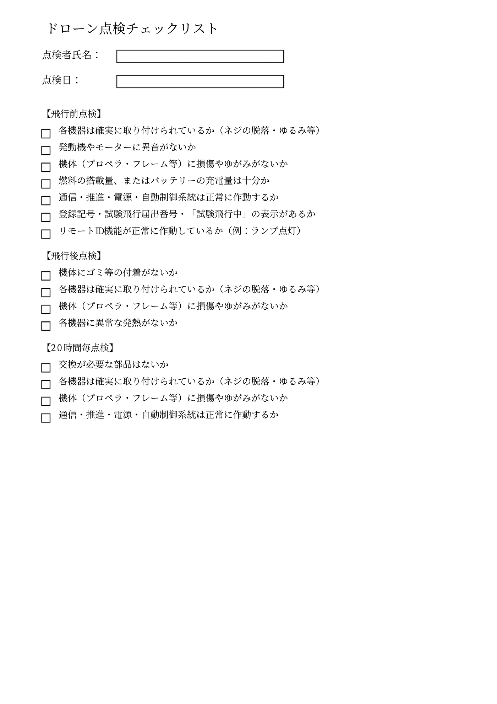
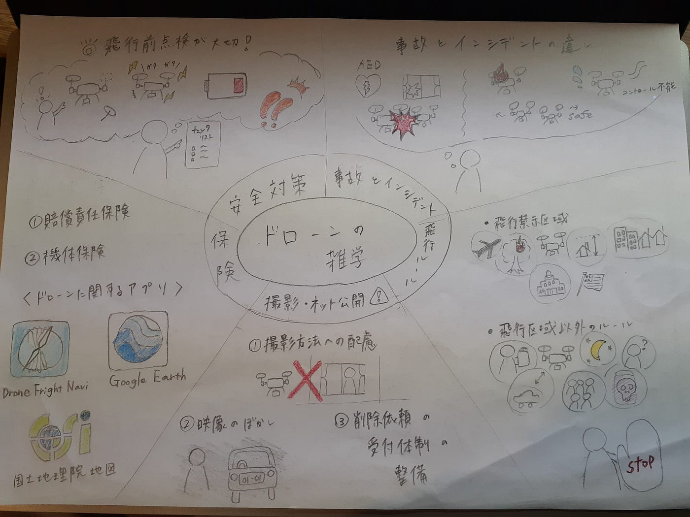

### ドローン、飛ばす前に確認しよう！

ドローン部②の週報を担当します寺土日南子です！

新三年生はドローンの知識がないため、

- 飛行ルール

- 安全対策

- ドローンに関する保険

- 撮影・ネット上公開の注意事項

- 事故とインシデント

の５つの項目をそれぞれが担当し、どこの情報、サイトを確認するのが適切かを各々が調べ、確認しました。それらの情報を下記にまとめました。

> **飛行ルール**

ドローンを飛ばす前にしっかりと飛行ルールを確認しておく必要があります。[国土交通省のホームページ](https://www.mlit.go.jp/koku/koku_tk10_000003.html)には無人航空機の飛行ルールがまとめられています。

**✔飛行禁止区域**

1. 空港周辺

1. 緊急用務空域（飛行許可があっても原則禁止）

1. 150m以上の上空（地表または水面から)

1. DID（人工集中地区）

飛行したい場合は国土交通大臣の許可が必要です。_[国土交通省航空局HP_](https://www.mlit.go.jp/koku/koku_fr10_000042.html)

5. 国の重要な施設等周外国辺

6. 外国公館の周辺（大使館など）

7. 防衛関係施設の周辺

8. 原子力事務所の周辺

施設管理者や都道府県公安委員会に事前の通報が必要です。_[警察庁HPへ_](https://proc.npa.go.jp/portaltop/SP0200/05/01.html) _(1も含む)_

**✔飛行空域以外のルール**

1. 飲酒時の飛行禁止

1. 危険な飛行禁止

1. 夜間での飛行禁止

1. 目視外飛行禁止

1. 距離の確保（第三者の上空は飛行しない。建物、車両の距離30mを保つ）

1. 催し場所での飛行禁止

1. 危険物輸送の禁止

1. 物件投下の禁止

**✔無人航空機とは？**

（ドローン、ラジコン機、農薬散布用ヘリコプター）

- 飛行機、回転翼航空機、滑空機、飛行船

- 人が乗れない

- 遠隔操作or自動操縦 可能

- 100g以上の重量（機体本体＋バッテリーの合計重量）

- 登録を受けたドローンのみ飛ばせる

参考資料

- 国土交通省, 警察庁. ドローンの飛行ルール. [001303817.pdf](https://www.mlit.go.jp/common/001303817.pdf)

- 国土交通省 航空局. (2023,1,23). 無人航空機(ドローン、ラジコン機等)の安全な飛行のためのガイドライン. [001303818.pdf](https://www.mlit.go.jp/common/001303818.pdf)

ひなこ

> 安全対策

ドローンは精密な機器であり、多くの部品やシステムが連動して動作します。そのため、飛ばす前に**飛行前点検**をすること安全対策につながります。

国土交通省が公開している無人航空機飛行マニュアル1–1(1)には、飛行前点検の重要性と具体的な手順が、詳しく記載されています。

例えば、各部のチェックリストや点検の頻度、異常時の対応方法などです。

１－１ 機体の点検・整備の方法

（１）飛行前の点検 飛行前には、以下の点について機体の点検を行う。

・各機器は確実に取り付けられているか（ネジ等の脱落やゆるみ等）

・発動機やモーターに異音はないか

・機体（プロペラ、フレーム等）に損傷やゆがみはないか

・燃料の搭載量又はバッテリーの充電量は十分か

・通信系統、推進系統、電源系統及び自動制御系統は正常に作動するか

・登録記号又は試験飛行届出番号及び「試験飛行中」について、機体に表示され ているか

・リモートＩＤ機能が正常に作動しているか（リモートＩＤ機能を有する機器を 装備する場合） 具体的な例：リモートＩＤ機能が作動していることを示すランプが点灯して いることの確認各機器は確実に取り付けられているか？

上記の飛行前点検だけでなく飛行後点検や定期的な点検をすることも求められます。

以下学習資料「無人飛行機飛行マニュアル」を元にchatgptに作らせた**初心者向けチェックリスト**です！(2025/4/21 ChatGPT 4o使用)

まだドローンを触ったことがないので、今後はより実用的なシートになるように、チェック項目のさらなる精査・分類の明確化や実際の点検フローに沿ったレイアウトの最適化などの改良を行う予定です。

みあ

> ドローンに関する保険

ドローンまつわるメジャーな保険には大きく分けて二種類あります。

1. 賠償責任保険

→対人・対物の弁償の保険。車で言う自賠責のようなもの。

2.機体保険

→本体が破損した時などに使える保険。

※それぞれに個人用、企業用がある。

2022年の航空法改正以降、登録が必要なドローン（100g以上）を飛ばす場合、賠償責任保険への加入が義務付けられたため、1の賠償責任保険への加入が必須である。事故で人や建物に損害を与えてしまい、高額な費用を請求されたときなどに適用される。

●保険会社

1. ドローンのメーカー保険

DGI

株式会社マゼックス

株式会社クボタ

株式会社ロボティクスジャパン

※DGIの場合、対象機種を新品購入すると無償付帯賠償責任保険が一年間つく

2.東京海上日動

3.三井住友海上

4.AIG損保

●ドローンに関するアプリ

ドローンは航空法などに違反しない場所で飛ばさなくてはならない！

それらをわかりやすくするアプリをリストアップしました。

1. ドローンフライトナビ

・航空法に基づくOKな場所の表示

・人口集中地区の表示

・小型無人機飛行法による禁止区域の表示

・空港、ヘリポート、基地の確認

・日の出、日の入りの時間の確認

[ドローンフライトナビ
ドローンに関する最新の航空法・小型無人機等飛行禁止法の規制、さらに緊急用務空域にも素早く対応。日出・日入時刻も確認可能。iOS・Android・PCのマルチデバイス対応。droneflightnavi.jp](https://droneflightnavi.jp/)

2.Google Earth

・周辺情報の表示

・距離、面積の把握

[概要 - Google Earth
Apple App Store で Google Earth をダウンロード Google Play ストアで Google Earth をダウンロードwww.google.com](https://www.google.com/intl/ja_in/earth/)

3.国土地理院地図

・人口集中地区の表示

[地理院地図 / GSI Maps | 国土地理院
地形図、写真、標高、地形分類、災害情報など、日本の国土の様子を発信するウェブ地図です。地形図や写真の3D表示も可能。maps.gsi.go.jp](https://maps.gsi.go.jp/#5/36.104611/140.084556/&base=std&ls=std&disp=1&vs=c1g1j0h0k0l0u0t0z0r0s0m0f1)

4.SORAPASS care

・人口集中地区の確認

・飛行場の確認

・賠償責任保険がつく

[SORAPASS care ソラパスケア | ドローン保険 + 飛行支援地図サービス
ドローン保険ならSORAPASS care ソラパスケア。飛行支援サービスと損害保険ジャパンが提供するドローン保険をセットにしたスマートフォン向けアプリです。SORAPASS…www.sorapass.com](https://www.sorapass.com/information/index.html)

あきら

> ドローンによる撮影・インターネット上で公開する際の注意事項

1. **撮影方法への配慮**

- 住宅にカメラを向けない、ズーム使用を避けるなど、住宅の写り込みを防ぐ

- 高層マンションでは、住居内部が見える角度（水平など）での撮影を避ける

- ライブ配信ではぼかし処理が困難なため、住宅地周辺のリアルタイム配信は控える

**２. 映像へのぼかし処理などの配慮**

- 顔、ナンバープレート、表札、生活用品などが写り込んだ場合、削除やぼかし処理を行う

**３. 電気通信事業者の対応**

- 削除依頼の受付体制を整備し、非インターネット利用者にも配慮（電話窓口など）

- 明白に同意なしと判断される映像は削除対象

- 公共性が高い撮影（例：観光地の群衆、犯罪報道など）は削除対象外の可能性あり

- 明らかな未成年の顔写真は、原則削除対象

出典: 総務省「ドローンによる撮影映像等の インターネット上での取扱いに係るガイドライン」2025/04/21閲覧

ふうか

> ドローン操縦中の「事故」と「インシデント」、どう違う？報告のポイントと注意点

ドローンを安全に飛ばすには、万が一のトラブルにも備えておくことが大切です。

国土交通省では、ドローンに関する「事故」と「重大インシデント」を以下のように定義し、発生時には迅速な報告を求めています。

●「事故」とは？

•	人が重傷以上を負った場合

•	他人の建物や車などの物件を損壊した場合

•	航空機と接触または衝突した場合

●「重大インシデント」とは？

•	人が軽傷を負った場合

•	ドローンが制御不能になった場合

•	飛行中に発火した場合

•	航空機との接触のおそれがあった場合

これらの事態が起きた場合は、DIPS 2.0（ドローン情報基盤システム）から速やかに報告が必要です。

ただし、単なる操縦ミスや点検不足による墜落は「制御不能」とは見なされず、重大インシデントに該当しないケースもあります。

たとえば、

•	自動帰還機能の設定ミスによる墜落

•	センサーキャリブレーション忘れ

•	経年劣化したバッテリーの使用などは、日頃の確認で防げるトラブルです。

●実際の報告件数（令和5年度）

•	事故：65件

•	重大インシデント：21件

•	該当しない事案：361件

出典: 国土交通省 航空局　無人航空機安全課「事故・重大インシデントについて」2025/04/21閲覧

●もし墜落したら…

プロペラは停止していても回転を続けている場合があり、非常に危険です。リチウムポリマーバッテリーは落下によるダメージで遅れて発火することもあるため、近づく前に状態確認を忘れずに!

安全運用のため、事故・インシデントへの理解と準備を万全にしておきましょう!

グラレコです

