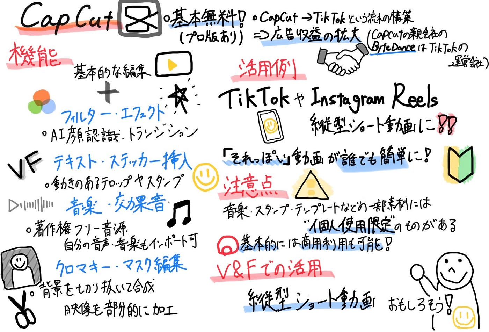

### CapCut徹底解剖～機能と無料のカラクリ～

こんにちは、V＆F部3年の高井です。
 今週は、V＆Fの[TikTok](https://www.tiktok.com/ja-JP/)運用に向けた仕込み期間の一環として、動画編集アプリである[CapCut](https://www.capcut.com/my-edit?from_page=landing_page&start_tab=video)について調査を行い、主な機能や活用事例、ビジネスモデルについて整理しました。

### 1．主な機能

- **基本的な編集機能**
 トリミング・カット・結合といった基本操作が直感的にでき、短時間でも映える動画が作れます。

- **フィルター・エフェクト**
 AIによる顔認識やトランジションなど、TikTok風のおしゃれな加工が豊富。

- **テキスト・ステッカー挿入**
 動きのあるテロップやポップなスタンプも簡単に追加できます。

- **音楽・効果音**
 著作権フリーの音源が揃っており、アプリ内のBGMをそのまま使用可能。自分の音声・音楽もインポート可。

- **クロマキー・マスク編集**
 背景を切り抜いて合成したり、映像を部分的に加工したりと、YouTuber的な編集も可能。

### 2．CapCutの活用例

- TikTokやInstagram Reelsなど、**縦型ショート動画**との相性が抜群。

- [V＆Fのサークル紹介動画](https://www.tiktok.com/@vfofficials/video/7449283764150111504?is_from_webapp=1&sender_device=pc&web_id=7474957410076231176)など、手軽に映像を作れる点が魅力。

- テンプレも充実しており、デザインの知識がなくても「それっぽい」動画が作れる。

### **3．CapCutのビジネスモデル**

**①基本利用は無料**
 CapCutは誰でも無料で高機能な編集が可能です。
 一方で、プロ版（CapCut Pro）では、4K出力やクラウド保存、有料テンプレートなどの機能が月額・年額課金で提供されています。

**②TikTokとの連携による収益構造**
 CapCutの親会社である**[ByteDance**](https://jobs.bytedance.com/jp/)は、**TikTokの運営会社**でもあります。
 そのため、「CapCutで編集 → TikTokに投稿」という流れを自然に促すことで、TikTok内のコンテンツが増え、結果的に広告収益の拡大に繋がる構造になっています。

### 4．CapCutの注意点

- **商用利用は可能。**ただし注意が必要。
 CapCutで作成した動画は、基本的に商用利用も可能です。
 ただし、アプリ内の音楽・スタンプ・テンプレートなどの一部素材には個人利用限定のものがあるため、商用で使う場合は利用規約やライセンスの確認が必須です。

- **V＆Fの活動は非営利かつ教育的な性格が強いため、現時点では非商用利用に該当し、基本的には問題ありません。**
 ただし、今後の外部発信や連携において商用性が強まる場合には、素材選定に注意が必要です。

### 5．今後の活用について

今後V＆FのTikTok動画を作成するうえでとても便利なツールだと思うので、今後色々試しながら動画を作成してみたいと思います！

#### 今週のグラレコ

**参考資料**

CapCut公式リソースページ（使い方や機能紹介）**
**[https://www.capcut.com/ja-jp/resource/how-to-use-capcut](https://www.capcut.com/ja-jp/resource/how-to-use-capcut)

CapCut基本機能と活用法（All in Motions）[https://allinmotions.co.jp/college/2024/05/magazine/movie/954/](https://allinmotions.co.jp/college/2024/05/magazine/movie/954/)

CapCutのテンプレート・エフェクト活用法（All in Motions）[https://allinmotions.co.jp/college/2024/07/magazine/movie/1275/](https://allinmotions.co.jp/college/2024/07/magazine/movie/1275/)
