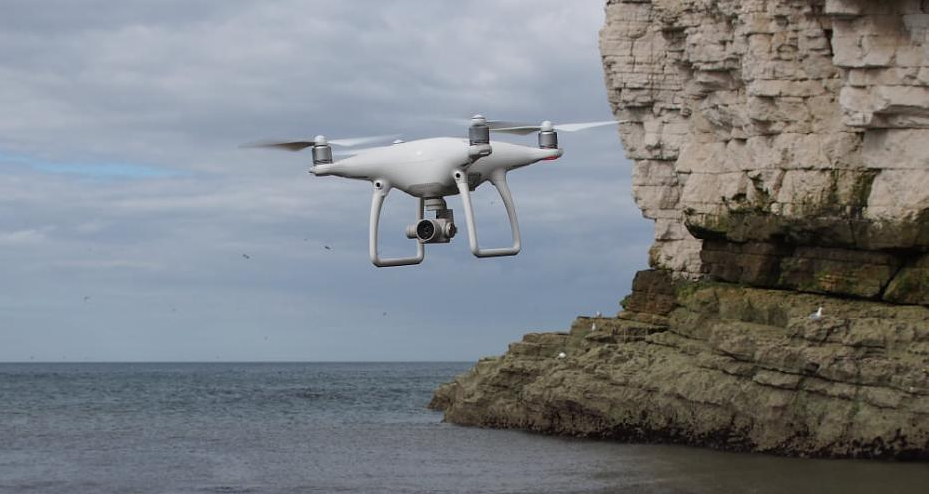
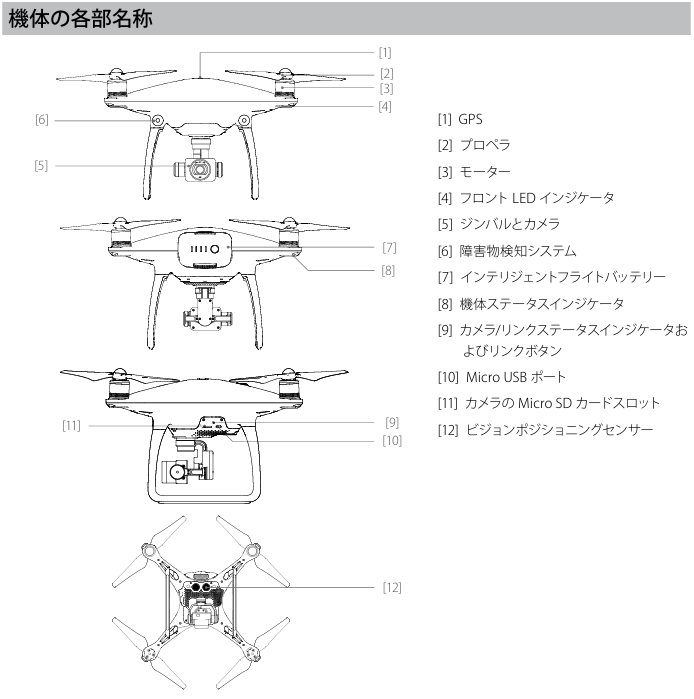
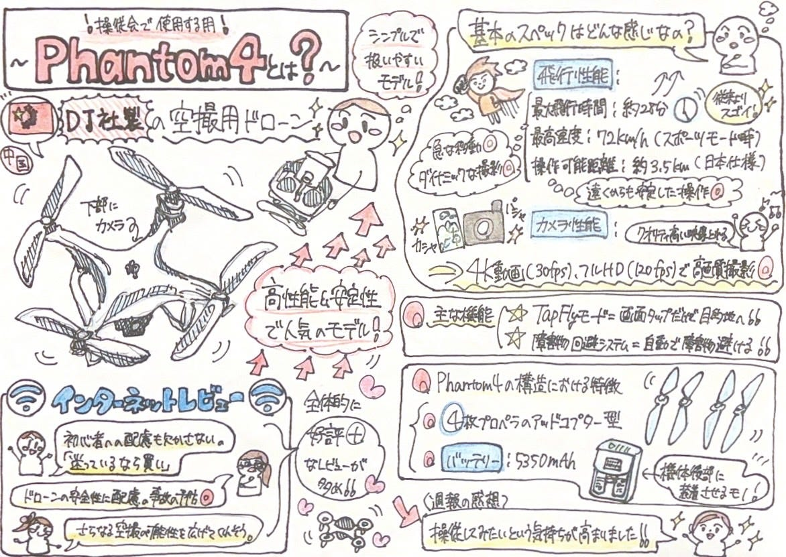

### Phantom 4って何？｜基本構造と機能をわかりやすく解説

こんにちは、ドローン部3年の井上です！これからよろしくお願いします。

今週の週報では、我々ドローン部がこれから操縦会で使用する「[Phantom4](https://www.dji.com/jp/products/phantom)」というドローンの機種の性能や構造について報告します。

### Phantom4の基本スペック

Phantom4は中国の[DJI社](https://www.dji.com/jp)が開発した空撮用ドローンで、安定した飛行性能と高品質なカメラを搭載しているのが特徴の人気モデルです。

〈基本スペック〉

- 飛行時間は最大28分で、従来よりも大幅に向上

- 最高速度は72kｍ/h！(スポーツモード)

→急な移動やダイナミックな撮影が可能

- 操作可能距離は日本仕様で最大3.5㎞

→遠隔地からでも安定した操作

- 4K動画を最大30フレーム/秒で、フルHD 1080p動画を最大120フレーム/秒で撮影可能

→クオリティの高い空撮映像を撮れる！

これらがPhantom4の基本スペックとなっています。

#### Phantom4の特徴的な機能ー「TapFly」

Tapflyモードとは送信機を使わず、スマートフォンやタブレットなどの画面を指でタップするだけで飛行を開始し、目的の場所まで誘導することができる個性的なモードのことです。

さらに、このモードには障害物回避システムが備わっており、自動的に障害物を回避するか、減速してホバリングを開始するので、これまで自分自身の技量でドローンを束すのが困難だった場所でも飛行可能となります。

操縦する機会にこのモードがどのようなものか実際に体感したいです！

### Phantom4の構造

- クアッドコプター（4枚プロペラ式）のドローン

→プロペラが６枚のヘキサコプターや８枚のオクトコプターもあるが、Phantom4は特に一般的なクアッドコプター

- バッテリーはインテリジェントフライトバッテリー(容量 5,350Ah)を採用しており、機体後部に装着

構造としては全体的にシンプルで扱いやすいモデルであるという事が分かりました。

### Phantom4に対するレビュー

- 初心者への配慮も欠かさないPhantom 4。一言でいうなら、「迷っているなら買い！」です！！

- Phantom 4は、ドローンの安全性に配慮した新機能を多数備え、事故の予防にかなり気を遣っています。

- Phantom 4はさらなる空撮の可能性を広げてくれそうなドローンだ。

全体的に好評なレビューが多く、操縦してみたいという気持ちが強くなりました。

この魅力的なドローンを使って充実したサークル活動にしていきたいと思います！

最後に今回のグラレコを紹介します。

【参考資料】

基本スペック

- DJI. (2016). _Phantom 4 ユーザーマニュアル（日本語版）_

- DJI. (2016). _Phantom 4 クイックスタートガイド（日本語版）_

- Skylink Japan. (2023). _DJI Phantom 4とは？機体の特徴やスペックを解説_．Skylink Japan公式ブログ．2025/04/20，[https://skylinkjapan.com/blog/dji-phantom-4/](https://skylinkjapan.com/blog/dji-phantom-4/)

構造

- DRONE GIRLS編集部. (2020). _ドローンはなぜ飛ぶの？飛行の仕組みを図解でわかりやすく解説_．DRONE GIRLS．2025/04/20，[https://drone-girls.com/lets_drone/study/flying_mechanism/](https://drone-girls.com/lets_drone/study/flying_mechanism/)

レビュー

- DroneMedia編集部. (2016). _DJI Phantom 4 レビュー：障害物回避機能がスゴい！進化した高性能ドローンの実力とは？_．DroneMedia．2025/04/20，[https://dronemedia.jp/dji-phantom-4-review/](https://dronemedia.jp/dji-phantom-4-review/)

- 古田雄介. (2016). _4K撮影＆障害物回避！ DJIの新型ドローン「Phantom 4」は空撮の常識を変えるか？_．GetNavi web．2025/04/20，[https://getnavi.jp/digital/41076/](https://getnavi.jp/digital/41076/)

- VIDEO SALON編集部. (2016). _【レポート】DJI Phantom4 注目の新機能をフィールドで検証_．VIDEO SALON Web．2025/04/20，[https://videosalon.jp/report/%e3%80%90%e3%83%ac%e3%83%9d%e3%83%bc%e3%83%88%e3%80%91dji-phantom4%e6%b3%a8%e7%9b%ae%e3%81%ae%e6%96%b0%e6%a9%9f%e8%83%bd%e3%82%92%e3%83%95%e3%82%a3%e3%83%bc%e3%83%ab%e3%83%89%e3%81%a7%e6%a4%9c/](https://videosalon.jp/report/%e3%80%90%e3%83%ac%e3%83%9d%e3%83%bc%e3%83%88%e3%80%91dji-phantom4%e6%b3%a8%e7%9b%ae%e3%81%ae%e6%96%b0%e6%a9%9f%e8%83%bd%e3%82%92%e3%83%95%e3%82%a3%e3%83%bc%e3%83%ab%e3%83%89%e3%81%a7%e6%a4%9c/)
