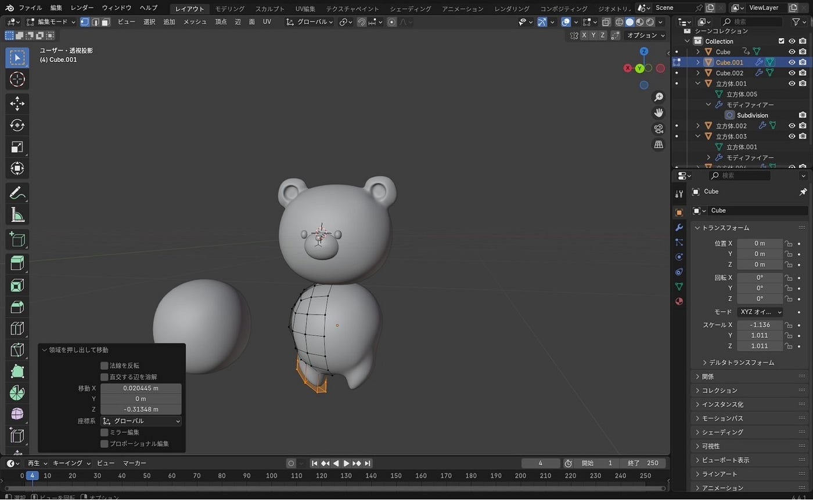
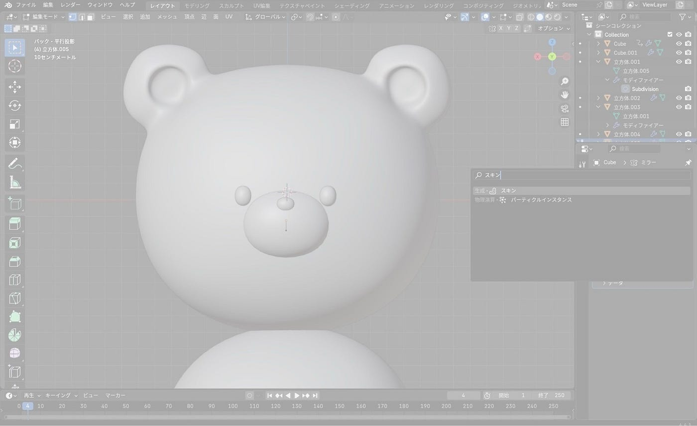
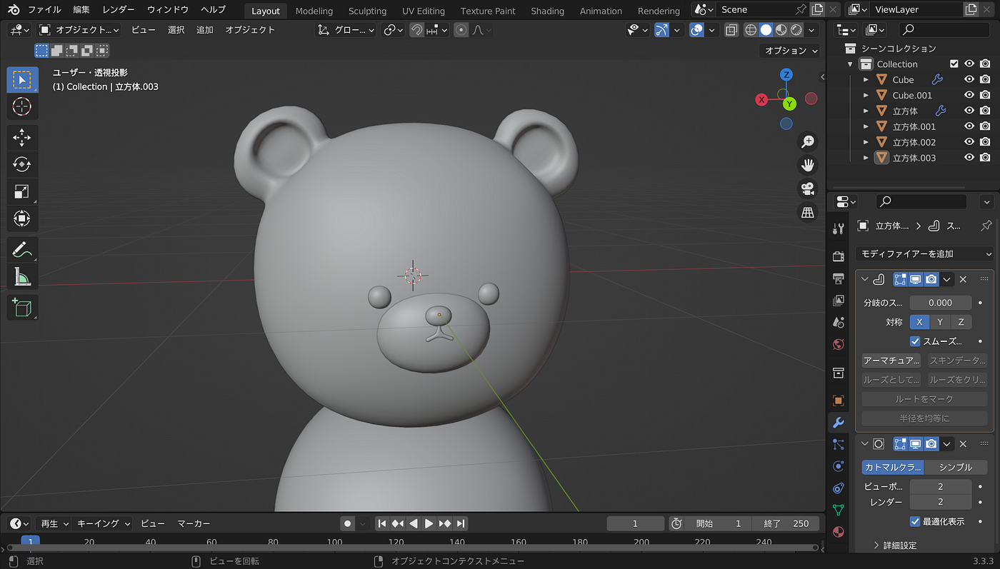
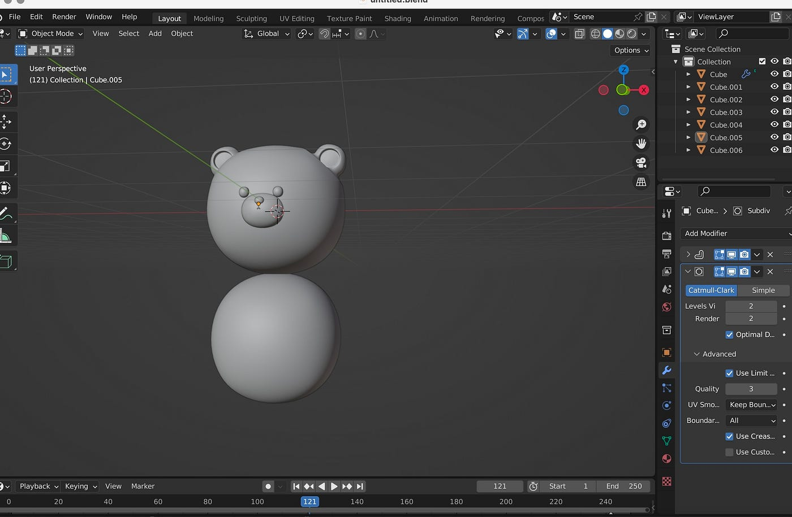
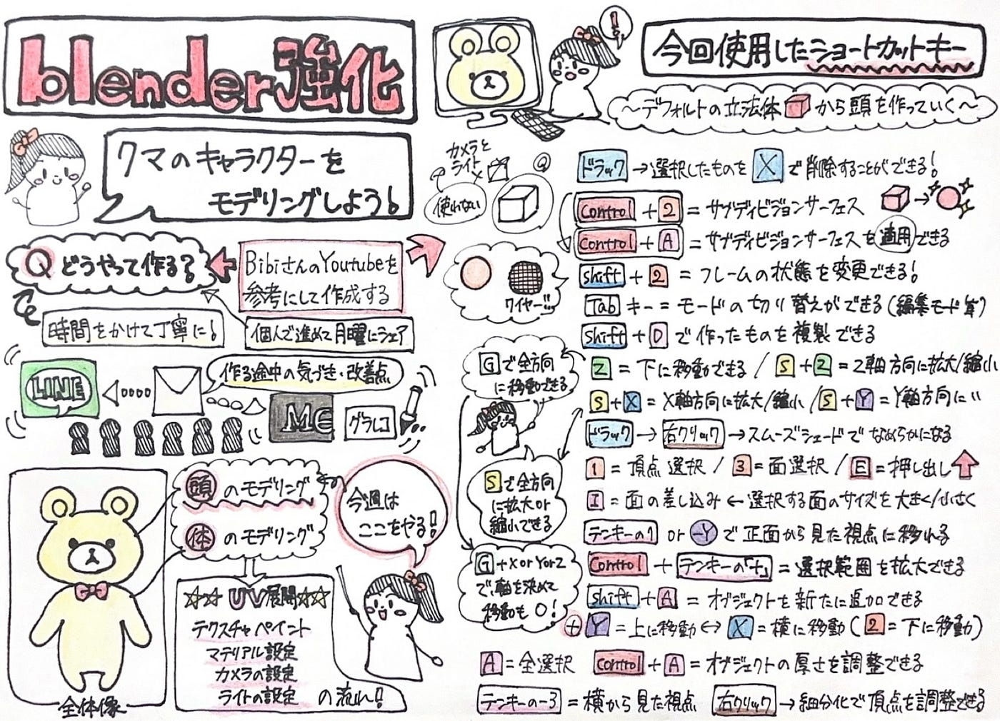

## デザイン部週報4/22

こんにちは！3年の臼井です。

デザイン部では今週からblender強化のため、メンバー全員がそれぞれblenderでクマのキャラクターをモデリングしていきます。

作成には以下の動画を参考にさせてもらっています。

今回はクマの頭の部分のモデリングを行いました。

以下はそれぞれのメンバーが作成した頭部のスクショです。

1人目：

パソコンの性能が悪くスキンを押すと写真のように白くなって落ちてしまったので、口は線を引いて曲げる形にして動画の口に寄せる工夫をしました。口が上手く出来なかった分として足を生やす所まで進めました。(稲田)

2人目：

動画も見ながら制作しましたが、顔のパーツ配置や耳の形は自分がかわいいと思える形になるように細かく調整しました。（臼井）

3人目：

途中で何回もどう進めるかわからなくなり、やり直しをしました。耳の形が変になってしまい、もう一度調整していきたいと思います。

### グラレコ

(稲田)
