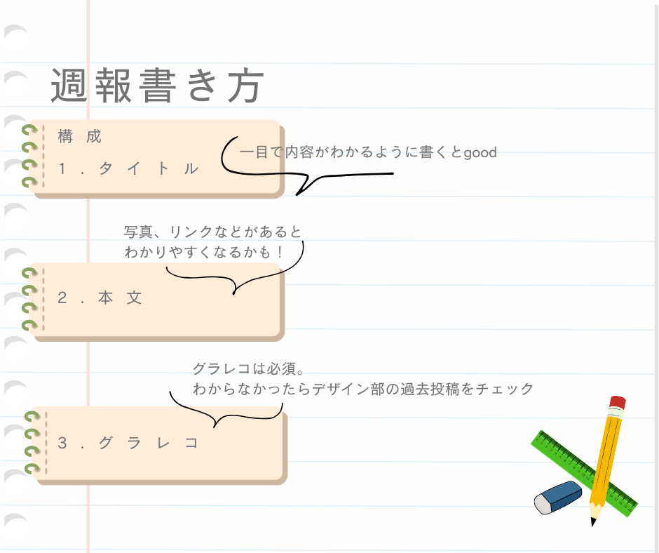

### Youth① 週報の書き方

こんにちは！！

時が経つのも早く、もう4月が終わりを迎えています。そして、新4年、卒業する学年になった、林（み）です。

今週は、新3年生の役に立てればいいなと思い、週報の書き方をまとめてみました。

週報の基本的な構成は、

1. タイトル

1. 本文

1. グラレコ

この3構成になっています。

タイトルには、内容がすぐわかるようなものをつけられるとグッドです！

本文には、内容をわかりやすくするために、写真やリンクなどを載せることも可能です！

グラレコは毎回の週報に必ず載せる必要があります！

グラレコを書く媒体はそれぞれ自由で、紙でも、iPad上で書いたものでもなんでもオッケーです

過去にグラレコの書き方をデザイン部の皆さんがまとめたものがあるので参考にしてみてください！

[グラレコの描き方~デジタル編~ デザイン週報(6/18)
こんにちは！3年の末木です。medium.com](https://medium.com/furuhashilab/%E3%82%B0%E3%83%A9%E3%83%AC%E3%82%B3%E3%81%AE%E6%8F%8F%E3%81%8D%E6%96%B9-%E3%83%87%E3%82%B8%E3%82%BF%E3%83%AB%E7%B7%A8-%E3%83%87%E3%82%B6%E3%82%A4%E3%83%B3%E9%80%B1%E5%A0%B1-6-18-799fda3be6f2)

[デザイン部週報 グラレコの書き方〜パソコン〜
こんにちは！三年の福田です。medium.com](https://medium.com/furuhashilab/%E3%83%87%E3%82%B6%E3%82%A4%E3%83%B3%E9%83%A8%E9%80%B1%E5%A0%B1-%E3%82%B0%E3%83%A9%E3%83%AC%E3%82%B3%E3%81%AE%E6%9B%B8%E3%81%8D%E6%96%B9-%E3%83%91%E3%82%BD%E3%82%B3%E3%83%B3-919381eb8e71)

[グラレコの書き方~手書き編~
こんにちは！
デザイン部3年の滝沢です！
今回は、グラレコの書き方、手書き編について週報を書きます。medium.com](https://medium.com/furuhashilab/%E3%82%B0%E3%83%A9%E3%83%AC%E3%82%B3%E3%81%AE%E6%9B%B8%E3%81%8D%E6%96%B9-%E6%89%8B%E6%9B%B8%E3%81%8D%E7%B7%A8-7077ad4965ee)

グラレコの書き方がわからなくなったらこれらを参考にしてみてください！

描き終わったら、Mediumに投稿するのですが、Organizationを[古橋研究室](https://medium.com/furuhashilab)の方に設定してください！

Mediumに投稿出来たら、[Facebook](https://www.facebook.com/groups/furuhashilabnow/)にも同じく投稿することをお忘れなく！！

グラレコ

