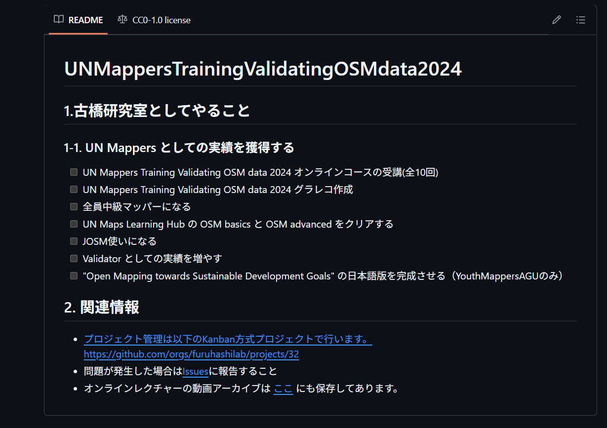
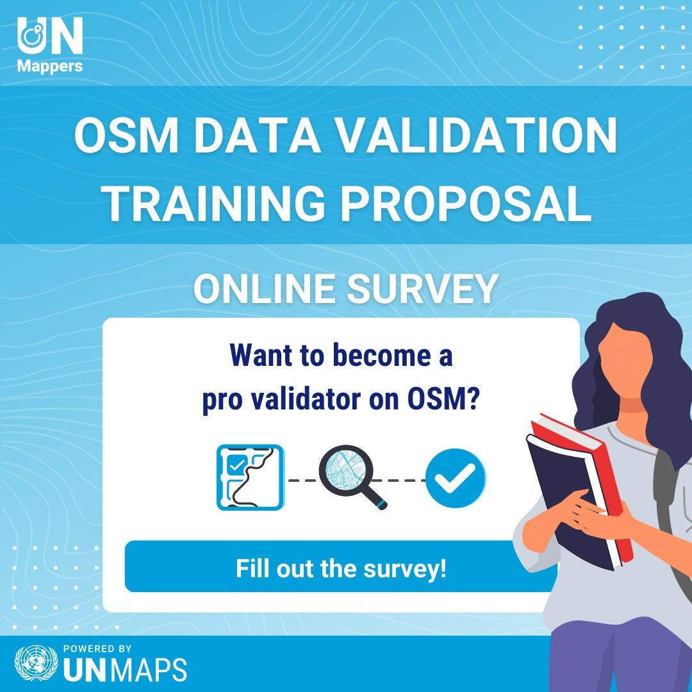
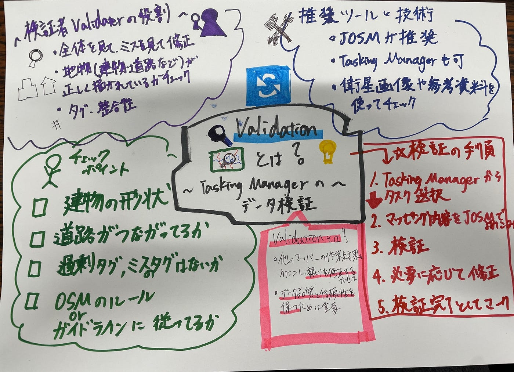

### ～OSM Validationの仕組みを知ろう！～Youth週報

こんにちはYouth2の4年佐藤です。こんにちは。今回は、昨年度に古橋研究室で行ったOpenStreetMap（OSM）に関する取り組みを、紹介します。特に「JOSM」という編集ツールの活用と、視覚的に情報を伝える「グラフィックレコーディング（グラレコ）」の活用を中心にお話しします。

### 昨年の古橋研究室ハッカソン

#### OSM DATA VALIDATION TRAININGとは？

私たち古橋研究室では、災害時の緊急対応や地図が整備されていない地域への貢献を目的に、OSMへの地理空間データの入力・整備を継続的に行っています。災害発生時には地図情報が非常に重要であり、救援活動の迅速な展開や被害状況の把握に直結するため、こうした日頃からの整備が大きな意味を持ちます。

[OpenStreetMapのデータ検証](https://wiki.openstreetmap.org/wiki/Tasking_Manager/Validating_data)は、経験豊富なボランティアが他の貢献者の作業を確認し、地図データの完全性と精度を確保する重要なプロセスです。​検証者は、建物の形状や道路の接続状況などをチェックし、必要に応じて修正やフィードバックを行います。​これにより、プロジェクトの作成者は、信頼性の高い地図データを得ることができます。​検証は、マッピングと同時進行で行うことが推奨されており、JOSMなどのツールを活用して効率的に実施されます。

OSM DATA VALIDATION TRAININGは、UNが主催するOSMデータ検証者を育成するためのプログラムです。このプログラムで指定された課題を終了し、実績を積み重ねることで、OSMのdata validationを行う権限をもらうことができます。

#### OSMの編集について

OSMの編集にはいくつかツールがありますが、その中でも「JOSM（Java OpenStreetMap Editor）」は特に多機能で、効率的に細かい編集作業を行えるため、上級者向けとして知られています。Javaで動作するため、WindowsやMacのパソコンが必要で、導入のハードルはやや高めです。

2023年度には、UN Mappersが主催する「OSM Data Validation Training Proposal」に、古橋研究室から12名の学生が参加しました。このプログラムでは、JOSMを使ってOSMに入力されたデータを検証する方法を学ぶことが求められました。しかし、参加した学生の中には、パソコン操作に不慣れなメンバーもおり、インストール作業の段階でつまずく例も少なくありませんでした。

[https://www.linkedin.com/posts/un-mappers_osm-validation-training-activity-7161000312651030528-1dsh](https://www.linkedin.com/posts/un-mappers_osm-validation-training-activity-7161000312651030528-1dsh)

### 【ゼミ独自の実績】JOSMを使ったOSMデータ整備とグラレコによる支援ツールの制作

さらに、このトレーニングはリアルタイムかつ英語で実施されたため、言語の壁やリスニング力によって理解度に差が生じました。結果として、初期に作成したグラフィックレコーディングは内容を十分に反映できておらず、全体の再構成が必要になりました。

そこで私たちは、[トレーニングの録画](https://drive.google.com/drive/u/3/folders/0AHZfntbcQr9GUk9PVA)を見直しながら、JOSMの操作手順や検証のポイントを図解で表現し直しました。これにより、視覚的に直感的でわかりやすい資料が完成し、現在、GitHubでオープンソースとして全世界に公開されています。リポジトリを検索してみてください！

