### 初めてのマッパソン！ドローン部１の能登半島地震クライシスマッピング

こんにちは！ドローン部3年の山﨑です！ よろしくお願いします。

今回の週報ではドローン部１で参加した[International Humanitarian Mapathon 2025](https://mapathon.la/en/)のパート１”Crisis mapping challenge”について報告します。写真左のチームです！

#### **International Humanitarian Mapathon 2025とは**

まず今回のマッパソンについて説明します。UCLA、一橋大学など国内外問わず参加し、人道支援に貢献するイベントです。日本では麗澤大学『さつき』iArenaで4月23日（水曜）、4月30日(水曜)の12時25分より開催される予定です。

#### パート１”Crisis mapping challenge”について

**課題**

- 過去1年間に発生した災害をマッピング

- 災害は人的、自然災害問わず

**目的**

- コミュニティが直面するリスク

- 逆境の中での回復力

- 回復への道筋

これら三つを視覚的に魅力的な方法で示すことを目的とする。

#### ドローン部１の作品選定

私たちは2024年1月1日16時10分に発生した石川県能登地方を震源とするマグニチュード7.6の大地震の概要・被害状況と被害が一番大きかった輪島市 避難所の位置についてクライシ スマッピングを作成しました。

**理由**

- 他大学に外国の大学もあり、英語の情報収集力では不利

- 能登半島地震は過去一年で起きた日本最大級の災害で情報が豊富

- 特に輪島市は一番被害が大きく情報も豊富と考えた

#### ドローン部１ 作品紹介

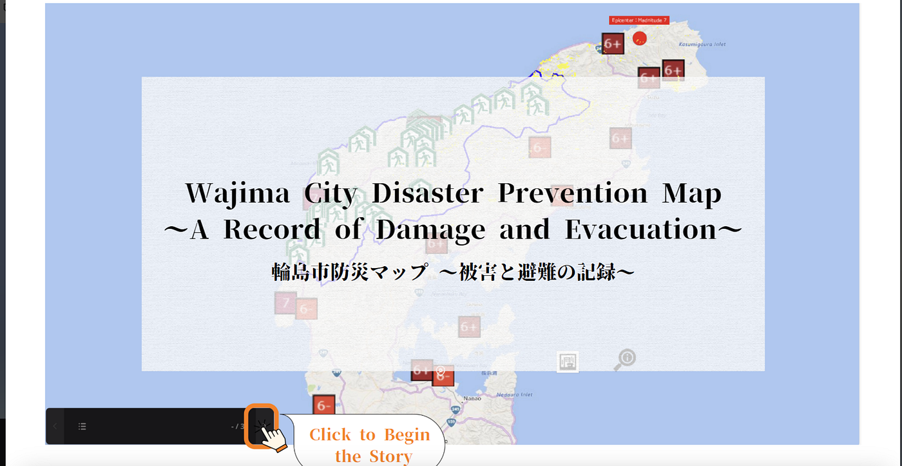

作成の際には[Re:Earth](https://reearth.io/ja/)を使用しました。Re:Earthとはブラウザ上で機能するWebアプリケーションのことで、GeoJSON、Shapefile、CZML、KMLなどの一般的に使用されるデータフォーマットに対応しているため、Re:Earth上で他のデータを一箇所に集めて可視化することが簡単にできる。

**その他の理由**

- ドローン部１のリーダーである林さんが慣れているため

- 1週間しかないため、慣れているものを使うほうが効率的と考えたため

課題を満たすために、地震の震度、被害状況、避難所の数をマッピングすることでコミュニティが直面したリスクや回復力について具体的に示せるようにしました。

#### １ 能登半島地震 石川県 震源・震度

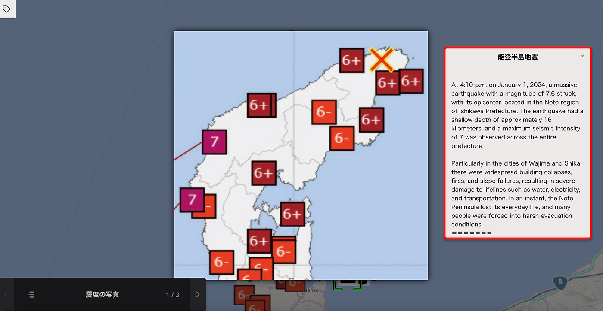

#### ２能登半島地震 石川県 被害状況

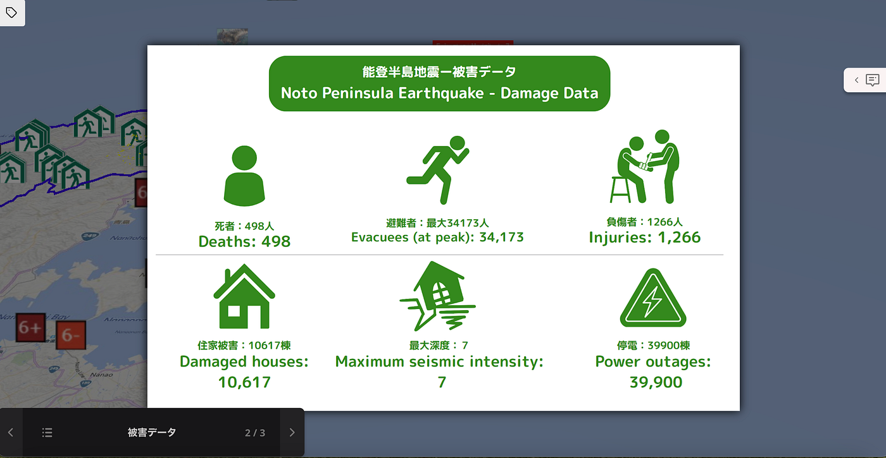

#### ３輪島市の被害データ

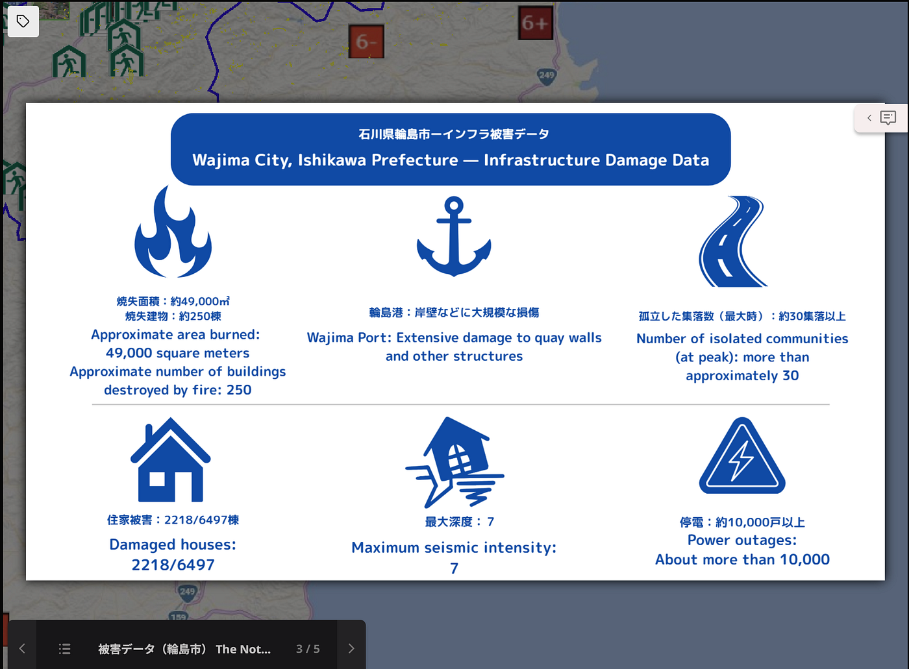

#### ４現在の輪島市の復興状況

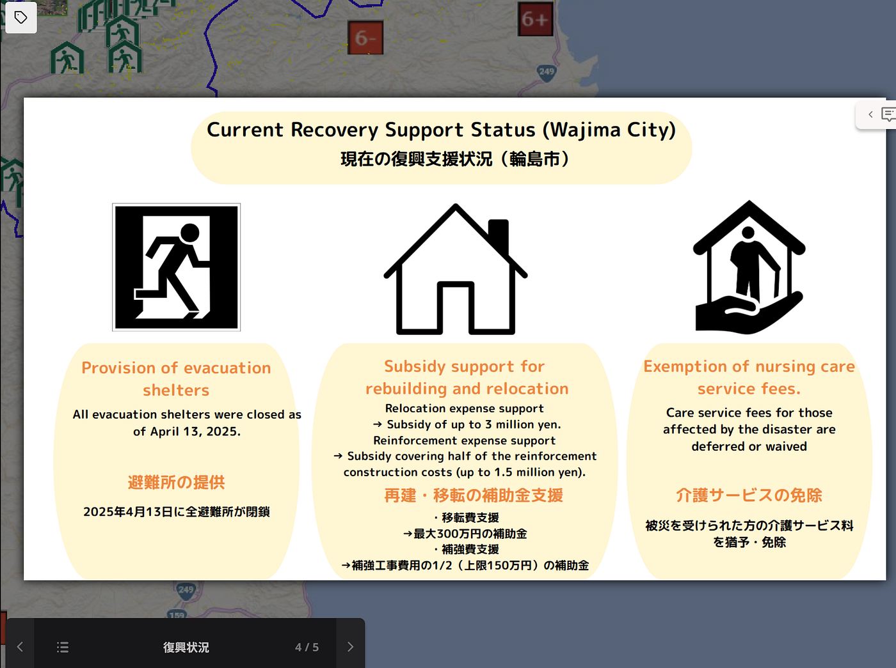

#### ５輪島市防災マップ

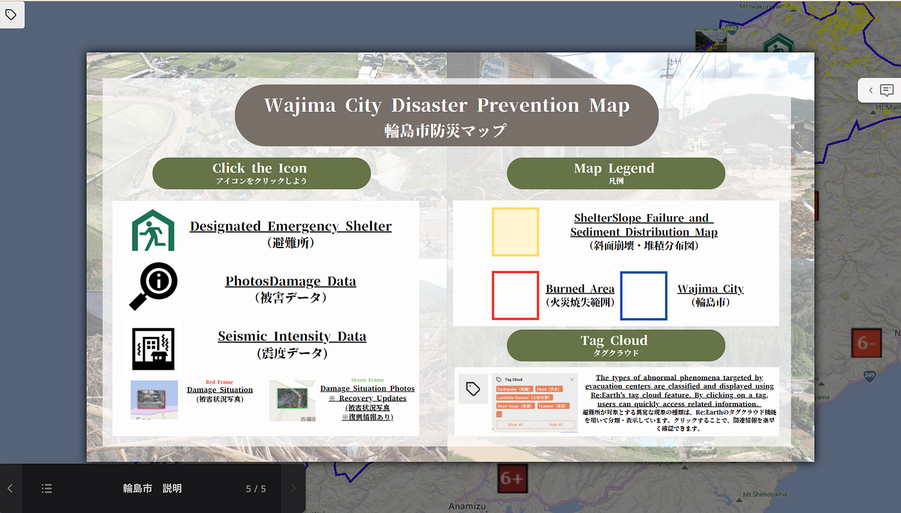

#### **作成の際に工夫した点**

**工夫点① タグクラウド機能の活用**

避難所の近くを対象とする災害現象のタグクラウド

**例１高潮タグ**

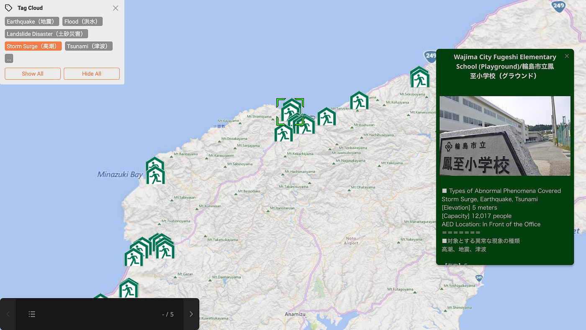

**例２土砂災害タグ**

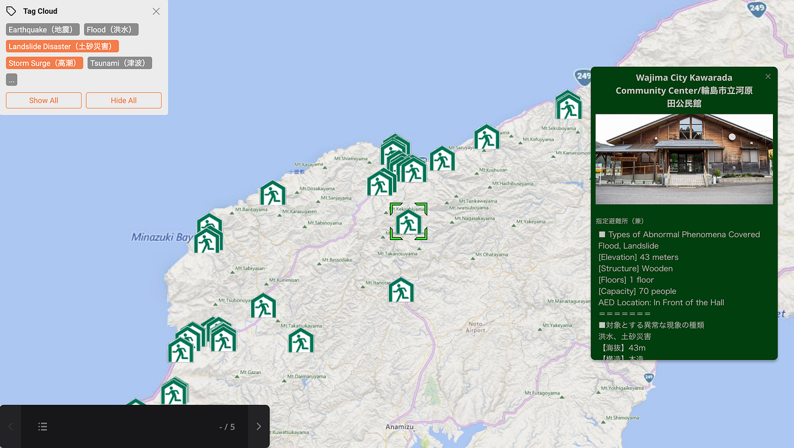

**工夫点② インフォボックスの活用**

インフォボックス内に避難所情報（収容人数、避難所の建築素材・階数、災害現象、AED設置場所など）や復興情報を記載

**例１避難所**

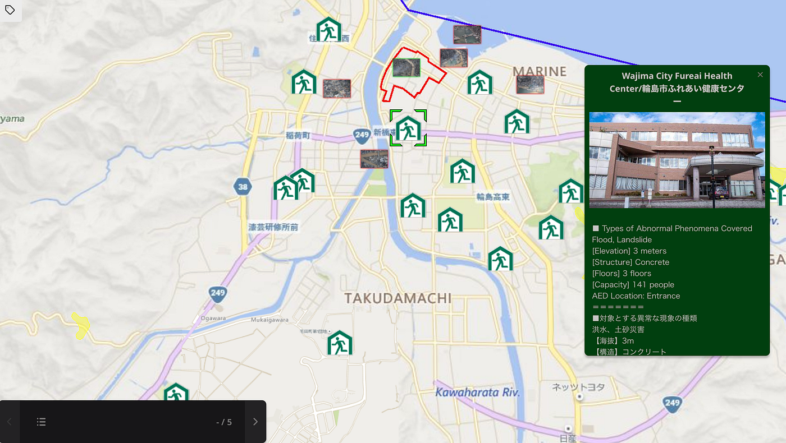

**例２ 土砂被害復興情報**

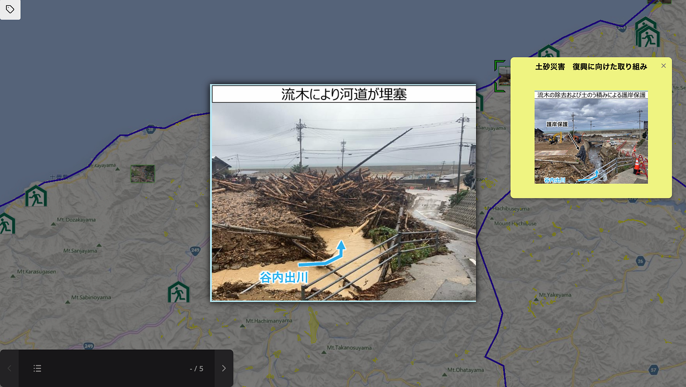

#### 作品紹介ビデオ

#### 作成後のチームの声

・数値や文章を地図に落とし込むことで直感的に被害状況や避難所の場所を分かるようになるため、効率的な支援を可能にする。

・地図を一回作成して終わるのでなく、リアルタイムに被害状況が分かれば効果的な支援だけでなく、的確な避難誘導にも使える。

・データに落とし込むことで後世にも容易に伝承することが可能になる。

・地図を作成することも大切だが、一般の方々にもクライシスマッピングや自治体が提供する避難所の地図情報などを広めていくことも重要だ。

・[ARアプリ](https://vr-tips.lipronext.com/xr_content/ar-application/)のように、カメラをかざし誰もが最寄りの避難所の場所や最適な避難経路を見つけ瞬時に行動できる直感的なツール必要だ。

⬇作品のリンクはこちら
[https://baejfefggc.reearth.io/](https://baejfefggc.reearth.io/)

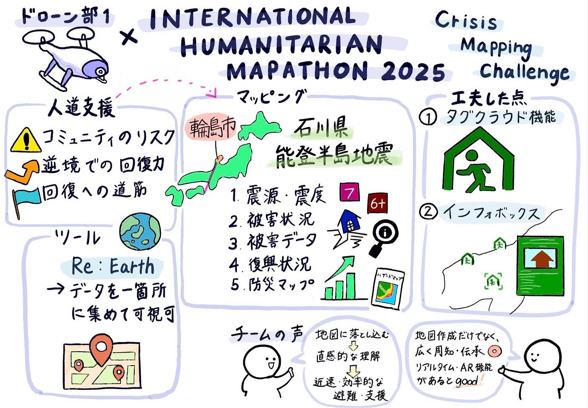

＜参考文献＞

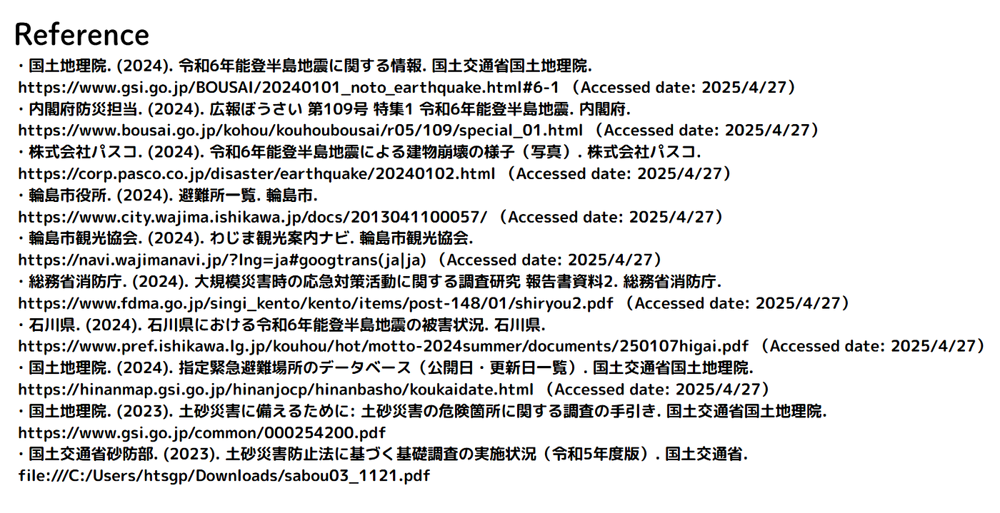
