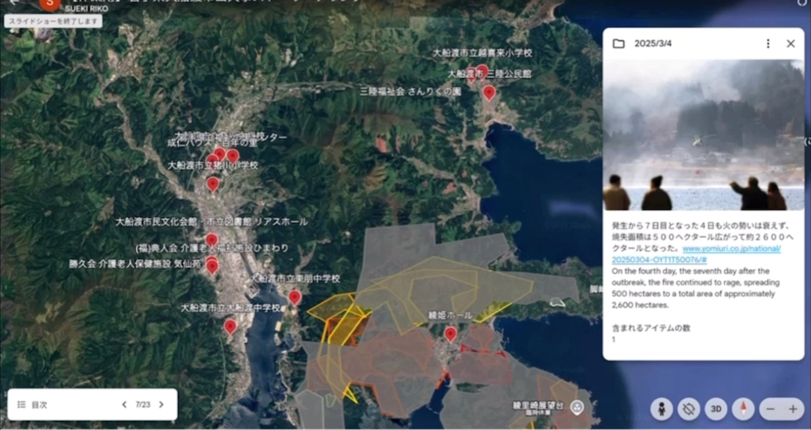
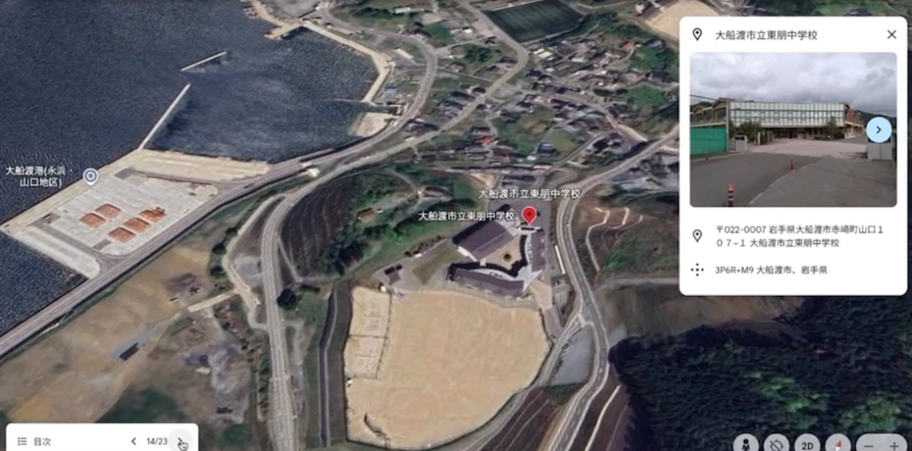

## International Humanitarian Mapathon 2025 | Youth②週報(4/29)

こんにちは。今週のYouth②週報を担当する、新3年の加藤祐大です。

僕たちは今週International Humanitarian Mapathon 2025に参加をしました！

> **International Humanitarian Mapathon 2025って？**

International Humanitarian Mapathon 2025とは、麗澤大学が開催する地図を使った実践型イベントのことで、災害の発生から復興までの物語をマッピングするPart1:Crisis Map Challengeと実際に[Hot Tasking Manager](https://tasks.hotosm.org/)を通してクライシスマッピングを行うPart2:Humanitarian Mapathonの2つで構成されています。世界各国の大学が参加しており、このイベントを通じて世界中のマッパーと繋がることができます。

今週は**Part1:Crisis Map Challenge**の活動を行いました！

> **活動内容**

過去一年に発生した災害が対象ということで、僕たちのグループは今年2月に岩手県大船渡市で発生した森林火災についてマッピングを行いました。具体的には[Google Earth](https://earth.google.com/web)のプレゼンテーション機能を利用して、第一次災害、第二次災害などの時間軸に沿ったマッピングを行い、発災から鎮火までの時系列を可視化するというものです。日ごとの火災発生状況を色分けしてマッピングすることで、火災がどのように広がり、収束していったかを時系列で視覚化しています。

また、大船渡市内の避難所も併せてマッピングしました。その結果、火災が集中して発生していたエリアには避難所が1か所しか存在せず、避難所の多くが火元から離れた地域に偏って配置されていることが明らかになりました。火災による断水や停電により生活インフラが脅かされ、多くの住民が避難所生活を余儀なくされる中で、避難所の分布の偏りは重要な課題であることが示されています。

ストーリーテリング、エリアマッピングの全容は動画にまとめています。[こちら](https://drive.google.com/file/d/1MG2zj8VT7RHXsjAcnVeGy6N1uvs5f7sj/view?usp=drivesdk)から確認できます。

マッピングの際に参考にした資料はページ下部に記載しております。

> **感想**

私自身こうしたイベントに初めて参加してみて、これまでは災害が発生しても、ニュースを流し見する程度でしか情報を得ておらず、深く関心を持つことはあまりありませんでしたが、今回実際に資料に目を通してストーリーテリング方式で災害をまとめることで、

・発災から市民はどのように避難してきたか

・鎮圧のために行政や官公庁がどのように尽力してきたか

といった人々の努力を知ることができ、今までとは違う視点で災害に向き合うことができたと感じました。これからゼミ活動を通して、様々な災害に向き合っていくと思いますが、今回はその活動の一歩目としてとても貴重な経験になりました。

_参考文献_

・読売新聞オンライン, “大船渡山林火災・熱源マップ”, 2025–03–10, [https://www.yomiuri.co.jp/topics/ofunato-heatmap](https://www.yomiuri.co.jp/topics/ofunato-heatmap)

・テレビ岩手, “【山火事】また大船渡市で新たな山火事発生 複数地区で建物火災も 避難指示発令 消火活動続く 岩手”, 2025–02–26, [https://news.ntv.co.jp/n/tvi/category/society/tvd916725739dc4d82855d0e4853029b90](https://news.ntv.co.jp/n/tvi/category/society/tvd916725739dc4d82855d0e4853029b90)

・岩手県大船渡市, “令和７年大船渡市大規模林野火災に伴う対応状況”, 2025–04–04, [https://www.city.ofunato.iwate.jp/uploads/contents/archive_0000003601_00/%E5%AF%BE%E5%BF%9C%E7%8A%B6%E6%B3%81%EF%BC%88250404_1600~_%E6%9C%AC%E9%83%A8%E5%93%A1%E4%BC%9A%E8%AD%B0_%E5%A4%A7%E8%88%B9%E6%B8%A1%E5%B8%82%E5%A4%A7%E8%A6%8F%E6%A8%A1%E6%9E%97%E9%87%8E%E7%81%AB%E7%81%BD%E8%B3%87%E6%96%99%EF%BC%89.pdf](https://www.city.ofunato.iwate.jp/uploads/contents/archive_0000003601_00/%E5%AF%BE%E5%BF%9C%E7%8A%B6%E6%B3%81%EF%BC%88250404_1600~_%E6%9C%AC%E9%83%A8%E5%93%A1%E4%BC%9A%E8%AD%B0_%E5%A4%A7%E8%88%B9%E6%B8%A1%E5%B8%82%E5%A4%A7%E8%A6%8F%E6%A8%A1%E6%9E%97%E9%87%8E%E7%81%AB%E7%81%BD%E8%B3%87%E6%96%99%EF%BC%89.pdf)

・東京海上ディーアール株式会社, “岩手県大船渡市の大規模林野火災の被害状況について”, 2025–03–06, [https://www.tokio-dr.jp/publication/column/182.html](https://www.tokio-dr.jp/publication/column/182.html)
