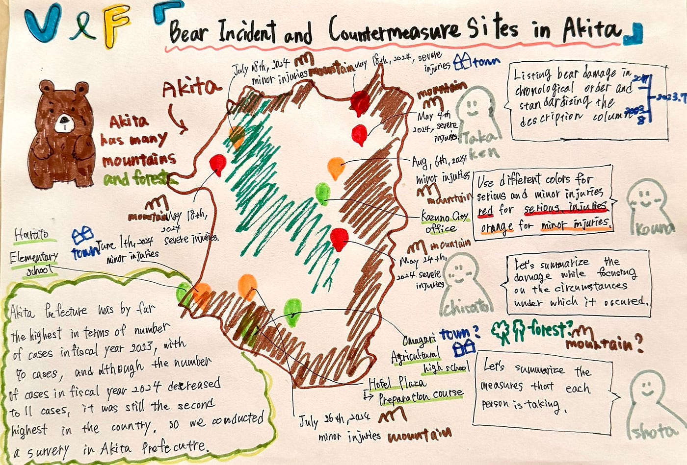

### クマ被害注意！マッパソンで人身被害を地図に落とし込んでみた。

こんにちは。高井健太郎です！
 今週は、ハッカソンの一環として「[2025 International Humanitarian Mapathon](https://padlet.com/UCLA_Library/international-humanitarian-mapathon-2025-8xjwv3mztrshbiqp)」に参加し、その中の「[Crisis Map Challenge](https://acrobat.adobe.com/id/urn:aaid:sc:AP:2282daa1-dd0a-47bb-9648-88842cbfae86)」にてストーリーテリング作品を制作しました。今回のマッパソンでは、「秋田県の熊による人身被害とその対策」というテーマを選び、Google Earth上でストーリーテリング作品を制作しました。
チーム名は「[MAPPINGERS](https://padlet.com/UCLA_Library/international-humanitarian-mapathon-2025-8xjwv3mztrshbiqp/wish/YBl3Z20rE4E8av16)」で、メンバーはKentaro、Chisato、Kouna、Shotaの4人です。

> **テーマ設定の背景**

#### なぜクマを選んだか

テーマとしてクマを選んだ理由は、クマが身近に存在する危険な野生動物であり、私たちのゼミ活動でも山やアウトドアに出かける機会が多いため、「知っておくべき危機」だと感じたからです。
 自然の中で活動する以上、リスクそのものに向き合う意識を持つ必要があると思いました。

#### なぜ秋田県を選んだか

秋田県を選んだ理由は、環境省の資料（[環境省 野生鳥獣による人身被害対策Q＆A](https://www.env.go.jp/nature/choju/effort/effort12/injury-qe.pdf)）によると、令和5年度におけるクマによる人身被害件数が**70件**と全国でダントツ1位だったためです。
 令和6年度も件数は減少したものの、**11件**で全国2位と深刻な状況が続いており、調査対象として最適と考えました。

> **制作作品内容と工夫点**

#### 制作内容

ストーリーテリング作品では、秋田県内で発生したクマによる人身被害の発生地点と、被害防止を目的に開催されたクマ対策出前講座の開催地点をマッピングしました。
また、電気柵の設置地点など、その他のクマ被害対策についても可視化を試みましたが、秋田県生活環境部自然保護課 鳥獣保護管理チームへの問い合わせの結果、これらは個人や法人による設置が多く、県として位置情報を一括管理していないとのことでした。
 そのため今回は、出前講座の情報に絞って可視化を行いました。

#### 工夫点

作品制作においては、以下の2点を工夫しました。
 まず、**ストーリーテリング地点の目印を色分けし**、赤＝重症、オレンジ＝軽傷、緑＝対策（出前講座）として一目で状況が分かるようにしました。
 次に、**人身被害が発生した順に時系列で並べる**ことで、被害の広がりや頻度の流れを視覚的に伝えられるよう工夫しました。

> **完成品**

[Google Earth
Aw snap! Google Earth isn't supported on your browser. You may need to update your browser or use a different browser…earth.google.com](https://earth.google.com/earth/d/1z5HweGPRlPcWTM-1v6gyQU9zLZTsDE66?usp=sharing)

> **気づいたこと、学んだこと**

① クマによる人身被害は、山間部や森林に近い住宅地など、自然との境界に位置する地域で多く発生していることが分かりました。地理的な特徴とリスクが密接に関係していることを実感しました。

② 出前講座は小学校や公民館など、人が集まりやすい場所で実施されており、実際の被害発生地点とは必ずしも一致していないことも明らかになりました。対策が「人の集まる場所」優先で行われており、被害地域とのギャップがある可能性も感じました。

③ 被害状況を可視化したことで、重症の被害がすべて5月に集中しており、それ以降の被害はすべて軽傷であるという傾向が見えてきました。調べたところ、5月はクマの冬眠明け直後で警戒心が強まる時期であり、山菜採りなど人間の活動とも重なりやすいため、全国的にも人身被害が起きやすい時期であることが分かりました。被害を時系列で可視化したことで、発生傾向や集中時期を直感的に把握でき、空間情報を活用した表現の有効性を改めて実感しました。

> **振り返りと今後に向けて**

今回のマッパソンを通じて、限られた情報でも地図を通して危機を可視化することができること、そしてそれが人に伝える力になることを実感しました。

9月には、長野県・千年の森自然学校でのきのこ狩りなど、アウトドア活動の機会がゼミでも予定されています。
 その際には、今回のように「どこにリスクがあるのか」を意識しながら、安全に活動できるよう心がけたいと思います。

今後のフィールド活動などでは、今回のような視点を活かしながら、空間情報を使ったリスクの可視化や情報整理を意識していきたいと思います。

> **グラレコ**

> **参考資料**

- [秋田県「令和6年度ツキノワグマによる人身被害一覧」](https://www.pref.akita.lg.jp/uploads/public/archive_0000023295_00/20241130_%E4%BB%A4%E5%92%8C6%E5%B9%B4%E5%BA%A6%E4%BA%BA%E8%BA%AB%E8%A2%AB%E5%AE%B3%E4%B8%80%E8%A6%A7.pdf)

- [秋田県「ツキノワグマ等情報マップシステム（クマダス）」](https://kumadas.net/)

- [男鹿市立払戸小学校「クマ被害防止 出前講座」記事](https://edu.city.oga.akita.jp/futto-es/post-3311/?doing_wp_cron=1745502230.1425759792327880859375)

- [秋田県立大曲農業高等学校ウェブサイト「秋田県庁出前講座『野生動物の生態や被害対策に』に関する記事」](https://daino-hs.net/2024/02/08/%E7%A7%8B%E7%94%B0%E7%9C%8C%E5%BA%81%E5%87%BA%E5%89%8D%E8%AC%9B%E5%BA%A7%E3%80%8C%E9%87%8E%E7%94%9F%E5%8B%95%E7%89%A9%E3%81%AE%E7%94%9F%E6%85%8B%E3%82%84%E8%A2%AB%E5%AE%B3%E5%AF%BE%E7%AD%96%E3%81%AB/)

- [秋田県 森の学校「クマ問題を考える講座」](https://www.forest-akita.jp/data/school-2023/2023-15/2023-15.html)

- [Yahooニュース「熊対策訓練に関する記事」](https://news.yahoo.co.jp/articles/29715d45212037161a71ccd71a7e9bb91bd2e8f6)
