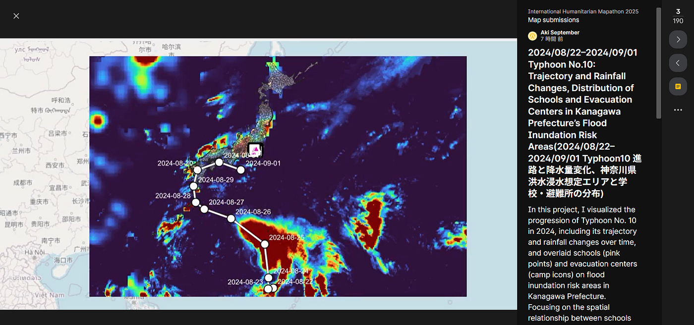
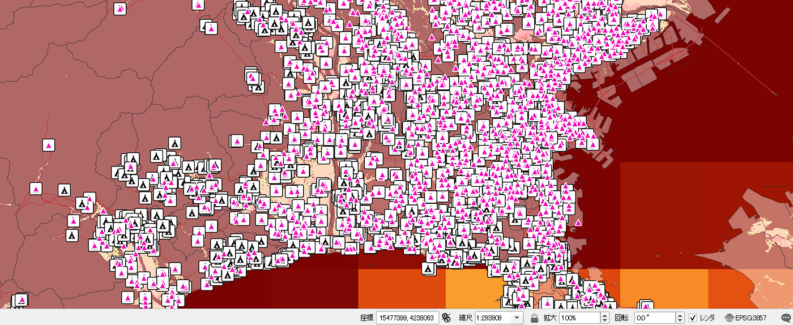
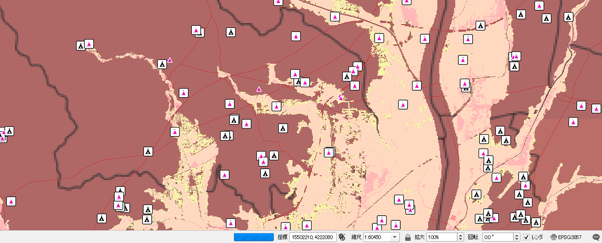
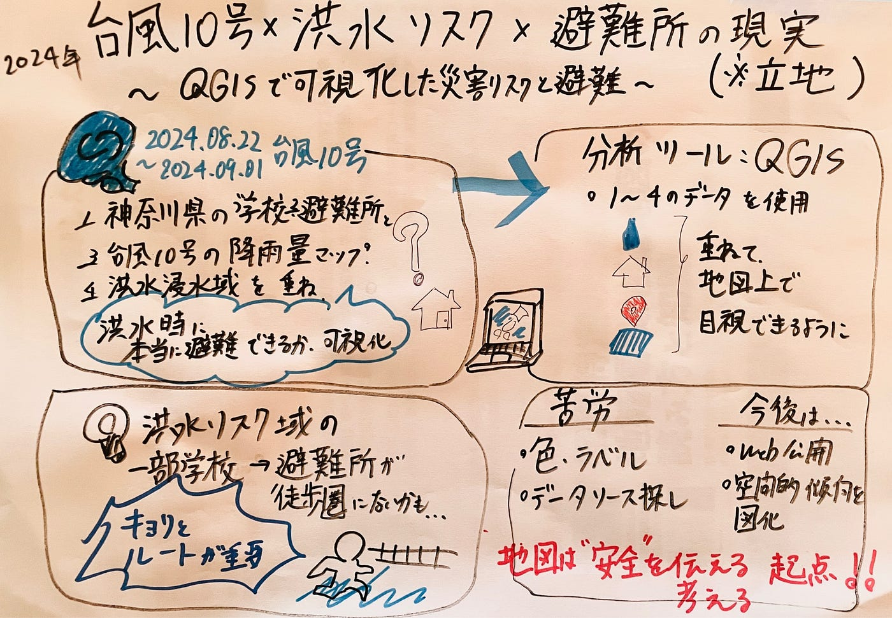

### 台風10号を追いかけて――QGISで見えた学校立地のリアル(ドローン2週報)

こんにちは。ドローン部2の佐藤愛妃です。

[2025 International Humanitarian Mapathon]では、2024年8月下旬に日本列島に接近した**台風10号**を題材に、QGISを使って可視化を行いました。

テーマは**「神奈川県における洪水リスクと避難」**です。神奈川県では、時系列での情報が不足していたため、情報の可視化を優先的に進めたため、QGISで作業を進めたので、Google Earthなどで表現できるストーリー化が困難でした。

[International Humanitarian Mapathon 2025
Made with Padletpadlet.com](https://padlet.com/UCLA_Library/international-humanitarian-mapathon-2025-8xjwv3mztrshbiqp/wish/wKmOZ5A44gdXZzMA)

最初は単純に「台風の進路と雨の量を地図に載せたい」と思っていたのですが、作業を進めるうちに思わぬ“地域の弱点”が見えてきたので、その記録を共有したいと思います。

### プロジェクトの目的

本プロジェクトの目的は、単に災害の被害予測を地図に落とし込むことではなく、**災害時の避難行動における“空間的な現実”を検討すること**でした。特に、洪水リスクのある区域に立地する学校に注目し、それらの学校が本当に徒歩で安全に避難できる距離に避難所があるのかを、地理情報として可視化しました。

### 背景と問題意識

災害リスクやハザードマップの情報は、行政や気象機関から公開されていますが、それらは単体で見ると「情報がある」だけにとどまりがちです。実際の避難行動において重要なのは、**複数の空間情報を重ねて見ることによって、地域における脆弱性を具体的に把握すること**だと考えました。

また、学校は多くの子どもたちが日常的に集まる場所であり、災害時には一時的な避難場所ともなり得る重要な施設です。しかし、必ずしもすべての学校が適切な避難所の近くにあるとは限りません。この「避難できる距離かどうか」という点は、文字や表だけでは把握しにくく、地図による可視化が必要であると感じました。

### 使用ツールとQGISを選んだ理由

可視化には、オープンソースのGISソフトウェアである**QGIS**を使用しました。QGISを選択した理由は以下の3点です。

**高度なレイヤー重ね合わせ機能**
 複数の地理データ（浸水想定区域、学校、避難所、降水量、台風進路など）を細かく調整しながら重ねて表示できる点で、QGISは非常に優れています。Google Earthではカスタマイズに限界があり、複雑な解析や表現には不向きでした。

**スタイリング・分析機能**
 QGISは、シンボルの設定、ラベル表示、属性フィルタ、距離計測など、空間分析に必要な機能が充実しています。避難所と学校の相対的な位置関係や、浸水区域との重なりを丁寧に可視化するには、この柔軟性が不可欠でした。

**オープンデータとの親和性**
 国土地理院や地方自治体が提供する地理空間データ（例：GeoTIFF、Shapefile、CSV形式など）をそのまま読み込み・加工できる点も、QGISを使う大きなメリットです。

**使用したデータ**

・2024/08/22–2024/09/01,台風中心点の移動経路

・世界測地系の行政区画図

・JAXA APIを用いた、降雨量ヒートマップ

・洪水浸水想定区域のヒートマップ

・神奈川県学校データ

・神奈川県避難所データ

・神奈川県の道路データ

### 可視化における工夫

今回のマップでは、「時間で変化する情報（台風進路・降水量）」と「空間的に固定された情報（学校、避難所、洪水リスク区域）」を適切に統合することに注力しました。

台風の進路と降水量は、時系列データとしてアニメーション形式で表示し、それに対して固定レイヤーとして洪水浸水想定区域を重ねました。さらに、学校はピンク色のポイント、避難所はキャンプマークで明示することで、視覚的にも直感的に情報が伝わるよう配慮しました。

**↑左が避難所、右が学校**

色の設定や凡例の配置、ラベルの重なりなどにも気を配り、視認性と正確性の両立を目指しました。視覚表現としての完成度を上げるよう意識しました。

### 技術的な困難と反省点

本プロジェクトにおける大きな課題のひとつは、**データの整形と管理**でした。
 たとえば、避難所や学校のデータは形式や提供元がバラバラで、座標情報がない場合もありました。これに対しては、住所から緯度経度を取得し、CSVファイルを再構成するなど、地道な作業が必要でした。

また、当初はQGISの**3Dビューア機能**を用いて立体的な浸水状況の表現も試みましたが、データの読み込み時間が長く、処理も重かったため断念しました。これは、今後のプロジェクトにおいて環境の最適化やデータの軽量化が必要であることを示す反省点となりました。

さらに、作成したマップを**Web上で共有する方法**についても課題が残りました。`qgis2web`や`qgis2threejs`といったプラグインを使えば、QGISで作成した地図をインタラクティブなWebマップとして公開できますが、今回は実装に至りませんでした。今後、より多くの人に共有・活用してもらうためには、こうした技術にも習熟する必要があります。

### 可視化から見えてきたこと

地図を完成させて特に印象的だったのは、「洪水リスクが高い区域にあるにもかかわらず、徒歩での避難が難しいと考えられる学校がいくつか存在していた」という事実です。
 可視化することで、従来の「学校＝安全な場所」という単純な図式では捉えきれない、地域ごとの“空間的な弱点”がある程度明確になりました。平塚市あたりで、洪水浸水想定地域近辺で避難所と学校間に距離がありました。ただ、徒歩距離などの計測は行っていないので、断定はできないです。

### 次回に向けて

今後は、本プロジェクトの成果をもとに、より多様な災害リスク――たとえば地震や土砂災害など――にも対象を広げて可視化を行いたいと考えています。また、他の都道府県や海外都市の事例にも応用し、汎用性のある防災支援ツールとしてのGIS活用を目指したいと思います。より多角的な災害分析ができるようスキルを磨いていきたいです。

