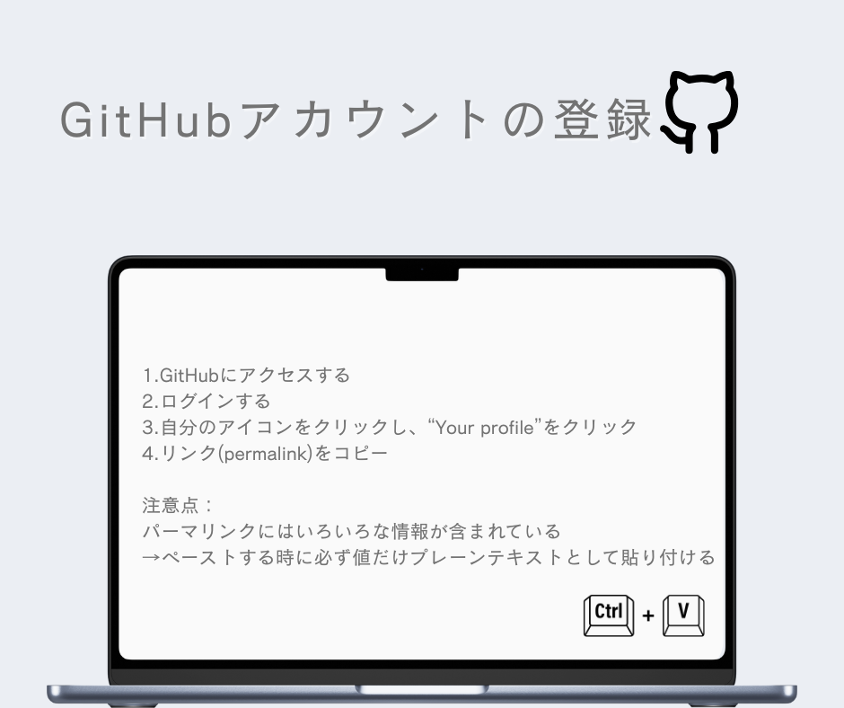

### 4/15授業

4/15の授業では、GitHubアカウントの登録を行なった。

Googleスプレッドシートに記入。

・パーマリンクをペーストする時には、必ず値だけプレーンテキストとして貼り付ける。

週報

ドローン部：１→自己紹介

２→自己紹介・ドローンについての挙動について（PHANTON4）

ユース：１→合宿について

２→ミャンマー地震のクライシスマッピングについて

デザイン部：自己紹介

V&F：自己紹介・活動方針→TikTok

