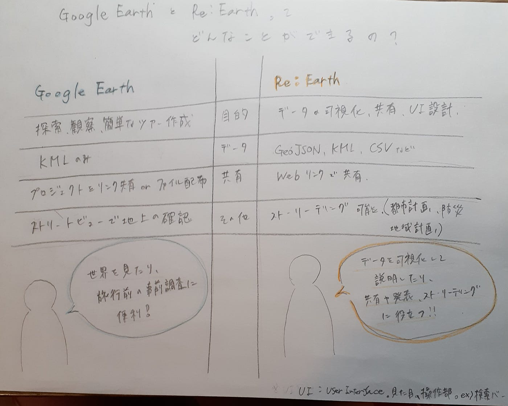

## 4月29日マッパソン報告会

３年、寺土日南子です。

先週のゼミを休んだため、動画を見てそれぞれのグループの内容と先生のコメントをまとめました。

### **International Humanitarian Mapathon 2025**

> vfメンバー

- 秋田県の熊による被害と対策

熊の被害は山間部

出前講座の開催地と被害地域のギャップ

5月の被害が重い→冬眠明けであり警戒心が高まる時期

<コメント>

全体を俯瞰してみれる地図が欲しい。

都市部と山間部の違いが見たい。

地図の上でのストーリテリングの方法。

> ユース②

- 岩手県の大船渡市での森林火災について

火災の広がり方と避難所の位置関係

火災が発生したエリアに避難所が一箇所 →. 避難所の偏り（個人が感じた課題）

<コメント>

現地の人が火災エリアと避難所のギャップに意見する人がいたのか？

人口（少子化傾向のある地域）と小学校、中学校（避難所になり得る）には相関がある

避難所から溢れた人はいたのか？

一般の人が理解できるようなストーリテリング

デフォルトは英語。英語日本語で表示。海外向け。

> ドローン②

- 2024年、台風10号の進路

ヒートマップ

QGIS データをマップに落とし込んだ

避難所と学校の位置関係に注目

洪水浸水域に指定されているにも関わらず徒歩圏内の避難所が少ない

<コメント>

ヒートマップ→mapbox stadium, QGIS（Google Earthにレイヤに落とし込む）

プレッチ

作ったデータを晒すこと。中途半端でも

> ドローン①

- 石川県能登地方の地震

Re:Earth

タグクラウド

<コメント>

ストーリーテリングで何を伝えたいのか。

能登復興状況はどうなのか？足りてる？他の地震被害地と比べて評価すると良い

最後に、

ストーリーテリングの方法が良く分かっていなかったので、今回の報告会でどのようなものなのか、どのように作ればよいのか分かった。まだまだ知らないツールが多く、今回グラレコではGoogleEarthとRe:Earthについて調べてみたがその他にもMapbox stadio や QGISについても調べ、実践していけるようにしたいと思った。

