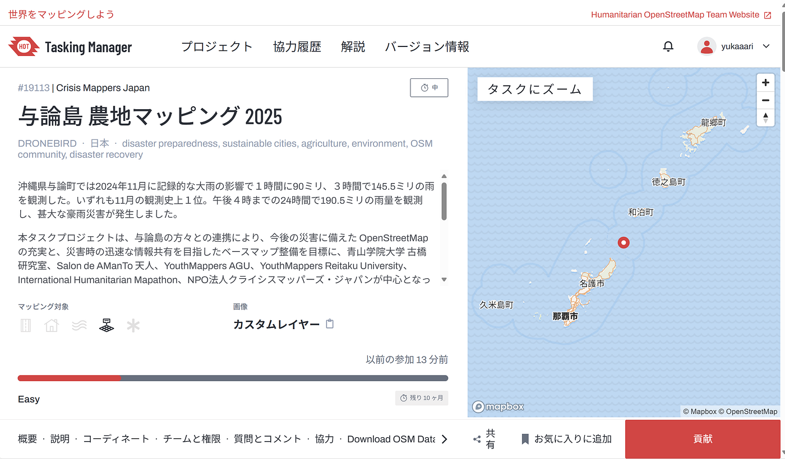
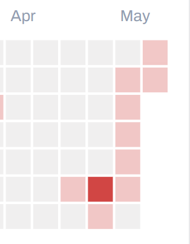
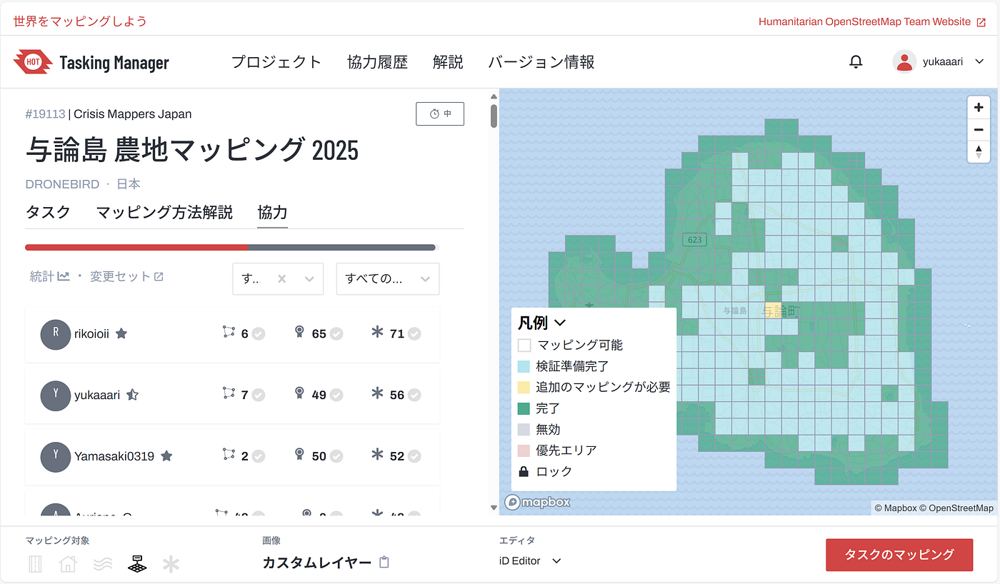
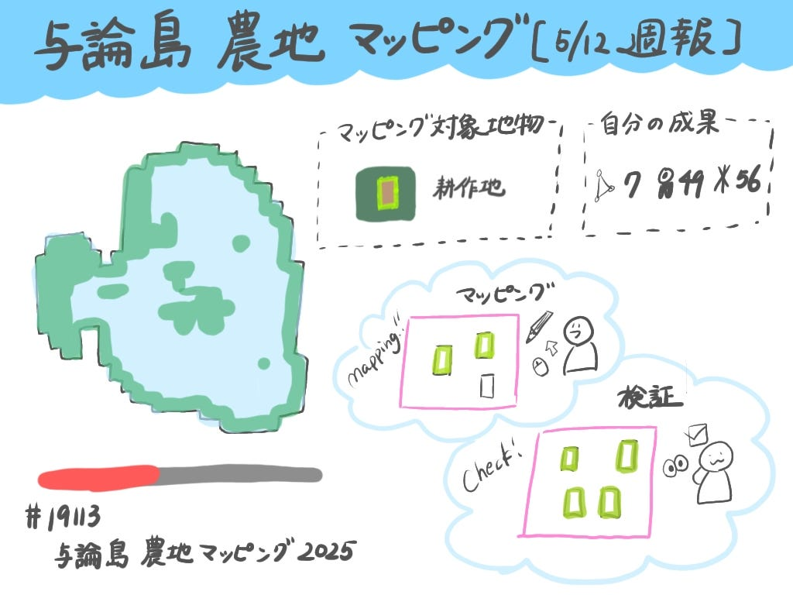

### 【2025/5/12 週報】与論島の農地マッピングに挑戦！

こんにちは。古橋研究室4年の林です。ゴールデンウィークはいかがお過ごしでしたでしょうか？
 私は実家に帰省したり、東京で友人と過ごしたりと、とてもリフレッシュできる時間を過ごすことができました！

さて、今週の週報では、先週に続いてInternational Humanitarian Mapathon 2025の第2弾イベント、与論島の農地マッピングプロジェクトに関する自分の取り組みについてご報告します！

#### 今回取り組んだプロジェクト概要

→[#19113: 与論島 農地マッピング 2025 — HOT Tasking Manager](https://tasks.hotosm.org/projects/19113#map=18.00/27.05301/128.44528)

2024年11月、沖縄県与論町は観測史上最大となる豪雨に見舞われ、甚大な災害が発生しました。本プロジェクトは、今後の災害に備えた地図整備を目的に、与論島の住民との連携のもと、OpenStreetMapのベースマップを充実させる取り組みです。

青山学院大学 古橋研究室、Salon de AManTo 天人、YouthMappers（AGU／麗澤大学）、International Humanitarian Mapathon、NPO法人クライシスマッパーズ・ジャパンが協力し、災害時の迅速な情報共有と地域支援を目指しています。

#### 自分の成果

今回のプロジェクトでは、主に検証作業に力を入れて取り組みました。作業は5月1日から開始し、「5月12日まで毎日1タスク以上を完了する」という目標を掲げて活動を続けました（1日だけうっかり忘れてしまいましたが……）。
 以下の画像が、実際に私が完了させたタスクの記録です。貢献度2位でした！（2025/05/13 11:00時点）

#### 感想

つい2週間前までは、与論島の地図にはまだ多くの白がありました。しかし、プロジェクトを通じて多くのマッパーと協力し合いながら、目に見えて形が整っていく様子を目の当たりにし、「一つの地図をみんなでつくり上げている」という実感を強く得ることができました。

現在、私はタスキングマネージャー上で452タスクを完了しており、上級マッパーになるための目標である500タスクまであと一歩というところまで来ています。この目標達成に向けて、UNMappers MAPPY HOURへの参加など、さらに経験を積みながらスキルを高めていきたいと思います。

#### グラレコ

