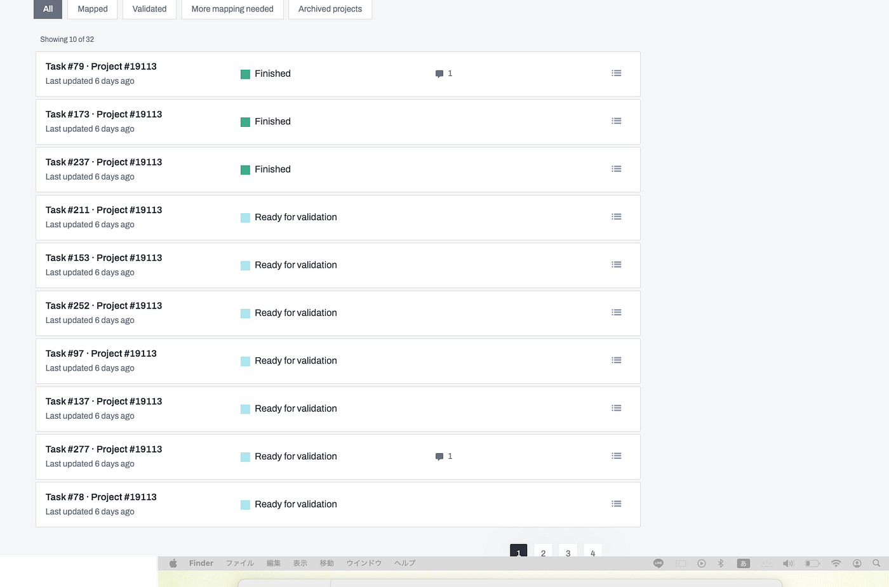
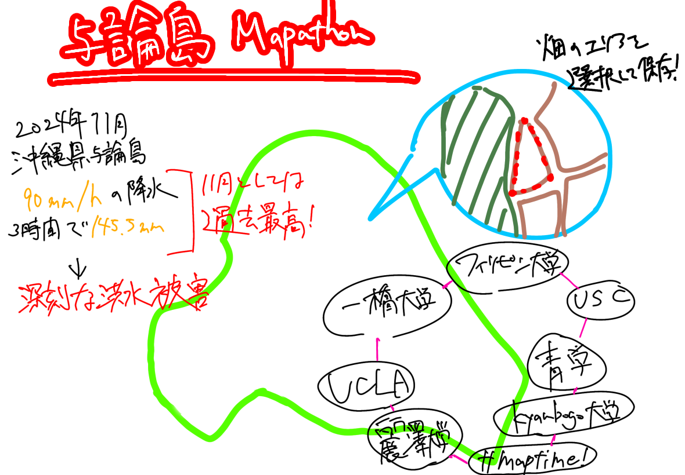

### Mapathonに参加！

こんにちは。古橋研究室三年の本吉顕です。今回の週報ではゴールデンウィーク中に行われたMapathonについての報告します。ゴールデンウィーク中の私はバイトに追われながらもキャンプにも出かけ、充実した時間を過ごすことができました。そんな中時間を見つけてマッピングをしていたわけですが、今回私が参加したのは以下のイベントです。

> _**与論島 農地マッピング_**

このイベントは、International Humanitarian Mapathon 2025の企画の一部です。Mapathonとは、衛星画像やデジタル地図作成ツールを活用し、参加者が協力して地図を作成するボランティアイベントです。作成された地図情報は、災害対応、人道的支援、都市開発など、さまざまな分野での活用を目的としています。

2024年11月、沖縄県与論町では記録的な豪雨により、最大で1時間に90mm、3時間で145.5mmの降水量が観測され、大規模な洪水被害が発生しました。これを受けて、青山学院大学古橋研究室、Salon de AManTo（天人）、YouthMappers AGU、YouthMappers麗澤大学、International Humanitarian Mapathon、NPO法人クライシスマッパーズ・ジャパンが連携し、住民の方々と協力しながら、OpenStreetMapを活用したマッピングプロジェクトに取り組んでいます。

本プロジェクトは、将来的な災害硫黄や減災に役立つ情報インフラの構築を目指して、災害に備えた基盤地図の整備と、緊急時の迅速な情報共有を目的としています。

[https://tasks.hotosm.org/projects/19113#map=18.00/27.05301/128.44528](https://tasks.hotosm.org/projects/19113#map=18.00/27.05301/128.44528)

> _**成果_**

私はまだ初級マッパーであるためvalidationの作業ができないため、ひたすら畑をマッピングする作業をしました。期間内に1日1タスク以上やることを目標にして行いました。電波の届かない環境にいた日もあったのでその日はできませんでしたが、他の日はタスクをこなしました。

> _**感想_**

Mapathonという企画を通して他の大学や組織とマッピングを競い合うことを通してオンラインで簡単にマッピングをできること、それが実際にOpen Streeet Mapに反映されて災害の被害を被った現地の人々の役に立つということを実感できました。期間が始まった頃は与論島はマッピングされていない箇所だらけで真っ白でしたが、すぐに全部のエリアがマッピング済みになり、組織として協力してマッピングを行っているということを肌で感じました。今回の自分の課題として、空き時間を有効活用すればより多くのタスクをマッピングできたと感じたので、次回以降はより数をこなすことに注力できると感じました。

> _**グラレコ_**

