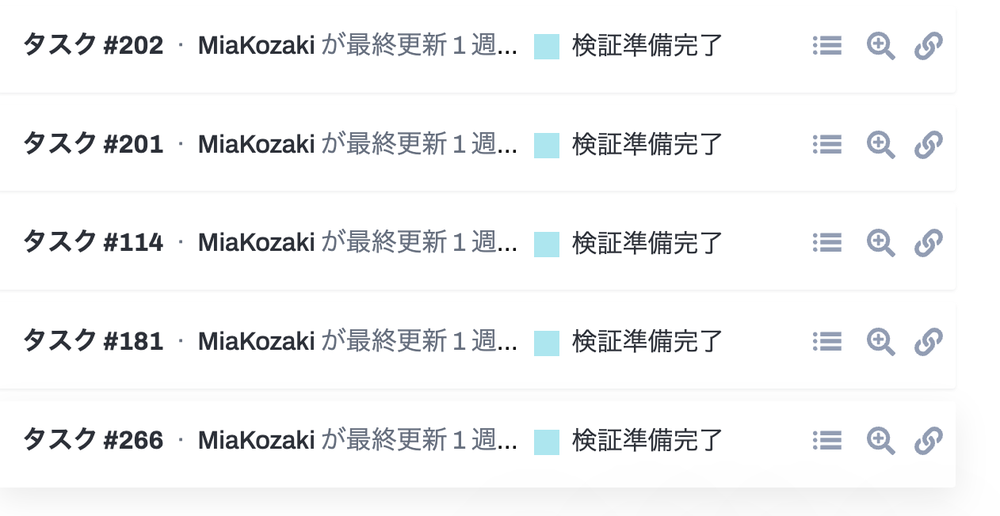
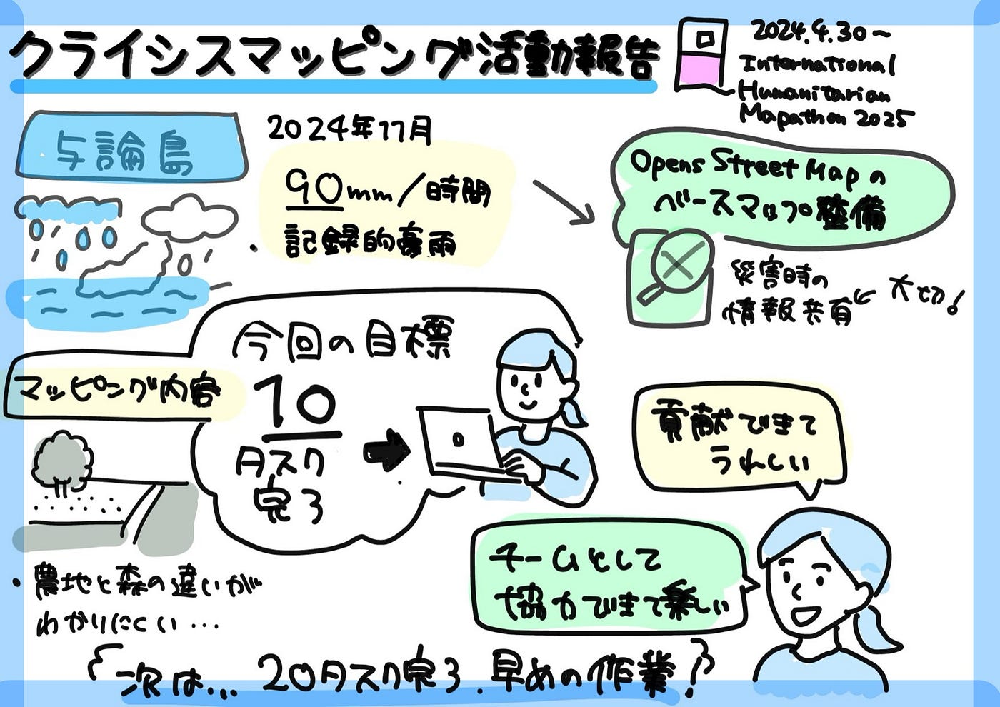

### 【5/13週報】クライシスマッピング実践記

こんにちは。3年の小崎です。4月はあっという間に終わり、気づいたら5月の中盤になっていました。

今回は、4/30より参加した**International Humanitarian Mapathon 2025**の一環として、**HOT Tasking Manager**を活用したクライシスマッピングについての報告をさせていただきます。

#### 概要

今回のマッピング対象地は、**2024年11月に記録的豪雨に見舞われた沖縄県与論町**です。

- **1時間に90ミリ、3時間で145.5ミリ**の雨を観測（いずれも11月の観測史上1位）

- **24時間雨量は190.5ミリ**に達し、甚大な被害が発生しました

この災害を受け、与論島の方々との連携のもと、今後の災害に備えた**OpenStreetMapのベースマップ整備**と、**災害時の迅速な情報共有**を目的に本タスクが企画されました。

#### 📓マッピング内容

今回は、家屋や建物ではなく、**農地のマッピング**が中心でした。

作業を通して特に意識したのは、**先生からの指示にもあった「道と農地を繋げない」**ことです。

また、農地と森林の違いが人目でわからず、**人によって判断に差が出やすい点が難しかった**です。

#### 🎯今回の目標と実績

期間中に中々作業の時間が取れないことが予めわかっていたので、作業をできる時に一気に進めようと考え、**10タスク完了**を目標にしました。

実際に作業を開始したのは5/2ごろでしたが、その時には約80%マッピング作業が完了していたため、私が行ったのはすでに完了したものを検証可能へと移行することがメインになってしまいました。

最終結果としては、2日間参加し、12タスク完了させることができました。

#### ✍ 反省と今後の目標

- 見た目では判断が難しい部分が多く、**慎重な確認作業と丁寧なマッピングが必要**だと実感

- どのくらいの時間がかかるか事前にわからなかったため、**次回はもっと早めに作業を始め、20タスク完了を目指したい！**

- また、**週報用にスクリーンショットを撮っておくべきだった**と反省。今後は記録も意識して取り組みたいです

#### 💬 感想

マッピング作業自体は基本的に**個人で行う形式**でしたが、HOT Tasking Manager上で**他の参加者の更新履歴や進捗状況が確認できる仕組み**があり、「自分もこの大きなプロジェクトの一員として関わっている」という実感がありました。
完全に一人作業ではなく、**遠隔で協力し合っているような感覚**が楽しく、モチベーションにもつながりました。今回は初心者マッパーで検証作業に参加できなかったため、次回までに中級に上がってもっと貢献したいです。

以下グラレコです。

