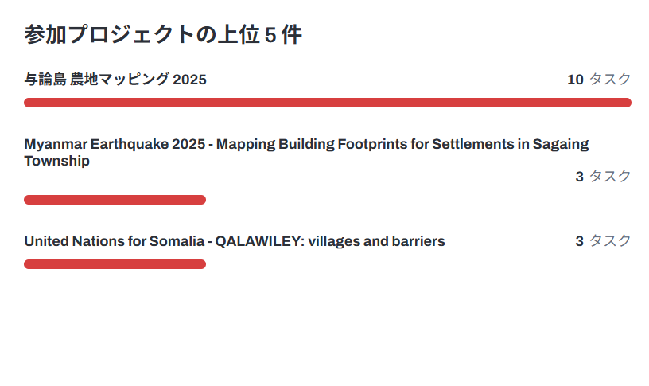
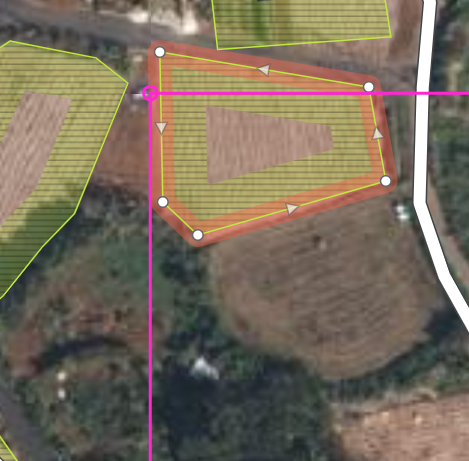
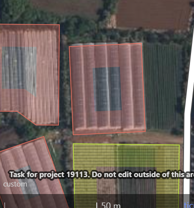
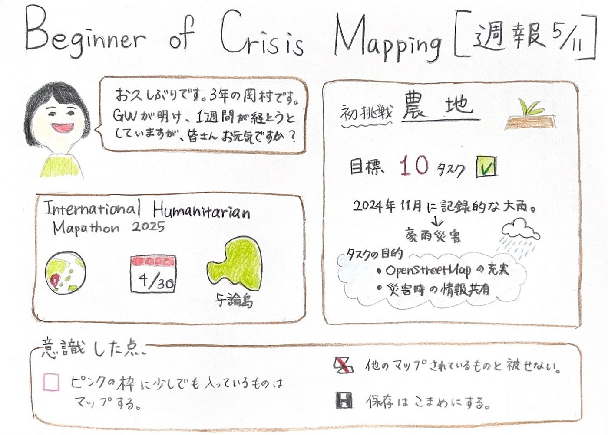

### Beginner of Crisis Mapping[週報5/11]

お久しぶりです。3年の岡村です。GWが明け、1週間が経とうとしていますが皆さんお元気ですか。

今回は4月30日からInternational Humanitarian Mapathon 2025で行ったクライシスマッピング([HOT Tasking Manager](https://tasks.hotosm.org/))について報告します。

今回マッピングの舞台となったのは、日本の与論島です。2024年11月に記録的な大雨の影響で甚大な豪雨災害が発生したこの地では、今後の災害に備えてOpenStreetMapの充実と災害時の情報共有を目的にタスクが設定されました。

今回のマッピング対象は「農地」ということで、私にとって初めてでした。説明を熟読し臨みました。

目標を10タスクと決め実施しました。←後から目標が低かったと思いました、、

【意識した点】

①ピンクの枠に少しでもはいっているものはマップする。

②他のマップされているものと被らないようにする。

③保存はこまめにする。

【まとめ】

現在、初心者マッパーで、気づけば、与論島のマップが中級以上でないとできなくなっていました。参加できるタスクが限られているのでいち早く脱出するべく、easyなタスクから次々に挑戦したいです。まずは、中級マッパー目指して精進します。

＊リト、ショウタが初級マッパーを抜け出していた！！追いつかねば、

【グラレコ】

