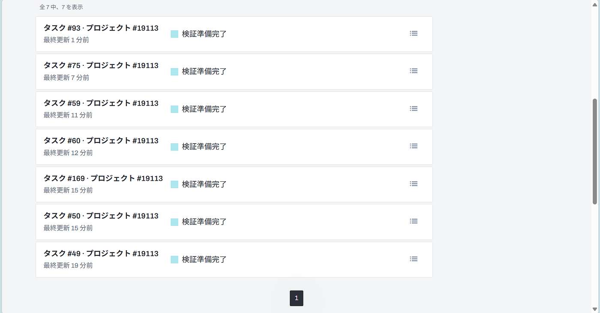
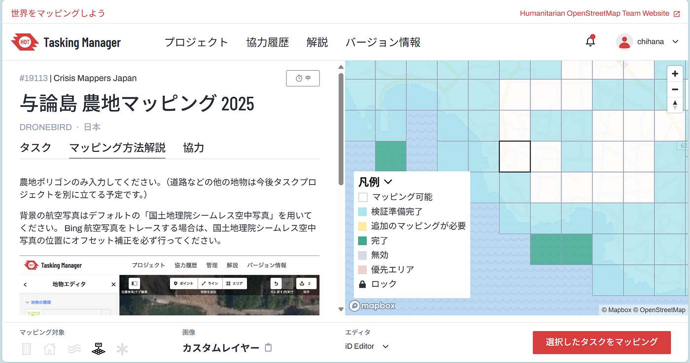
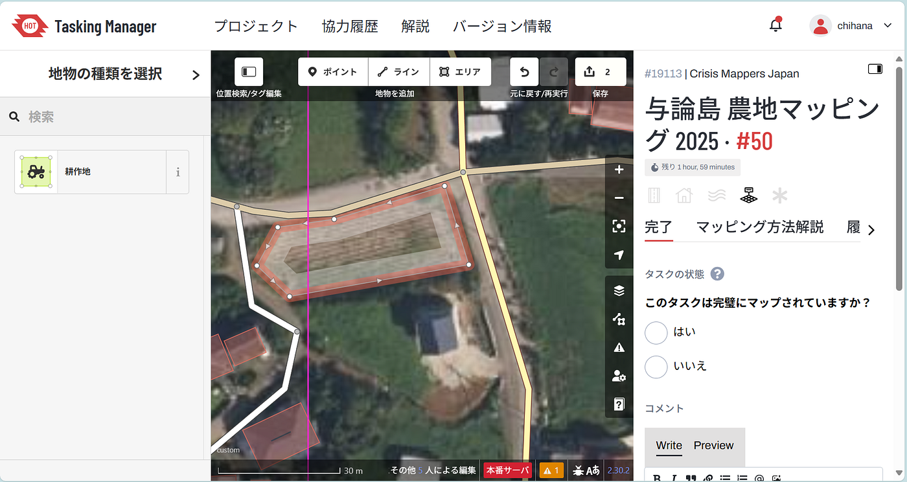
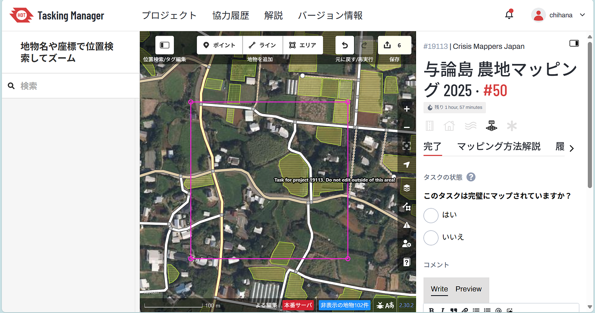
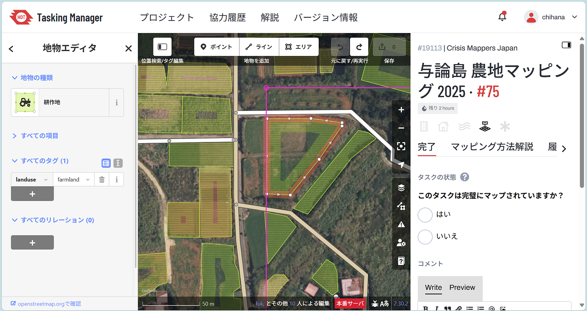
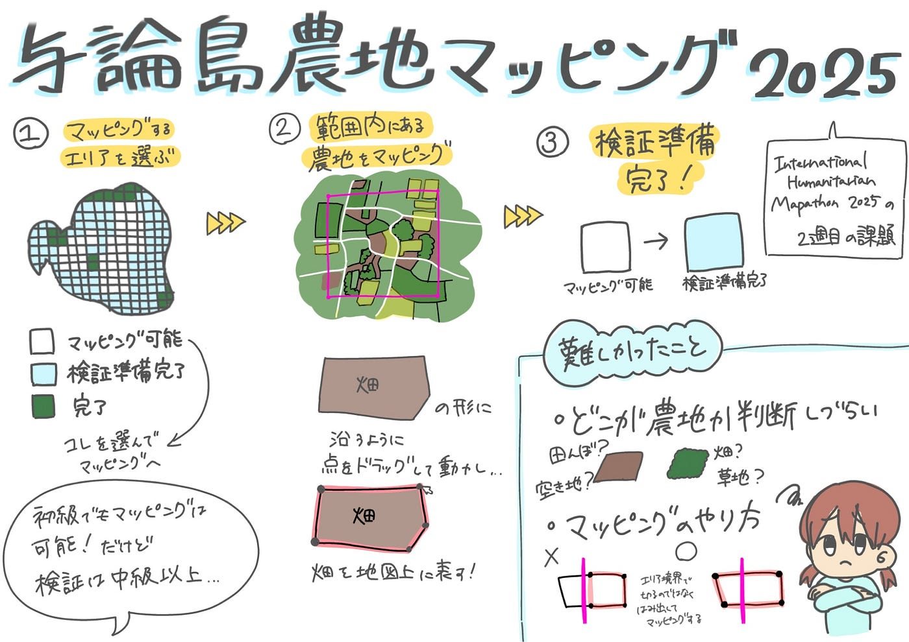

## 与論島の農地マッピングに参加しました！

こんにちは。3年の臼井です。

今回私は与論島の農地マッピングに参加しました。International Humanitation Mapathon 2025の2週目に行ったプロジェクトになります。

恐らくゼミ生は全員理解していると思いますが、簡単に手順を説明します。

マッピングの方法は、まずマッピング可能エリアからマッピングするエリアを選びます。

次に範囲内に存在する農地（畑や田んぼ）のエリアを耕作地としてマッピングします。

変更を保存して投稿し、マッピングしたエリアがマッピング可能を示す白から検証準備完了の水色になっていれば完了です。

今回のプロジェクトでは初級でも以上で述べたようなマッピングの作業は行えますが、検証作業は中級以上のマッパーのみが行えます。

今回マッピングしてみてどこが農地か判断する事とマッピングのやり方が難しいと感じました。田んぼや空き地、畑、草地などは上空から見ると同じように見えてしまい、どこをマッピングすれば良いのか見分けるのが大変でした。

また、他の人がマッピングした物を見ていると、境界に沿って農地が切れた形でマッピングしているケースもありました。これも初心者にはどのようにマッピングするのが正しいか判断するのは難しいのではないかと感じました。

### グラレコ

