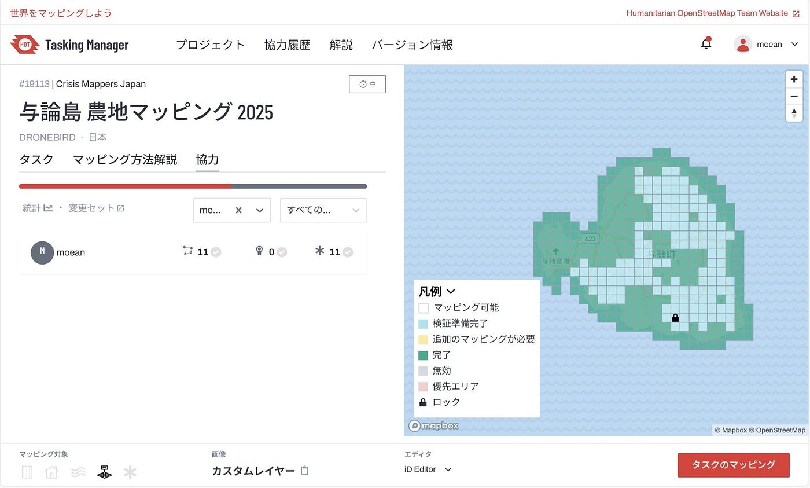
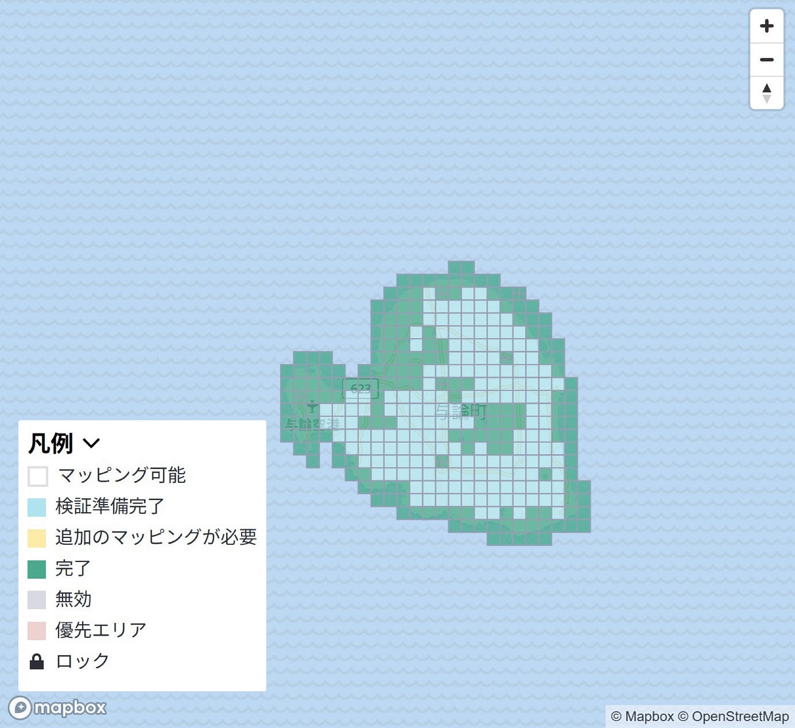
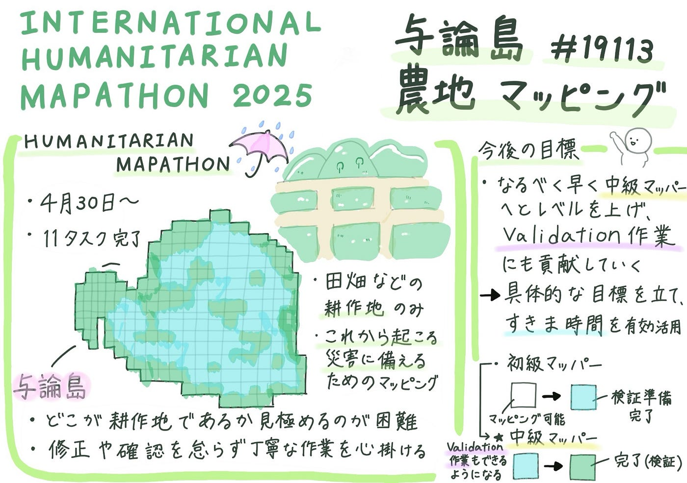

### 初めての農地マッピング

こんにちは。3年の安生 萌です。

今回の週報ではINTERNATIONAL HUMANITARIAN MAPATHON2025の活動Part2である[Humanitarian Mapathon](https://tasks.hotosm.org/projects/19113)の参加について報告します。

### 1. Humanitarian Mapathonについて

4月30日から開始されたHumanitarian Mapathonは「与論島 農地マッピング 2025」です。

2024年11月、沖縄県与論町では記録的な豪雨に見舞われ、1時間に90ミリ、3時間で145.5ミリ、24時間で190.5ミリの雨量を観測しました。いずれも11月としては観測史上最多であり、大規模な災害でした。

このような災害に備え、現地住民との連携のもと、今後の迅速な災害対応と情報共有を目的としたOpenStreetMap（OSM）のベースマップ整備を進めました。本活動は、青山学院大学 古橋研究室、Salon de AManTo 天人、YouthMappers AGU、YouthMappers Reitaku University、International Humanitarian Mapathon、NPO法人クライシスマッパーズ・ジャパンの協働により実施されています。

今回は耕作地のポリゴン（エリア）のみのマッピングでした。

- iDやRapiDエディタでは耕作地 「landuse」=」farmland」 のみ選択できるように設定してある

- 田・畑どちらも区別せず両方入力する

- 入力する耕作地の単位はあぜ道で区切られた１筆の農地を丁寧にトレースする

という３つの条件のもとそれぞれがタスクに取り組みました。

### 2.意識した点と反省点

今回のマッピング活動で私が特に意識した点は次の3点です。

- 緑や茶色の部分が多くあったが、どこが田畑などの耕作地であるか見極めるのが難しかったため、極限までアップしてできる限り誤りがないよう努めた。

- 自分の選択したエリア内で既にマッピングされているものの中に線がずれているものや誤りがあるものを見つけた際は修正したり、マッピングし忘れているものはないかよく確認し丁寧に作業した。

- 建物や道路などの他のエリアに重なることがないよう慎重にマッピングを行なった。

また、反省点は以下の2点です。

- 作業期間がゴールデンウィークに重なっていたこともあり、予定があったため毎日作業することができず、タスクの数をこなすことができなかった。

→今後は隙間時間を有効活用して作業を進めていきたい。

- 現時点で全てのエリアが検証準備完了となっているが、まだ検証が完了していない部分が多く残っている。

→自分もValidation作業に参加して少しでも貢献できるようなるべく早く中級マッパーへとレベルを上げる。

### 3.作業報告と今後の目標

今回の「与論島 農地マッピング 2025」では全部で11タスクの作業をしました。作業期間を振り返ってみると隙間時間を活用してより多くのタスクをこなすことができたと感じるので、次回はより具体的な目標を立てて参加したいです。

また、現時点での作業記録をみると、まだ水色の部分が多く残っており、初級マッパーと比べて中級以上のマッパーの数が少ないように感じるため、自分も早く中級マッパーへの仲間入りを果たしてValidation作業にも貢献していきたいです。

最後にグラレコです。

