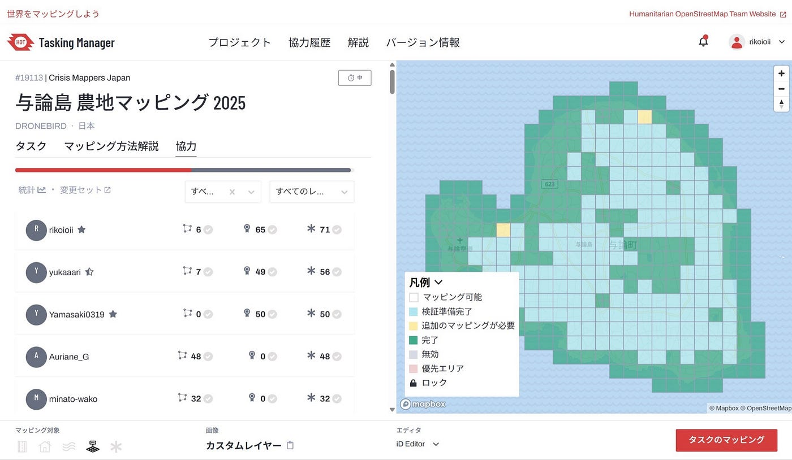
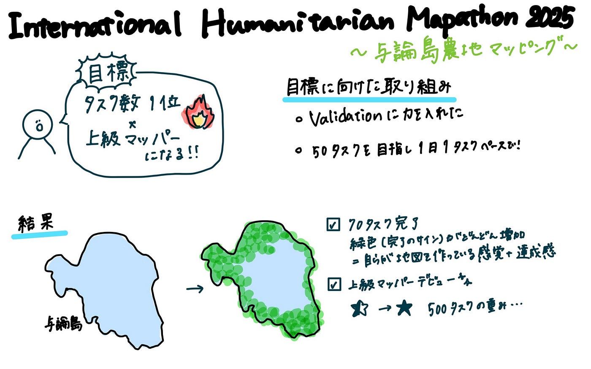

## 貢献度1位と上級マッパーを目指して！！

こんにちは。4年の末木です。

今回は、先週に引き続き、[International Humanitarian Mapathon 2025](https://mapathon.la/en/)の一環として行われた[与論島農地マッピング](https://tasks.hotosm.org/projects/19113)に参加したのでその報告をさせていただきます！

#### 与論島農地マッピングとは？

> ※以下、HOT Tasking Manager プロジェクトページ（#19113）より引用　[https://tasks.hotosm.org/projects/19113](https://tasks.hotosm.org/projects/19113)

> 沖縄県与論町では2024年11月に記録的な大雨の影響で１時間に90ミリ、３時間で145.5ミリの雨を観測した。いずれも11月の観測史上１位。午後４時までの24時間で190.5ミリの雨量を観測し、甚大な豪雨災害が発生しました。

> 本タスクプロジェクトは、与論島の方々との連携により、今後の災害に備えた OpenStreetMap の充実と、災害時の迅速な情報共有を目指したベースマップ整備を目標に、青山学院大学 古橋研究室、Salon de AManTo 天人、YouthMappers AGU、YouthMappers Reitaku University、International Humanitarian Mapathon、NPO法人クライシスマッパーズ・ジャパンが中心となって企画したものになります。

#### 「タスク数1位」と「上級マッパー」を目指して

プロジェクト開始にあたり、私は以下の2つを目標に掲げました。

- 与論島プロジェクト内でタスク数1位になること（50タスクを目標に設定）

- 上級マッパーになること（累計500タスク達成）

今回のプロジェクトでは、検証作業（Validation）を中心に行いました。

約2週間、「毎日1タスク以上」を意識して取り組み、目標としていた50タスクを超える、70タスクを完了しました。

その結果、その時点（2025.05.13 0:00）での貢献数がプロジェクト内で1位となりました。また、それに伴い、たくさんマッピングを行った結果上級マッパーデビューも果たしました！

#### 感想

貢献数1位を目指していたので最後かなり追い組みでValidationを頑張ったのですが、履歴のほとんどが私という状況で、地図が緑色に変わっていくのを見ていると、私が地図を作っているような達成感がありました。Tasking Manager上で、完了済みのエリアが緑色に変わっていくのを目にするのは、シンプルですがとても大きなやりがいでした。また、与論島は昨年YouthMappers AGUが主催したマッパソンの地で、私が初めてマッパソンの主催に携わったということもあり、思い入れのある地域で、少しずつ地図が形になっていく様子に満足感を覚えました。さらに、与論島プロジェクト以外のタスクも含め、累計500タスクを達成し、ついに上級マッパーになることができました。今後もマッパソンなどに参加しながらより一層精度の高いマッピングができるようスキルアップを目指していきたいと思います！

