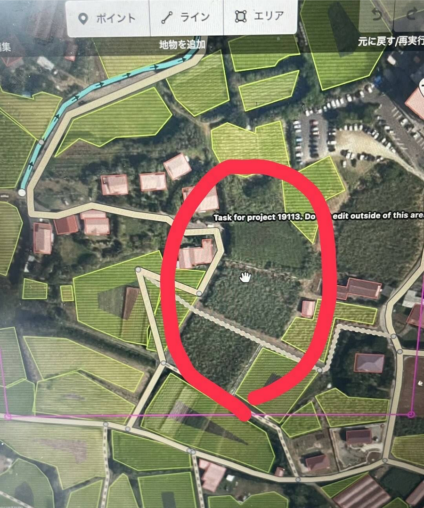
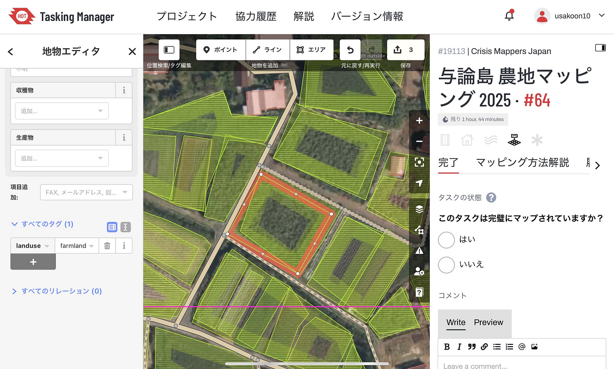
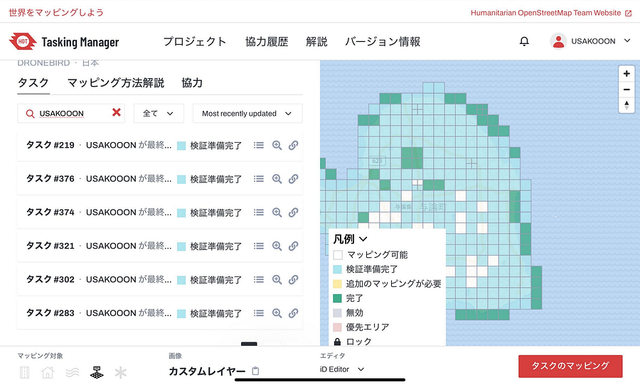

### 農地マッピングをしてみて

三年、寺土日南子です。ゴールデンウィーク期間中も含めて、マッパソンの個人課題であるHot tasking managerの与論島をマッピングした。

その活動の中で学んだことや感じたことについて述べていく。

> 感想

今回の課題である農地マッピングは初めてだった。マッピングを進めていく中で、特に写真から農地であるのか木が生い茂っている区画なのか不明で悩むことが多かった。場所がわかるところは再度別の地図で確認する作業も加えていたため、建物のマッピングよりも時間がかかると思った。

（ゴールデンウィーク中、私は栃木に行っており、そこでたくさんの農地を見て、農地とそうでない部分の想像がしやすくなりマッピングの際に少し役立ったと感じた。）

マッピングを行っている際に、気になったことが一点あった。それは添付した写真のように、一つの区画に幾つかのエリアが張られており、最初意図がわからなかったが、調べてミスである可能性が高かったため修正した部分がいくつかあった。マッピングをする前に、しっかりと調べたり教えてもらったりと指導を受ける必要があるかと今回の活動を通して考えた。

> 成果

私はまだ中級に上がれなかったので今後も別のプロジェクトに参加し、級を上げていこうと思う。その過程で、まだまだ行なったことのないマッピングの項目もあり不明な点があれば私よりも級が高い人にしっかり質問してその都度やり方を理解していかなければいけないと思った。

> グラレコ

